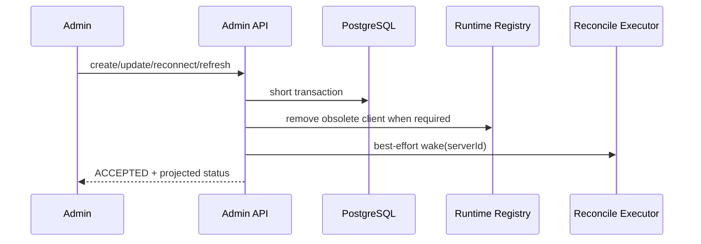

# Design: Minimal DB-Driven MCP Reconciliation

## 1. Decision Summary

This design deliberately models a single-instance Admin application, not a
distributed control plane.

The lifecycle is:

```text
Admin short transaction -> DB desired state -> bounded reconcile worker
                       -> conditional observed write -> read-time status
```

The design removes:

- `runtime_revision`, `applied_runtime_revision`, and `runtime_generation`;
- persisted `connection_status` / `catalog_status` state machines;
- durable operation/job rows, leases, dispatcher, cancellation, and retention;
- per-ID coordinator, striped locks, waiter/reference counting, and lock cleanup;
- connection/catalog/warning error DTO hierarchies;
- tool list, policy negative lookup, and callback caches plus ordered invalidation.

The remaining concurrency mechanisms are MyBatis optimistic locking, one
process-local monitor in the existing `McpServerRuntime` held only across short
DB/Registry publication sections, one instance-local active flag, and one
process-local `ConcurrentHashMap.newKeySet()` for worker de-duplication.

## 2. Existing Components and Target Ownership

| Existing file | Target responsibility |
|---|---|
| `mcp/admin/controller/McpAdminController.java` | Validate/authorize Admin requests and return DTOs. No MCP I/O. |
| `mcp/admin/service/McpServerAdminService.java` | Commit desired state under one short mutation monitor; request reconcile. |
| `mcp/admin/service/McpServerRuntime.java` | Client factory/Registry facade and owner of the one short process-local mutation monitor. |
| `mcp/admin/service/McpBootstrapRunner.java` | Become `McpStartupRecoveryRunner`; enumerate DB rows only. |
| `mcp/admin/service/McpToolAdminService.java` | Paginated policy CRUD and refresh intent; no remote fetch and no cache invalidation. |
| `mcp/admin/service/McpToolConfigAccessor.java` | Direct indexed DB reads; no positive/negative cache. |
| `infrastructure/security/SecurityCryptoProperties.java` | Current key ID/key plus one optional previous key ID/key; no unbounded keyring. |
| `infrastructure/security/SecretCipher.java` | AES-GCM current-key encrypt and bounded current/previous decrypt used by MCP and existing consumers. |
| `mcp/runtime/McpServerRegistryImpl.java` | Atomic live-client snapshot and exact-instance conditional removal. |
| `mcp/runtime/McpServerImpl.java` | One live client plus one instance-owned invocation circuit; read visible tools directly from DB. |
| `mcp/runtime/McpRemoteCallExecutor.java` | Own and update the instance-local circuit state machine. |
| `mcp/mcpclient/SyncMcpToolCallbackProvider.java` | Delete; per-request `McpToolCallbackAdapter` is already the actual callback path. |
| `mcp/mcpclient/McpServerToolCallbacksAdapter.java` | Delete with its default implementation; it exists only for the provider path. |
| `mcp/config/DatabaseToolFilter.java` | Delete; direct visible-tool SQL replaces the provider-only filter. |
| `mcp/mcpclient/McpToolNamePrefixGenerator.java` | Delete with its default implementation; catalog reconciliation calls `McpToolUtils` directly. |
| `mcp/runtime/McpCircuitBreakerRegistry.java` | Delete; key-based shared state permits retired calls to affect replacements. |

New components are intentionally limited:

| New component | Responsibility |
|---|---|
| `McpDesiredStateHasher` | Deterministic SHA-256 of canonical desired fields without plaintext token persistence. |
| `McpConnectionStateProjector` | The only `PENDING/READY/DEGRADED/DISABLED` derivation used by API and health. |
| `McpConnectionReconciler` | One captured-hash connection/catalog attempt, retry calculation, and safe failure persistence; no internal retry loop. |
| `McpConnectionRecoveryScheduler` | Bounded scan, backoff eligibility, and worker submission. |
| `McpEndpointSafetyGuard` | MCP-specific URL/DNS validation around existing `HostSafetyValidator`. |
| `McpBearerTokenValidator` | Exact token format/length contract. |

No operation, dispatcher, coordinator, lease, generation, or cache-manager class is
introduced.

## 3. V19 Destructive Cutover

V19 is a PostgreSQL SQL Flyway migration named:

```text
V19__reset_mcp_connections_for_db_runtime.sql
```

The application is pre-release, so V19 deletes existing MCP tool and Server rows.
It does not edit V17/V18, remap old identity, or retain old encrypted credentials.
Security configuration and Admin audit rows remain.

### 3.1 `mcp_server_config`

Keep existing desired/display columns and `@Version version`. Remove `init_error`.
Add:

| Column | SQL type | Meaning |
|---|---|---|
| `server_id` | `VARCHAR(48) NOT NULL UNIQUE` | `mcp_<row-id>` local identity. |
| `remote_server_name` | `VARCHAR(255) NULL` | Informational initialize result. |
| `desired_state_hash` | `CHAR(64) NOT NULL` | Current desired URL/token/enabled digest. |
| `observed_state_hash` | `CHAR(64) NULL` | Digest applied to this process's client. |
| `catalog_synced` | `BOOLEAN NOT NULL DEFAULT FALSE` | Complete catalog committed for desired state. |
| `error_code` | `VARCHAR(64) NULL` | Stable allowlisted current failure. |
| `error_message` | `VARCHAR(256) NULL` | Safe Chinese message from allowlist. |
| `consecutive_failures` | `INTEGER NOT NULL DEFAULT 0` | Recovery backoff input. |
| `next_reconcile_at` | `TIMESTAMPTZ NULL` | Durable due time for initial/manual/retry reconciliation; null means no scheduled work. |
| `last_attempt_at` | `TIMESTAMPTZ NULL` | Latest background attempt. |
| `last_connected_at` | `TIMESTAMPTZ NULL` | Latest applied connection. |
| `create_request_key` | `VARCHAR(128) NOT NULL UNIQUE` | Create idempotency key. |

Checks enforce lowercase 64-hex hashes, nonnegative failures, the local Server ID
pattern, `error_code/error_message` both-null-or-both-present, and
`catalog_synced = FALSE OR observed_state_hash = desired_state_hash`.

There is no overall status column and no connection/catalog failure-domain column.
The stable error code itself describes the failure for operators; reconcile control
flow uses observed facts, not the code.

`create_request_key` is not an idempotency-log table. One key occupies the existing
Server row for that row's lifetime and is physically removed on Server delete. A
deleted key may be reused; no TTL, tombstone, GC scheduler, or extra row exists.

### 3.2 `mcp_tool_config`

V19 recreates tool rows with:

- `present BOOLEAN NOT NULL DEFAULT TRUE`;
- `last_seen_at TIMESTAMPTZ NOT NULL`;
- `input_schema JSONB NOT NULL` validated as a JSON object;
- existing raw/prefixed names, description, enabled, intent, risk, override, version;
- `UNIQUE(server_id, tool_name)` and `UNIQUE(prefixed_tool_name)`.

Serialized input schema is bounded to 64 KiB per tool and 4 MiB for one complete
catalog before the transaction starts. These limits bound memory, statement size,
JSONB work, and WAL amplification without adding batching state.

Indexes cover paginated Server listing, due-work scan
`(enabled, next_reconcile_at)`, Server tool listing, and the direct
`prefixed_tool_name` authorization lookup.

### 3.3 Migration execution

PostgreSQL transactional DDL makes V19 all-or-nothing. Deployment order is: stop old
process, back up MCP tables, deploy once, let Flyway run, verify empty MCP tables and
constraints, then create connections through Admin. Rollback is restore + old binary;
there is no reverse migration.

`McpV19PostgresMigrationIT` runs through Maven Failsafe with `mvn verify`, not
Surefire `mvn test`.

## 4. Desired and Observed Facts

### 4.1 Hash contract

`McpDesiredStateHasher` computes SHA-256 over a length-prefixed canonical encoding of:

```text
canonical URL
encrypted token envelope or explicit null marker
enabled boolean
```

The encrypted envelope, not plaintext token, is hashed. AES-GCM uses a random IV, so
every token rotation intentionally changes the desired hash even when an operator
submits the same plaintext. Display name, description, `autoConnect`, and remote name
do not alter the client and are excluded.

Encryption-key rewrap is explicitly not a desired-state mutation: it replaces only
the ciphertext envelope and preserves `desired_state_hash`, `observed_state_hash`,
`version`, Registry client, and catalog. The hash is the equality token assigned when
client semantics last changed; it is not recomputed merely because at-rest wrapping
changed.

The hash is an equality token, not an ordering token. No greater-than comparison or
generation arithmetic exists.

### 4.2 Status projection

`McpConnectionStateProjector` takes the DB row and a Registry runtime observation
(`live`, instance-owned circuit state):

```java
if (!enabled) return DISABLED;
if (errorCode != null) return DEGRADED;
if (runtime.live() && runtime.circuitState() != CLOSED) return DEGRADED;
if (runtime.live()
        && desiredHash.equals(observedHash)
        && catalogSynced) return READY;
return PENDING;
```

API, health, and metrics must call this component rather than replicate predicates.
For a non-CLOSED live circuit it derives stable `MCP_CIRCUIT_OPEN` plus its allowlisted
message without persisting transient invocation state in the Server row.
On process restart the Registry is empty, so a row cannot falsely project READY even
if historical hashes match.

### 4.3 Mutation effects

| Command | Desired hash | Observed hash | Catalog | Registry |
|---|---|---|---|---|
| create | compute | null | false | request reconcile |
| URL/token/enable/disable | recompute | null | false; mark old tools absent | remove old client; request reconcile when enabled |
| display/description | unchanged | unchanged | unchanged | no replacement |
| autoConnect | unchanged | unchanged | unchanged | enabling schedules due work only when not currently READY; disabling keeps a live client but stops new automatic recovery after current due work |
| reconnect | unchanged | null | false; mark old tools absent | remove old client; request reconcile |
| refresh tools | unchanged | unchanged | false | request catalog reconcile |
| delete | row removed | n/a | tool rows cascade/delete | remove client |

Each enabled desired-changing or manual remote command clears `error_*`/failure count
and sets `next_reconcile_at=now()`. Disable clears the due time. Display-only changes
do not alter it. All versioned Admin writes use `TransactionTemplate` and affected-row
checks.

## 5. Fast Admin Command Flow

Network I/O is never performed while handling an Admin request.



`McpServerRuntime` owns one instance monitor shared by Admin and reconciler. It exposes
one `withMutationGuard` callback and never leaks the monitor. The monitor covers only
the short linearization section containing Registry withdrawal and desired DB
mutation. A connection-changing command uses this order:

1. Registry `withdraw(serverId)` removes the old instance from the snapshot and marks
   its instance-local `active=false`; callbacks captured earlier now fail before a new
   remote call.
2. Execute and commit the desired DB transaction.
3. On commit, close the withdrawn instance asynchronously. On rollback, Registry
   `restore(withdrawn)` marks it active and republishes the exact same instance.

The guard prevents a background publisher from interleaving with withdraw/commit/
restore. Already-started calls may finish on the retired instance; no call can start
through it after the new desired state commits. The monitor never
covers validation, encryption, remote connect, `tools/list`, sleep, or retry delay.
This serializes low-frequency Admin mutations and runtime publication without a
custom per-ID lock manager.

The monitor is an accepted Admin-plane serialization point. Capacity evidence includes
100 concurrent independent mutations, guard wait/hold histograms, and one 100-Server
bulk disable executed as one transaction/guard acquisition. If the target is missed,
the implementation first shortens SQL/transaction scope or applies bounded Admin
concurrency; this task does not silently introduce keyed/striped locks.

Create is two local DB writes in one transaction: insert to obtain `id`, assign
`server_id=mcp_<id>` plus desired hash, then update. `create_request_key` is unique.
On a duplicate key, the service loads the existing row, decrypts the stored token,
compares normalized request fields (token comparison is constant time), and either
returns the existing Server or rejects key reuse.

A best-effort executor wake can be rejected without losing work because the same Admin
transaction sets `next_reconcile_at=now()`. The scheduler selects every enabled due
row regardless of `autoConnect`, so an initial or explicit manual command survives
process failure. After a successful attempt, `next_reconcile_at` is cleared. A
permanent failure clears it as well; only `autoConnect=true` rows receive future
automatic attempts without another Admin command.

## 6. Reconcile Flow and Stale-Result Proof

`McpConnectionRecoveryScheduler` uses a bounded `ThreadPoolExecutor` (8 workers,
queue 200) and `ConcurrentHashMap.newKeySet()` named `inFlight`. Submission owns the
set entry only after `add`; rejection removes it immediately:

```java
if (!inFlight.add(serverId)) return;
try {
    executor.execute(() -> {
        try { reconciler.reconcile(serverId); }
        finally { inFlight.remove(serverId); }
    });
} catch (RejectedExecutionException rejected) {
    inFlight.remove(serverId);
    saturatedUntilNanos = nanoTime() + jitter(1, 3).toNanos();
    stopSubmittingThisBatch();
}
```

There is no waiter count, fairness setting, timeout claim, lock entry, cleanup, or
orphan detection. The set is process local and disappears cleanly on restart. Queue
saturation leaves DB due time unchanged and delays the whole next scan once; it does
not create a per-Server rejection counter or repeatedly resubmit the same full batch.

Persisted scheduling uses database time only. Admin SQL writes
`next_reconcile_at = CURRENT_TIMESTAMP`; retry SQL writes
`CURRENT_TIMESTAMP + :delay`; due queries compare with `CURRENT_TIMESTAMP`.
Application wall-clock time is never persisted. `System.nanoTime()` is used only for
process-local saturation/DB-outage delays.

### 6.1 Connection path

1. Read enabled row and capture `desiredHash` plus decrypted connection fields.
2. Validate URL/DNS and build/connect the client outside transaction and monitor.
3. Enter `McpServerRuntime.withMutationGuard`.
4. Re-read the row. If missing, disabled, or hash changed, close the new client and
   stop; the stale result was never published.
5. In a short `TransactionTemplate`, conditionally update observation and let that
   transaction commit before publication:

```sql
UPDATE mcp_server_config
SET observed_state_hash = :capturedHash,
    catalog_synced = FALSE,
    remote_server_name = :safeRemoteName,
    last_connected_at = now(),
    error_code = NULL,
    error_message = NULL
WHERE id = :id
  AND enabled = TRUE
  AND desired_state_hash = :capturedHash;
```

6. If affected rows is zero, close the unowned client and stop.
7. Atomically publish the exact new `McpServerImpl` instance. If publication throws,
   call Registry `removeIfSame`, conditionally clear `observed_state_hash` for
   `capturedHash` in a compensating short transaction, and close the client when it is
   not Registry-owned.
8. Exit the monitor and perform catalog fetch.

The conditional `WHERE`, shared short monitor, and DB-before-Registry order prove a
stale result cannot become visible after delete, disable, or a new desired state.
Exact-instance Registry removal remains the cleanup primitive for failures after
publication and prevents stale cleanup from removing a newer replacement. Neither
proof needs a generation token.

### 6.2 Catalog path

1. A live client with `observedHash == desiredHash` is required.
2. Fetch the complete `tools/list` outside any DB transaction and validate unique raw
   names, bounds, descriptions, and JSON-object schemas.
3. In one default PostgreSQL `READ COMMITTED` `TransactionTemplate`, lock only the
   owning Server row with `SELECT ... FOR UPDATE` and require enabled + same desired/
   observed hash. Remote fetch/JSON validation is already complete before this lock.
4. Use one multi-values upsert plus one set-based absent update, preserve existing
   policy, default new rows disabled, then set `catalog_synced=true` and clear error.
5. Any fetch/validation/transaction failure leaves the prior committed tool rows and
   `catalog_synced=false`; no partial catalog becomes visible. A connection-changing
   Admin mutation has already marked those rows absent; manual refresh leaves the
current connection's prior rows present until a complete replacement commits.

PostgreSQL takes row/index locks for affected tool rows, not an intentional table lock;
MVCC readers see the previous or committed catalog without blocking. The integration
test measures commit p95, concurrent visible-tool read p95, Server-row lock wait, and
WAL delta for 200 bounded schemas. If this small transaction misses the gate, optimize
the two SQL statements/indexes before considering batches or extra catalog states.

If the live client and matching observed hash exist while `catalog_synced=false`,
the scheduler runs only catalog reconciliation. It does not infer this from an error
domain or reconnect unnecessarily.

## 7. Retry and Circuit Semantics

There is one remote attempt per reconcile invocation; no request thread waits through
multiple attempts.

- Retryable failure: increment `consecutive_failures`, calculate exponential backoff
  with full jitter, set `next_reconcile_at`, and persist one safe error.
- Permanent failure: persist safe error and `next_reconcile_at=null`; automatic recovery
  stops until desired state changes or Admin reconnect/refresh clears the failure.
- Before the configured threshold, capped backoff is 1 s, 2 s, 4 s... up to 30 s.
- At/after threshold, a 60 s `next_reconcile_at` interval is the connection recovery
  circuit OPEN period. The first due attempt is the HALF_OPEN probe. Success clears
  failures/retry; failure reopens it. No separate circuit-status column is needed.
- Scheduler adds 20% jitter and never sleeps while holding a worker or monitor.

For normal tool/resource/prompt calls, `McpRemoteCallExecutor` owns a
`CircuitBreakerStateMachine` inside each `McpServerImpl`. Replacing a Server creates a
new instance and a new circuit. An invocation already running on the retired object
may finish and update only that retired circuit; it cannot recreate or mutate state
for the replacement. This removes `McpCircuitBreakerRegistry` and its late-write race.

The new instance intentionally starts CLOSED even if the retired circuit was OPEN.
Configuration/reconnect represents a fresh client and carrying OPEN forward could
block recovery. The accepted cost is at most the configured failure threshold of new
failed calls before the replacement opens again; metrics and tests make that visible.

## 8. Cache Deletion and Callback Discovery

V19 stores each tool's validated `input_schema`. The existing per-request path is
`AgentToolCallbackFactory -> McpToolCallbackAdapter -> McpServerImpl.visibleTo`.
It therefore needs no aggregate provider, remote `tools/list` call, or cache:

1. each live `McpServerImpl.visibleTo` queries its enabled + present rows by Server ID
   and requested intent;
2. it returns core `McpTool` values using committed prefixed name,
   description/override, and input schema;
3. `McpToolCallbackAdapter` constructs request-scoped Spring AI callbacks;
4. direct invocation re-reads authorization policy as it does today.

Remove:

- `McpToolAdminService.toolListCache`;
- `McpToolConfigAccessor` positive/negative Caffeine cache;
- `SyncMcpToolCallbackProvider`, `McpServerToolCallbacksAdapter`, and
  `DefaultMcpServerToolCallbacksAdapter` in full;
- provider-only `DatabaseToolFilter`, `McpToolFilter`, `McpConnectionInfo`,
  `McpToolNamePrefixGenerator`, `DefaultMcpToolNamePrefixGenerator`,
  `SyncMcpToolCallback`, and `ToolContextToMcpMetaConverter`;
- all ordered invalidation calls and invalidation-failure outcomes.

Catalog reconciliation's single transaction is the visibility boundary. Direct DB
queries see the old complete catalog or the new complete catalog. At the stated
20,000-row baseline, caching is not added without profiling evidence. The capacity
test is a gate; if it fails, a separate measured optimization task may introduce one
version-keyed projection cache without changing lifecycle state.

## 9. API, Health, and Errors

`McpMutationResponse` is:

```java
public record McpMutationResponse(
        String resourceId,
        McpMutationOutcome outcome,
        McpConnectionStatus status,
        String errorCode,
        String errorMessage) {}
```

Enums serialize uppercase. `ServerConfigResponse` uses the same status/error
projection. Controller methods return the project standard HTTP 200 wrapper; input,
permission, optimistic-lock, and idempotency conflicts remain normal business
exceptions.

`ServerConfigResponse.nextReconcileAt` exposes the DB due time to authorized Admins.
Metrics stay aggregate: guard wait/hold histograms, scheduler saturation/DB-failure
counters, `pending_oldest_age_seconds`, and stale-PENDING counts in fixed buckets
`1m/5m/30m/1h`. Pending age uses DB `CURRENT_TIMESTAMP - GREATEST(updated_at,
COALESCE(last_attempt_at, created_at))`; it does not create a persisted state timestamp
or per-Server tag.

Existing `McpErrors` is narrowed to map internal classified failures to one of a small
fixed set, for example:

| Code | Chinese message |
|---|---|
| `MCP_CONNECT_FAILED` | `MCP Server 连接失败，请检查配置` |
| `MCP_CATALOG_SYNC_FAILED` | `MCP 工具清单同步失败，请稍后重试` |
| `MCP_AUTH_REJECTED` | `MCP Server 拒绝了连接凭据` |
| `MCP_ENDPOINT_REJECTED` | `MCP Server 地址不符合安全策略` |
| `MCP_PROTOCOL_INCOMPATIBLE` | `MCP Server 协议不兼容` |

Raw causes are logged only as bounded error types with Server ID. API, DB safe error,
audit, health, and metric labels never contain raw causes or endpoint/credential data.

## 10. Security Boundary

### 10.1 Endpoint and transport enforcement

Repository-locked MCP SDK 2.0.0 exposes
`HttpClientStreamableHttpTransport.Builder.clientBuilder(HttpClient.Builder)` and a
per-request customizer. `McpClientBuilder` therefore supplies a JDK builder with
`Redirect.NEVER`, `ProxySelector.NO_PROXY`, connect timeout, and no authenticator;
`McpEndpointSafetyGuard` validates at Admin write, before connect, and in the request
customizer before every SDK request.

This closes redirect/proxy bypass without replacing the SDK. It does not provide true
DNS pinning: JDK `HttpClient` exposes no resolver or validated-address injection, and
connecting to an IP URI would break normal HTTPS hostname/SNI verification. Production
therefore requires network-layer egress enforcement (firewall/CNI/security group)
that independently rejects private, link-local, and metadata destinations. Phase A proves redirect behavior against a
local redirect Server and records the egress assumption before V19 work begins.

The SDK `McpClientTransport` interface technically permits a custom OkHttp transport,
and OkHttp 4.12 is already present, but implementing Streamable HTTP sessions, SSE,
reconnect, DELETE, and authorization retry would duplicate security-sensitive SDK
code. It is explicitly a separate future task if mandatory egress enforcement is
unavailable, not a fallback hidden inside this cutover.

### 10.2 Master Key lifecycle

MCP writes `v2:<keyId>:<base64 cipher>:<base64 iv>`. Configuration contains exactly:

```text
current key ID + current Base64 32-byte key
optional previous key ID + previous Base64 32-byte key
```

The concrete properties are existing `app.security.crypto.master-key` plus
`master-key-id` (default `primary`), and optional `previous-master-key` plus
`previous-master-key-id`; environment names use the corresponding
`SECURITY_CRYPTO_*` form.

IDs must be distinct and an optional previous pair must be complete. Encrypt always
uses current. MCP decrypt selects exactly one configured key by v2 key ID; unknown/v1
envelopes fail closed because V19 deletes all pre-v2 MCP rows. `SecretCipher` retains
bounded current-then-previous legacy decrypt only for existing non-MCP consumers that
have no key-ID column. This avoids a general key-management subsystem.
Key IDs match `[A-Za-z0-9._-]{1,32}` so envelope parsing and aggregate key counts are
unambiguous; IDs are operational labels, not secrets.

V19 deletes MCP Server/tool rows, so this cutover never decrypts or re-encrypts old MCP
ciphertext. For a later rotation:

1. deploy new current and retain old as previous;
2. the existing startup recovery pass locally rewraps MCP rows from previous to current
   with conditional ciphertext updates, without version/hash/client/catalog changes;
3. verify aggregate previous-key row count is zero, then remove previous on a later
   restart.

`SecretCipher` is shared with LLM BYOK. Removing the previous Master Key also requires
the existing LLM canary/migration policy to confirm no LLM ciphertext still needs it;
this MCP task does not silently declare a shared key safe to remove.

Missing current key leaves the application running for tokenless/already-live paths,
rejects new token writes, and makes encrypted rows safely DEGRADED. A key that is lost
without a usable previous copy cannot be recovered cryptographically; Admin must enter
new Bearer Tokens. A leaked encryption key is rotated through the same window, and
remote Bearer Tokens are also rotated if ciphertext exposure cannot be excluded.

`McpBearerTokenValidator` enforces optional visible ASCII and maximum 4096 characters
before encryption/header construction. Idempotent create compares decrypted existing/
new values in memory, never logs them, and never persists a plaintext fingerprint.

## 11. Failure and Restart Behavior

- Crash after desired commit but before executor wake: `next_reconcile_at` remains due,
  so startup/scheduler discovers both automatic and explicitly requested manual work.
- Crash after client connect but before publication: process cleanup closes it; no DB
  observation was trusted.
- Crash after observation commit but before publication: read-time status is PENDING
  because Registry liveness is false; due work remains until full catalog success.
- Crash after publication: in-memory client disappears. On restart, read-time status
  is PENDING because Registry liveness is false; startup schedules previously healthy
  enabled auto-connect rows, while persisted retry due times remain authoritative.
- Observation DB update failure happens before publication; the unowned client is
  closed and the row remains PENDING/DEGRADED for retry.
- Catalog DB failure: previous complete catalog remains and catalog-only retry occurs.
- Queue saturation: remove the rejected `inFlight` entry, stop the batch, apply one
  jittered process-local scan delay, and leave DB due facts untouched.
- PostgreSQL unavailable before reconciliation: no Registry mutation occurs, the
  `inFlight` entry is released, and a bounded process-local DB scan delay (1-30 s)
  prevents a tight loop. Existing Registry clients and their circuit state remain.
- PostgreSQL unavailable during tool discovery/authorization: fail closed with a safe
  transient error because policy cannot be verified; do not reintroduce a stale cache.
  Already live resource/prompt capabilities that do not require DB policy may continue.
- PostgreSQL unavailable during Admin mutation: the transaction fails; withdrawn
  instance restore semantics apply, and the API returns the normal service error.

## 12. Alternatives Rejected

| Alternative | Reason rejected |
|---|---|
| Four revision/generation tokens | Solves distributed controller problems absent from this single-instance Admin system. |
| `desired/observed` hash plus persisted READY | Persisted READY can drift; derive it instead. |
| Per-ID striped lock coordinator | Adds a new concurrency subsystem to protect low-frequency operations. |
| Durable operation table | DB desired rows already provide durable recovery; operation lifecycle adds leases, cleanup, API, and audit complexity. |
| Synchronous 54-second Admin workflow | Conflicts with gateway/client timeout and disconnect semantics. |
| Three caches with ordered invalidation | Makes correctness depend on post-commit side effects; direct indexed DB reads fit the baseline. |
| Shared circuit registry keyed by Server ID | Late calls from a retired client can mutate a replacement's circuit. Instance ownership is simpler. |
| DB `claiming` column | Single-process `inFlight` set is enough; no crash-stuck claim state exists. |
| Per-Server queue-rejection counters | Saturation is executor-wide; one global short scan delay avoids hot looping with less state. |
| Custom OkHttp MCP transport | Technically possible, but duplicates Streamable HTTP/SSE/session security logic; use SDK hooks plus mandatory egress enforcement. |
| Unlimited encryption keyring/background rotation jobs | One current + one previous key and startup rewrap cover safe sequential rotation. |

## 13. Risk Matrix

| Risk | Probability | Impact | Mitigation |
|---|---|---|---|
| Egress policy absent or misconfigured | Medium | Critical | Phase A verification; require network enforcement or split a custom-transport task before V19 implementation. |
| Direct callback query exceeds budget | Low at baseline | Medium | Test 20k rows; optimize later from evidence, not preemptively. |
| Runtime short monitor misses Admin throughput | Low | Medium | 100-way and bulk benchmarks; shorten SQL/transaction or bound Admin concurrency, not striped locks. |
| Due row repeatedly fails without auto-connect | Low | Low | Permanent failure clears due time; Admin command explicitly schedules another attempt. |
| Conditional publication cleanup removes replacement | Low | High | Registry exact-instance compare/remove race tests. |
| Replacement resets an OPEN invocation circuit | Medium | Medium | Accepted fresh-client semantics; bounded failure threshold and metrics. |
| DB outage blocks DB-authorized MCP tools | Medium | Medium | Fail closed while preserving live clients; expose DB/reconcile outage metrics. |
| Previous Master Key removed too early | Low | High | Current/previous count plus shared LLM canary gate; affected rows degrade without anonymous fallback. |
| Destructive V19 loses local dev MCP config | Certain | Low | Accepted pre-release reset; backup optional, recreate via Admin. |
