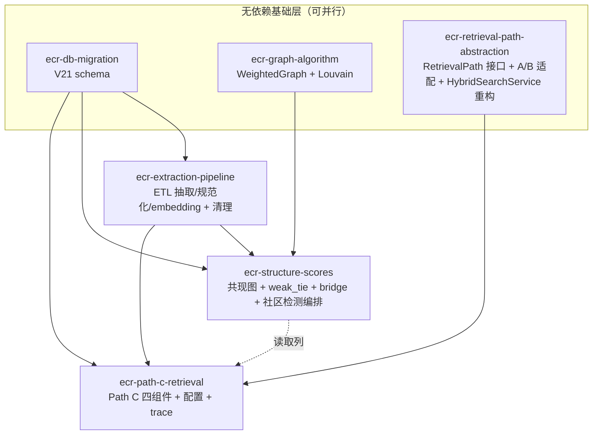

# Design — Entity-Centric Retrieval (Parent)

## Authoritative Source

完整技术设计见 **`docs/design/entity-centric-retrieval.md`**（1605 行，已通过 2 轮审计）。本文件仅记录父任务集成层的设计补充；任何正文细节以主文档为准。子任务的 `design.md` 同样是指向主文档的薄指针 + 子任务级边界。

## Integration Architecture（跨子任务视图）

## Cross-Child Contracts（跨子任务接口契约，违反 = 集成失败）

1. **Mapper 归属**：`EntityMapper`/`EventMapper`/`ChunkEntityMapper` 属 `ecr-extraction-pipeline`；`EntityCooccurrenceMapper` 属 `ecr-structure-scores`。后者不得重定义前三者的方法。
2. **degree 列**：`rag_entity.degree` 是派生列，由 `ecr-extraction-pipeline` 在写入 `rag_chunk_entity` 时增量维护、在清理时全量重算（§8.4）。`ecr-structure-scores` 仅读取 degree 用于 `WHERE degree < 100` 性能预算，**不得写**。
3. **结构分列**：`weak_tie_score`/`bridge_score`/`community_id`/`community_stale` 由 `ecr-structure-scores` 离线写入；`ecr-path-c-retrieval` 仅读取参与融合排序，**不得写、不得在线计算**。
4. **RetrievalPath 注册**：`EntityRetrievalPath`（path-c）注册为 `@Component + @ConditionalOnProperty(app.rag.entity.enabled)`；`HybridSearchService`（retrieval-path-abstraction）通过 `List<RetrievalPath>` 构造注入自动收集——path-c 的 Bean 不存在时 Path C 自动缺席。
5. **事件契约**：`EtlVectorizedEvent(documentId, userId, teamId)`（extraction-pipeline 新增）由 FastTrackStrategy.asyncVectorize 在 `loader.load()` 成功后发布；`EntityExtractionService` 同时监听 `EtlCompletedEvent`（StandardStrategy）与 `EtlVectorizedEvent`（FastTrack），委托同一 `extractAndIndex`。
6. **配置契约**：`RagRetrievalProperties.EntityRetrievalProperties` 嵌套 record（path-c）挂在主 record 的 `entity` 字段；`withOverrides` 透传 `entity`。`app.rag.entity.*` yaml 绑定。

## Compatibility / Migration

- V21 为纯新增迁移，不改 V1-V19 任何对象；回滚 = `DROP TABLE/VIEW`（子任务 implement.md 须提供 down SQL 用于验证，即便 Flyway 不执行）。
- `vector_store` 表结构零改动（Spring AI 契约）。
- 默认 `entity.enabled=false`，灰度上线，详见 §12.3。

## Integration Test Strategy（父任务验收层）

- **跨子任务集成测试**由父任务在所有子任务完成后追加：ingest 多主题文档 → 断言四表 populated → 触发结构分批处理 → 断言 weak_tie/bridge 非默认 → 多跳 query → 断言 Path C trace + 结果正确。
- 跨用户隔离测试：双用户 ingest 共享实体名的文档，断言共现图/query 结果互不泄露。
- supersede 测试：上传 v1 → supersede v2，断言 v1 实体索引清理、v2 重建、共享实体 degree 正确。

## Rollback Shape

- 代码层：`entity.enabled=false` 即时关闭 Path C；ETL 抽取/结构分批处理可通过独立开关停（§7.1 `weakTieEnabled`/`communityDetectionEnabled`）。
- 数据层：V21 down SQL 删除四表一视图；`vector_store` 不受影响，Path A/B 持续可用。

## Design Principle Mapping（父任务层汇总，详情见各子任务 design.md）

| 原则 | 落实点 | 子任务 |
|---|---|---|
| SRP | 三处多职责类拆分（抽取/检测/检索各拆 3-5 类） | extraction / structure-scores / path-c |
| OCP | RetrievalPath 注册机制 + 嵌套配置 record | retrieval-path-abstraction / path-c |
| DIP | 依赖 ChatCapable / WeightedGraph 抽象 | extraction / path-c / structure-scores |
| CARP | 图算法下沉 `infrastructure/algorithm/graph/` | graph-algorithm / structure-scores |
