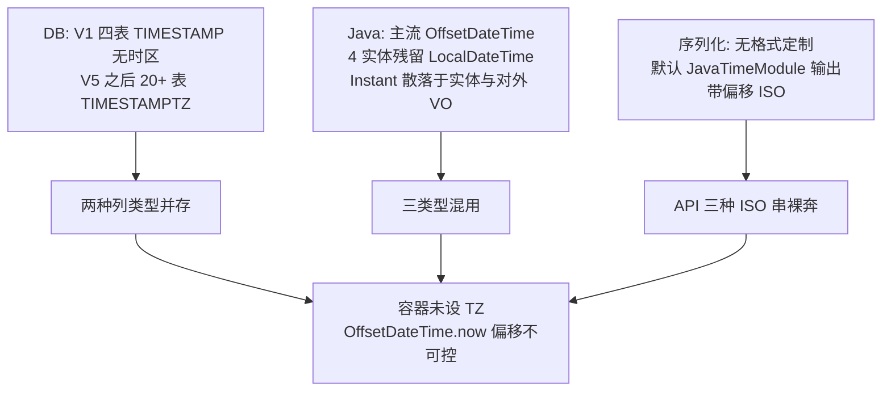
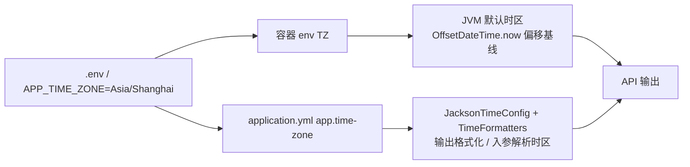

# 后端时间类型与时区统一

> 状态：已实现（2026-08-18 验收通过：§12 全部达成，测试矩阵 25 用例全绿）
>
> 范围：后端全模块（DB DDL、Java 实体/DTO/Mapper/Service/Controller、全局序列化与参数绑定、容器时区）

## 1. 目标定义

全栈时间表达统一为单一契约：存储用绝对时间点，API 输出固定为 `yyyy-MM-dd HH:mm:ss`、展示时区可配置（默认东八区）、无偏移量、无多格式分支。

对外 API 任意时间字段一律输出：

```text
2026-06-20 14:30:00
```

不再出现 `2026-06-20T14:30:00+08:00`、`2026-06-20T06:30:00Z`、`2026-06-20T14:30:00` 三种 ISO 串并存的局面。

## 2. 设计原则

本次重构遵守以下约束：

1. **修根因，不修症状。** 不加 `if` 特殊分支、不复制改参数、不开绕过开关。补丁堆比干净重写更糟时，就地重写。
2. **应用层：改定义，不留兼容。** 上线前无存量用户，不留兼容层。只为承载旧形态而存在的应用代码（手动 `toString` 转换、双类型分支）一律删除。
3. **数据层：Flyway 按序递增。** 项目已采用 Flyway 管理迁移，遵守其不可变迁移契约——不回溯改写已发布迁移（`V1`/`V9`/`V10` 原样保留），不删迁移文件，按最大序号往后递增新增一个迁移收口残留的 `TIMESTAMP` 列。无存量数据，部署时 `flyway clean` + `migrate` 重建即可，新迁移无需承载历史数据搬运。

另一项独立约束由需求给出：**时区不写死**。展示时区是部署级配置项，默认东八区，可被环境变量覆盖。

## 3. 当前实现与根因

代码库冻结在一次未完成的全局迁移中途，表现为三层独立缺陷叠加：



实测残留点（均在 `src/main` 中逐处核实）：

- **DB**：`V1__init_schema.sql` 中 `system_prompt`、`model_params`、`token_usage`、`rag_document` 的时间列为 `TIMESTAMP`（无时区）；`rag_document` 后由 V10 补救式 `ALTER` 为 `TIMESTAMPTZ`。
- **Java 实体（LocalDateTime 残留 4 处）**：`ModelParams`、`SystemPrompt`、`TokenUsage`、`AdminAuditLog`。其中 `AdminAuditLog` 的 DDL（V17）已是 `TIMESTAMPTZ`——Java 类型与列类型不匹配，是与当年 `Conversation` 同构的潜在 `PSQLException`，只是尚未触发。
- **LocalDateTime 构造点（构造侧，与实体配对）**：`AdminAuditAspect.java:104 entry.setCreatedAt(LocalDateTime.now())` 与上述 4 实体的构造器 `LocalDateTime.now()`。
- **Instant 在对外 VO（非内部专用）**：`admin/dto/TraceEventVO.java:34`、`admin/dto/AgentEventVO.java:26` 的 `createdAt` 是 `Instant`，经 `AdminTraceController.listTraces`/`listAgentEvents` 直接返回对外 API；源实体 `TraceEvent`、`AgentSessionEvent` 同为 `Instant`。它们当前裸奔输出 `...Z` 的 UTC ISO 串。
- **API 出口**：无任何 java.time 格式定制（见 §6 根因澄清）。三种格式并存。
- **容器**：`docker-compose*.yml` 未设 `TZ`，JVM 跑默认时区，`OffsetDateTime.now()` 的偏移不可控。
- **兼容层**：`mcp/admin/dto/ServerConfigResponse` 的时间字段是 `String`，靠 `from()` 手动 `toString` 转换——典型的为承载旧形态而存在的胶水层。

## 4. 统一契约

| 层 | 类型 | 说明 |
| --- | --- | --- |
| DB 列 | `TIMESTAMPTZ` | 绝对时间点，唯一列类型 |
| Java 实体/VO（对外） | `OffsetDateTime` + `Instant` | 两种类型均出现在对外 API；二者由同一套全局序列化配置统一格式化 |
| 内部专用 | `Instant` | `OutboxEntry` 等做时间差计算，不出 API |
| API 输出 | `yyyy-MM-dd HH:mm:ss` 字符串 | 全局 Jackson 配置格式化，展示时区取自配置项 |
| API 入参（@RequestBody） | `OffsetDateTime` | 全局反序列化器，按展示时区还原绝对时刻 |
| API 入参（@RequestParam） | `OffsetDateTime` | 全局 `Formatter` 绑定，按展示时区补偏移（见 §6） |

**关键澄清（修 P0-1）**：`Instant` 并非"内部专用"。它既出现在内部 `OutboxEntry`（epoch 语义），也直接出现在对外 `TraceEventVO`/`AgentEventVO`。本次不强行把 VO 的 `Instant` 改成 `OffsetDateTime`——那会引入实体到 VO 的转换胶水且无正确性收益；两类类型都由 §6 的全局配置统一格式化输出。

`LocalDateTime` 在持久化与 API 边界彻底消失。`DateTimeTools` 内 `LocalDateTime.now(zoneId)` 是给 LLM 看的展示文案生成，属展示层自由构造，不在本次范围。

## 5. 时区配置化设计

展示时区是部署级配置，不写死在代码或 DDL。展示时区与 JVM 时区从同一环境变量派生：



配置定义（`application.yml`）：

```yaml
app:
  time-zone: ${APP_TIME_ZONE:Asia/Shanghai}
  date-format: yyyy-MM-dd HH:mm:ss
```

绑定类：

```java
@ConfigurationProperties("app")
public record AppProperties(ZoneId timeZone, String dateFormat) {}
```

容器层 `docker-compose*.yml`：

```yaml
environment:
  TZ: ${APP_TIME_ZONE:-Asia/Shanghai}
```

`.env.example` 补 `APP_TIME_ZONE=Asia/Shanghai`。

这样 `OffsetDateTime.now()` 的偏移（JVM `TZ`）与 API 输出展示时区（`app.time-zone`）从同一源派生，永远一致；改部署时区只改一处，代码零分支。

**PostgreSQL 会话时区的边界（修 P1-3）**：容器 `TZ` **不会**自动设置 PostgreSQL 的 `timezone` GUC（官方镜像默认 UTC，需 `PGTZ` 或 `postgresql.conf`）。本次**不**为此加 `PGTZ`——对 `TIMESTAMPTZ` 列这不构成正确性问题：列存的是绝对时刻，JDBC 读回的 `OffsetDateTime` 偏移随会话时区，但绝对时刻正确，Jackson 再 `atZoneSameInstant(configTZ)` 归一化，展示永远对。因此"JVM 偏移、展示时区、PG 会话时区三者一致"既非事实也非必要。框架自带表 `SPRING_AI_CHAT_MEMORY."timestamp"`（无时区列）由 Spring AI 拥有，本项目不映射为 java.time，不纳入本次范围。

## 6. 全局序列化与参数绑定

### 6.1 根因澄清（修 P0-2）

`pom.xml` 引入 `spring-boot-starter-web`（无 JSON 排除），传递带入 `spring-boot-starter-json`。Spring Boot 3.5.14 的 `JacksonAutoConfiguration` **已自动注册 `JavaTimeModule`**——这正是今天 `OffsetDateTime`/`Instant` 能以 ISO 串（而非数组，`SerializationFeature.WRITE_DATES_AS_TIMESTAMPS=false` 默认）输出的原因。

所以缺的不是"注册 module"。真正缺的是**输出格式**：默认 `JavaTimeModule` 输出带偏移的 ISO-8601（`+08:00` / `Z`），目标是丢弃偏移的 `yyyy-MM-dd HH:mm:ss`。因此配置类的职责是**覆盖 serializer**，而非重复 `registerModule(JavaTimeModule)`。

### 6.2 配置类与共享 codec（修 P0-2 / P0-5 / 构造签名）

jsr310 原生 `OffsetDateTimeSerializer`/`OffsetDateTimeDeserializer`/`InstantSerializer`/`InstantDeserializer` **没有** `(DateTimeFormatter, TimeZone)` 或 `(ZoneId, DateTimeFormatter)` 构造——它们的定制点是 `withFormat(...)` 或子类，且无法原生表达"丢偏移按配置时区格式化"和"带偏移/无偏移双口径解析"。因此本方案**自写**序列化器/反序列化器（`extends JsonSerializer<T>` / `extends JsonDeserializer<T>`），不用原生类。

**实施增补（Spring Framework 6.2 急切校验，实测 P0）**：`JsonSerializer<T>`/`JsonDeserializer<T>` 的默认 `handledType()` 返回 `Object.class`——泛型参数**不会**自动反射。Spring 6.2 起（本项目 spring-web 6.2.18，Boot 3.5.14）`Jackson2ObjectMapperBuilder.serializers(...)`/`deserializers(...)` 在注册时急切调用 `handledType()`，返回 `null` 或 `Object.class` 直接抛 `IllegalArgumentException("Unknown handled type in <class>")`，导致 `jacksonObjectMapperBuilder` 工厂方法启动失败。因此每个自写序列化器/反序列化器**必须**覆写 `handledType()` 返回具体类型（本项目 4 个类均已覆写；Spring ≤6.1 无此校验，样例可侥幸通过，6.2 起必炸）。

**根因约束**：输出与解析逻辑在 Jackson 与 Spring 两条入口只能有一份实现（§2 不复制改参数）。因此抽一个共享 codec，序列化器/反序列化器/`Formatter` 全部委托给它。"口径一致"由"同一份代码"保证，而非文档声明。

**共享 codec**（`config/time/TimeCodec.java`，纯值类，由 `JacksonTimeConfig` 注册为单例 `@Bean`）：

```java
public final class TimeCodec {
    private final DateTimeFormatter printFormatter;   // yyyy-MM-dd HH:mm:ss，无 zone
    private final ZoneId zone;                        // app.timeZone

    public TimeCodec(ZoneId zone, String pattern) {
        this.zone = zone;
        this.printFormatter = DateTimeFormatter.ofPattern(pattern);
    }

    /** 输出：任意时刻归一到配置时区后格式化，丢偏移。 */
    public String format(Instant instant) {
        return instant.atZone(zone).format(printFormatter);
    }

    /** 配置时区（反序列化器/Formatter 还原 OffsetDateTime 时取偏移用）。 */
    public ZoneId zone() { return zone; }

    /** 解析：带偏移串（ISO-8601）优先；无偏移串按配置时区补偏移。返回绝对时刻。 */
    public Instant parse(String text) {
        try {
            return OffsetDateTime.parse(text).toInstant();      // 带偏移
        } catch (DateTimeParseException offset) {
            // 无偏移串（pattern "yyyy-MM-dd HH:mm:ss"，空格分隔）——用配置 printFormatter 而非
            // 默认 ISO_LOCAL_DATE_TIME（后者要求 'T' 分隔符）按配置时区补偏移
            LocalDateTime ldt = LocalDateTime.parse(text, printFormatter);
            return ldt.atZone(zone).toInstant();
        }
    }
}
```

`parse` 的双口径是显式契约：先尝试 ISO-8601 带偏移（`2026-06-20T14:30:00+08:00`），失败再按配置时区解释无偏移串（`2026-06-20 14:30:00`）。两个分支落入同一 `Instant`，绝对时刻唯一。

**序列化器**（`config/time/OffsetDateTimeJsonSerializer.java`、`config/time/InstantJsonSerializer.java`）：

```java
public final class OffsetDateTimeJsonSerializer extends JsonSerializer<OffsetDateTime> {
    private final TimeCodec codec;
    public OffsetDateTimeJsonSerializer(TimeCodec codec) { this.codec = codec; }

    @Override
    public void serialize(OffsetDateTime v, JsonGenerator g, SerializerProvider p) throws IOException {
        g.writeString(codec.format(v.toInstant()));   // atZoneSameInstant(zone) 在 codec 内完成
    }
}
// InstantJsonSerializer 结构同，委托 codec.format(v)。
```

**反序列化器**（`config/time/OffsetDateTimeJsonDeserializer.java`、`config/time/InstantJsonDeserializer.java`）：

```java
public final class OffsetDateTimeJsonDeserializer extends JsonDeserializer<OffsetDateTime> {
    private final TimeCodec codec;
    public OffsetDateTimeJsonDeserializer(TimeCodec codec) { this.codec = codec; }

    @Override
    public OffsetDateTime deserialize(JsonParser p, DeserializationContext c) throws IOException {
        return OffsetDateTime.ofInstant(codec.parse(p.getValueAsString()), codec.zone());
    }
}
// InstantJsonDeserializer.deserialize 返回 codec.parse(text)。
```

**注册**（`config/JacksonTimeConfig.java`）：

```java
@Configuration
public class JacksonTimeConfig {

    @Bean
    TimeCodec timeCodec(AppProperties app) {
        return new TimeCodec(app.timeZone(), app.dateFormat());
    }

    @Bean
    Jackson2ObjectMapperBuilderCustomizer javaTimeCustomizer(TimeCodec codec, AppProperties app) {
        return builder -> builder
            .serializers(
                new OffsetDateTimeJsonSerializer(codec),
                new InstantJsonSerializer(codec))
            .deserializers(
                new OffsetDateTimeJsonDeserializer(codec),
                new InstantJsonDeserializer(codec))
            .timeZone(TimeZone.getTimeZone(app.timeZone()));
    }
}
```

**不注册 `LocalDateTime` 的 serializer/deserializer**——`LocalDateTime` 在全栈清理后彻底消失，留它的序列化分支本身就是"为旧形态保留的兼容层"，按 §2 删除。不写 `@JsonFormat` 散点注解，不开 per-field 开关。

### 6.3 @RequestParam 入参绑定（修 P1-7 / 解析口径）

`UsageController` 的 `startTime`/`endTime` 是查询参数（`@RequestParam` + `@DateTimeFormat(iso = DateTimeFormat.ISO.DATE_TIME)`），走 Spring `ConversionService`/`Formatter`，**不走 Jackson 反序列化**。该注解按 ISO-8601 解析（接受带偏移串），但无法把无偏移串 `2026-06-20 14:30:00` 解析成 `OffsetDateTime`（缺偏移信息）。移除注解后，全局 `Formatter` 的双口径解析同时覆盖带偏移与无偏移两种既有入参格式。

根因修复：注册一个全局 `Formatter<OffsetDateTime>`，**复用 §6.2 的 `TimeCodec`**（不复制解析逻辑）。`Formatter.parse` 与 Jackson `deserialize` 委托同一个 `codec.parse`，因此 `@RequestBody` 与 `@RequestParam` 接受的串语法、解析时区、回退顺序完全相同——这是代码级一致，不是声明。

```java
public final class OffsetDateTimeParamFormatter implements Formatter<OffsetDateTime> {
    private final TimeCodec codec;
    public OffsetDateTimeParamFormatter(TimeCodec codec) { this.codec = codec; }

    @Override public String print(OffsetDateTime v, Locale l) { return codec.format(v.toInstant()); }
    @Override public OffsetDateTime parse(String text, Locale l) {
        return OffsetDateTime.ofInstant(codec.parse(text), codec.zone());
    }
}

@Configuration
public class TimeFormattersConfig implements WebMvcConfigurer {
    private final TimeCodec codec;
    public TimeFormattersConfig(TimeCodec codec) { this.codec = codec; }  // Spring 单例 bean

    @Override
    public void addFormatters(FormatterRegistry registry) {
        registry.addFormatter(new OffsetDateTimeParamFormatter(codec));
    }
}
```

`TimeCodec` 注册为单例 `@Bean`（由 `JacksonTimeConfig.timeCodec(AppProperties)` 工厂方法创建），由 `JacksonTimeConfig` 与 `TimeFormattersConfig` 共享同一实例。`UsageController` 入参改 `OffsetDateTime` 后移除 `@DateTimeFormat`（格式与时区由 `TimeCodec` 单点定义，不在 Controller 重复 pattern）。

### 6.4 作用域边界（修 P1-6）

全局 customizer 作用于 **Spring 主 `ObjectMapper`**，覆盖：
- 所有 `@ResponseBody` JSON 响应；
- SSE 对象帧——`SseStreamBridge` 经 `SseEmitter.event().data(payload)` 发送对象（`canceled`/`error`/tail 帧），Spring 用同一主 `ObjectMapper` 序列化。

代码库另有17 处 `new ObjectMapper()`（含实现后新增的 `DocumentStatusCodec`，2026-08-14）（`GenericChatClient`、`TokenCacheService`、`OutboxRelay`、`OutboxMessageBus`、`EntitySeedExtractor`、`DbByokConfigSource`、`ToolResult`、`McpToolUtils`、各 LLM client 等）及 Redisson `JsonJacksonCodec`。这些是**内部序列化**（LLM 请求体、工具结果、配置 JSON、消息 headers、缓存对象），当前均不向 API 出口发射裸 java.time 对象（如 `TokenCacheService` 用 `Instant.now().toString()` 手动预转字符串）。

这些离群 mapper **不在本次 customizer 作用域内**。本次不承诺"覆盖所有 java.time 输出"——只承诺覆盖对外 API 出口。实现阶段须逐处审计确认无离群 mapper 把 java.time 对象写入 API 边界；若发现某处会，则将该处改注入 Spring 主 `ObjectMapper` 而非 `new`（修根因），不为离群 mapper 单独复制格式配置（不修症状）。

## 7. 数据层：Flyway 递增迁移

遵守 Flyway 不可变迁移契约：`V1`/`V9`/`V10` 原样保留，不回溯改写、不删文件。按最大序号往后递增新增一个迁移，收口 V1 残留的 3 张 `TIMESTAMP` 表（`rag_document` 已由 V10 收口，不重复）。

**新增 `V25__unify_timestamp_to_timestamptz.sql`**：

```sql
-- 收口 V1 残留的 TIMESTAMP（无时区）列为 TIMESTAMPTZ。
-- rag_document 已由 V10 统一，本迁移不重复。

ALTER TABLE system_prompt
    ALTER COLUMN created_at TYPE TIMESTAMPTZ USING created_at AT TIME ZONE 'Asia/Shanghai',
    ALTER COLUMN updated_at TYPE TIMESTAMPTZ USING updated_at AT TIME ZONE 'Asia/Shanghai';

ALTER TABLE model_params
    ALTER COLUMN created_at TYPE TIMESTAMPTZ USING created_at AT TIME ZONE 'Asia/Shanghai',
    ALTER COLUMN updated_at TYPE TIMESTAMPTZ USING updated_at AT TIME ZONE 'Asia/Shanghai';

ALTER TABLE token_usage
    ALTER COLUMN created_at TYPE TIMESTAMPTZ USING created_at AT TIME ZONE 'Asia/Shanghai';
```

`AT TIME ZONE 'Asia/Shanghai'` 把无时区列值按东八区解释为绝对时刻——与本次确立的展示时区一致。无存量数据，该解释的实际影响为零（部署时 `clean` 重建后表为空），但语义上必须正确声明，避免将来有人在不 `clean` 的环境补跑时产生歧义。这是选择 Flyway 不可变契约（不回改 V1）的代价——硬编码仅作用于空表的 DDL 解释，不进入运行时；运行时时区仍由 `APP_TIME_ZONE` 单点控制。

**不动的迁移**：`V1`（保留其 `TIMESTAMP` 定义）、`V9`（4 条 `COMMENT` 已在此）、`V10`（`rag_document` 的 `ALTER` + team 表 `COMMENT` 已在此）、`V7`（Spring AI 框架自带表 `SPRING_AI_CHAT_MEMORY."timestamp"`，框架契约决定，本项目不映射为 java.time）。

**部署操作**：开发与预发环境执行 `flyway clean` 后 `flyway migrate`。新迁移在 `clean` 重建的空库上跑 `ALTER`，本质是 DDL 统一，无数据搬运成本。

## 8. 应用层清理

`LocalDateTime` 在持久化与 API 边界全部替换为 `OffsetDateTime`，所有构造点 `LocalDateTime.now()` 改为 `OffsetDateTime.now()`（偏移由 JVM `TZ` 决定，与配置一致）。MyBatis-Plus 自动填充（`MyBatisPlusMetaHandler`）已是 `OffsetDateTime`，无需改动。

构造点清理必须覆盖实体构造器与切面/服务侧的 `setCreatedAt(LocalDateTime.now())`：
- `ModelParams`/`SystemPrompt`/`TokenUsage`/`AdminAuditLog` 实体字段 + getter/setter + 构造器 `now()`；
- `AdminAuditAspect.java:104` 的 `entry.setCreatedAt(LocalDateTime.now())`（修 P1-5：首轮漏列）；
- `UsageServiceImpl` 的 4 处 `LocalDateTime.now().minusDays(...)`。

## 9. 兼容层删除

只为承载旧形态而存在的代码一律删除，不保留委托、别名或开关：

- **`ServerConfigResponse`**：时间字段 `String` 改为 `OffsetDateTime`，`from()` 中手动 `toString` 转换整段删除，由全局 Jackson 配置统一输出。
- **`MyBatisPlusMetaHandler`**：`createTime`/`updateTime` 与 `createdAt`/`updatedAt` 并存填充，源于 `rag_document` 与其余表的字段命名差异（业务现实，非兼容层），逻辑不变，仅更新注释说明原因，删除任何"为旧字段兜底"的措辞。

## 10. 测试设计

- **全局序列化测试**：对 `OffsetDateTime`、`Instant` 两类字段断言输出均为 `yyyy-MM-dd HH:mm:ss` 无偏移，且按配置时区取值。改 `APP_TIME_ZONE` 后断言输出随之变化（验证未写死）。**不含 `LocalDateTime` 用例**（该类型已消失，§6.2 不注册其序列化器）。
- **反序列化器双口径测试（修 P2-13）**：`@RequestBody` 入参同时接受带偏移串（`2026-06-20T14:30:00+08:00`）与无偏移串（`2026-06-20 14:30:00`），两者解析到同一绝对时刻。
- **`@RequestParam` 查询参数解析（修 P2-13）**：`UsageController` 的 `startTime=2026-06-20 14:30:00` 经全局 `Formatter<OffsetDateTime>` 正确绑定，验证 `@DateTimeFormat` 已移除、pattern 单点定义。
- **离群 mapper 不回归（修 P2-13）**：审计确认 17 处 `new ObjectMapper()` 与 Redisson codec 均不向 API 边界发射裸 java.time；对确实发射的个别处，断言改注入主 mapper 后格式正确。
- **`UsageController`/`UsageService` 测试**：入参 `LocalDateTime` 改 `OffsetDateTime`，时间窗聚合查询在 PostgreSQL 上回归通过。
- **`AdminAuditLog` 持久化测试**：经 `AdminAuditAspect` 插入与读取不再触发类型不匹配异常（验证隐藏 bug 已修）。
- **现有时间契约测试复用（修 P2-13）**：复用既有 MCP 实体时间契约测试（TIMESTAMPTZ + OffsetDateTime round-trip），扩展覆盖本次新增的全局格式化。

## 11. 实现改动范围

| 文件 | 动作 |
| --- | --- |
| `config/AppProperties.java` | 新增，绑定 `app.time-zone`、`app.date-format` |
| `config/time/TimeCodec.java` | 新增 `@Component`，`format`/`parse` 唯一实现；`parse` 双口径（带偏移 ISO-8601 优先，无偏移按配置时区补） |
| `config/time/OffsetDateTimeJsonSerializer.java` | 新增，`extends JsonSerializer<OffsetDateTime>`，委托 codec |
| `config/time/InstantJsonSerializer.java` | 新增，`extends JsonSerializer<Instant>`，委托 codec |
| `config/time/OffsetDateTimeJsonDeserializer.java` | 新增，`extends JsonDeserializer<OffsetDateTime>`，委托 codec |
| `config/time/InstantJsonDeserializer.java` | 新增，`extends JsonDeserializer<Instant>`，委托 codec |
| `config/JacksonTimeConfig.java` | 新增，注入 `TimeCodec` 注册上述 4 个序列化器/反序列化器（不注册 `LocalDateTime`，不重复注册 module） |
| `config/time/OffsetDateTimeParamFormatter.java` | 新增，`implements Formatter<OffsetDateTime>`，委托同一 codec |
| `config/TimeFormattersConfig.java` | 新增，注册 `OffsetDateTimeParamFormatter` 覆盖 `@RequestParam` 绑定 |
| `src/main/resources/application.yml` | 加 `app.time-zone`、`app.date-format` |
| `.env.example` | 加 `APP_TIME_ZONE=Asia/Shanghai` |
| `docker-compose.yml` / `docker-compose.prod.yml` / `docker-compose.2c4g.yml` | 加 `TZ: ${APP_TIME_ZONE:-Asia/Shanghai}` |
| `db/migration/V25__unify_timestamp_to_timestamptz.sql` | 新增，收口 `system_prompt`/`model_params`/`token_usage` 的 `TIMESTAMP` → `TIMESTAMPTZ`（`rag_document` 已由 V10 处理）；`V1`/`V9`/`V10` 原样保留 |
| `chat/entity/ModelParams.java` | `LocalDateTime` → `OffsetDateTime` |
| `chat/entity/SystemPrompt.java` | 同上 |
| `chat/entity/TokenUsage.java` | 同上 |
| `admin/entity/AdminAuditLog.java` | 同上（修正 TIMESTAMPTZ 类型不匹配） |
| `infrastructure/audit/AdminAuditAspect.java` | `:104` 构造点 `LocalDateTime.now()` → `OffsetDateTime.now()` |
| `chat/dto/SystemPromptDTO.java` | `LocalDateTime` → `OffsetDateTime` |
| `chat/dto/TokenUsageDTO.java` | 同上 |
| `chat/mapper/TokenUsageMapper.java` | 4 方法参数类型 |
| `chat/service/UsageService.java` | 6 方法签名 |
| `chat/service/impl/UsageServiceImpl.java` | 签名 + 4 处 `now()` |
| `chat/controller/UsageController.java` | 入参 `OffsetDateTime`，移除 `@DateTimeFormat` |
| `mcp/admin/dto/ServerConfigResponse.java` | 时间字段 `String` → `OffsetDateTime`，删手动转换 |
| `config/MyBatisPlusMetaHandler.java` | 更新注释，逻辑不变 |
| 17 处 `new ObjectMapper()` | 逐处审计；向 API 边界发射 java.time 者改注入主 mapper |
| 相关 `*Test.java` | 类型、序列化、参数绑定、SSE 帧、离群 mapper 断言同步 |

## 12. 完成标准

- 代码中不存在 `LocalDateTime` 持久化字段或 API 入参/出参类型（`DateTimeTools` 展示文案除外）。`JacksonTimeConfig` 中不注册 `LocalDateTime` 序列化器。
- 时间格式化与解析只有一份实现（`TimeCodec`）；Jackson 序列化器/反序列化器与 Spring `Formatter` 全部委托它，`@RequestBody` 与 `@RequestParam` 解析口径由代码级共享保证一致。
- 不存在手动 `toString` 时间转换胶水层。
- 数据层通过单一新增迁移 `V25` 统一本项目自有的 V1 残留 `TIMESTAMP` 列（`system_prompt`/`model_params`/`token_usage`）为 `TIMESTAMPTZ`；`rag_document` 已由 V10 收口，框架表 `SPRING_AI_CHAT_MEMORY."timestamp"` 豁免。不回溯改写或删除已发布迁移（`V1`/`V9`/`V10` 原样保留），遵守 Flyway 不可变契约。
- 改 `APP_TIME_ZONE` 单一环境变量，JVM 时区与 API 输出展示时区同步变化，代码零改动（PostgreSQL 会话时区不受其控制，但对 `TIMESTAMPTZ` 不构成正确性问题）。
- 17 处离群 `new ObjectMapper()`（`DocumentStatusCodec` 为实现后新增，2026-08-18 复核：仅序列化 SSE 状态码载荷，不含 java.time 对象） 经审计确认不向 API 边界发射裸 java.time；对发射者已改注入主 mapper。
