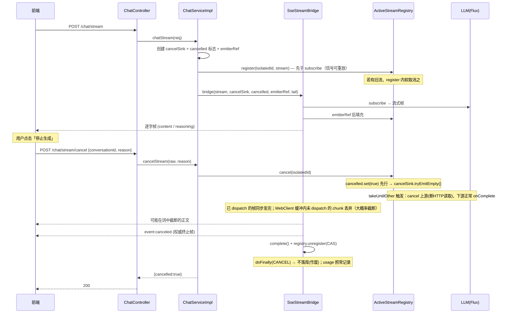
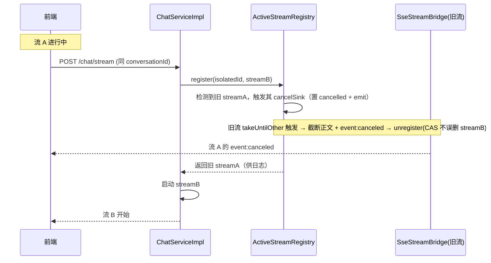

# 流式对话取消生成端点设计

> 目标：为前端「停止生成」交互提供显式、可靠、可观测的取消入口。
> 核心语义：**优雅终止（soft cancel）**——停止从 LLM 拉取新 token（断开 HTTP 读取），
> 并让下游以正常 `onComplete` 终止，以便桥接层发送权威的 `event:canceled` 终止帧后再 `complete()` emitter。
> 取消后**一律不落库**，用户须重新生成或复述问题才能继续。
>
> 关键预期（必须读）：取消后的帧序列是「**可能在任意位置截断的正文 + 权威的 `event:canceled`**」。
> 大概率在词中 / 句中被截断，**半句截断是常态**，不是「结尾完整」。前端以 `canceled` 为权威终止信号。
>
> 关联文档：
> - [chat-mode-strategy-step2-execute-sinking.md](chat-mode-strategy-step2-execute-sinking.md) §7.6/7.12（流式执行下沉与 `doFinally` 落库语义）
> - [llm-unified-spi-refactoring.md](llm-unified-spi-refactoring.md) §5.1（`ChatCapable.chatStream` 契约）

## 1. 背景与动机

### 1.1 现状：已有「隐式中断」，缺「显式取消」

当前 `POST /api/chat/stream` 的流式链路为：

```
ChatController.chatStreamPost
  → ChatServiceImpl.chatStream          构建 Flux<StreamFrame>（经 fallbackExecutor 跨模型降级）
  → SseStreamBridge.bridge              订阅 Flux 成 SseEmitter
```

`SseStreamBridge.subscribe` 已注册 `emitter.onCompletion(subscription::dispose)`、
`onTimeout`、`onError`。客户端断开 SSE 连接时，Reactor 订阅被 `dispose()`，cancel 信号沿上游传播到
`ChatCapable.chatStream` 的 `Flux<StreamChunk>`，LLM 连接随之断开。

**即：客户端断连本身已能中断生成。** 缺的是一个显式、可控、可统计的取消入口。

### 1.2 隐式中断的痛点

| 痛点 | 显式端点如何解决 |
|---|---|
| 客户端断连语义模糊：网络抖动 / 页面关闭 / 用户主动停止无法区分 | 带 `reason` 字段标记 `USER_ABORT`，区分于断连 |
| Nginx / 网关 buffer 下，断连信号传到后端 SseEmitter 延迟甚至丢失，流空转烧 token | 服务端主动触发软取消，不依赖客户端连接状态 |
| 跨标签 / 跨设备停止（在 B 处停 A 的生成）做不到 | 按 `conversationId` 取消，与发起连接无关 |
| 无法统计主动中断率 | 打点 `chat.stream.cancelled{reason}` |

### 1.3 已有的落库行为（关键前置）

`AbstractModeStrategy.doExecuteStream` 的 `.doFinally(signal -> onStreamComplete(...))` 在所有终止
信号（`ON_COMPLETE` / `ON_ERROR` / `CANCEL`）下都会触发 `StreamCompletionHelper.onComplete`：

- `ON_COMPLETE` → `publishMessageSave` 落 user + 完整 assistant
- `CANCEL` / `ON_ERROR` → `savePartialResponse` 落**部分** assistant

本设计的「取消不落库」语义将修改 CANCEL 分支（见 §5.3）。

> 注意：`doFinally` 内另有 `usageRecorded.compareAndSet(false,true) → recordUsage(...)`（AbstractModeStrategy:176-178），
> **不受 CANCEL 影响**——取消时 token 确实已被消耗，usage 照常记录，仅消息不落库（见 §5.3 说明）。

## 2. 设计目标

### 2.1 目标

- 提供 `POST /api/chat/stream/cancel` 端点，实现**优雅终止**：断开与 LLM 的连接（停止拉取新 token），
  并让下游正常 `onComplete`，以便桥接层发出 `event:canceled` 后再 `complete()`。
- 明确预期：取消后**大概率在词中 / 句中截断**，不是「发完最后一帧才停」。`takeUntilOther` 的价值是让
  下游以正常 `onComplete` 终止（桥接层得以发终止帧并 `complete` emitter），**而非冲刷 buffer**——
  `takeUntilOther` 处无缓冲队列，每个 `onNext` 同步转发给 `sendFrame`；取消瞬间已 dispatch 的帧会发完，
  但还躺在 WebClient SSE 接收缓冲里未被 dispatch 的 chunk 全部丢弃（cancel 即断连接）。
- 取消后**一律不落库**（含用户主动取消与意外断连），会话历史保持干净，用户须重新生成或复述才能继续。
- 支持单会话单活跃流约束：新发起 `chat/stream` 时自动取消该会话的旧流。
- 天然防越权：取消键基于已隔离的 `conversationId`，A 用户取消不到 B 的流。
- 可观测：取消事件打点（沿用 `LlmMetrics` 的 null-safe 包装模式）+ 日志（MDC 含 conversationId）。

### 2.2 非目标

- 不实现跨实例的取消广播（首版限单实例，进程内 registry；多实例见 §8.3）。
- 不改变 `ChatCapable.chatStream` 契约或 `SseStreamBridge` 的帧协议（仅扩展，不破坏现有 SSE 帧序列）。
- 不引入新的消息中间件或持久化结构。
- 不保证取消后正文结尾完整（半句截断是常态，见 §2.1 与 §8.1）。

## 3. 设计原则

1. **优雅终止，而非冲刷 buffer**：用 `takeUntilOther` 让下游以正常 `onComplete` 终止（桥接层得以发终止帧
   并 `complete` emitter），而非 `dispose()` 砍断 pipeline。`takeUntilOther` 处无缓冲队列，**不提供 drain 保证**——
   取消后大概率截断，产品侧应接受半句截断为常态。
2. **取消即作废**：取消的内容不进会话历史。继续对话的唯一方式是重新生成（重发同一消息）或复述。
   这让会话上下文始终干净，避免半截回复污染多轮记忆。
3. **最小契约变更**：取消键复用前端已持有的 raw `conversationId`，前端零新增状态管理。
4. **尽力而为**：取消是 best-effort，前端以 `event:canceled` 终止帧为唯一权威终止信号，忽略其后的飞行 chunk。

## 4. 核心抽象

### 4.1 `ActiveStreamRegistry`（新增）

进程内活跃流注册表。每个活跃 SSE 流注册一个条目，终止时注销。

```java
@Component
public class ActiveStreamRegistry {

    /** 键为 isolatedConversationId（含 userId 隔离） */
    private final ConcurrentHashMap<String, ActiveStream> streams = new ConcurrentHashMap<>();

    /** 单条活跃流。
     *  - cancelSink：软取消触发器（Sinks.Empty 信号对迟到订阅者可重放，见 §4.3 注册时序）
     *  - cancelled：AtomicBoolean，registry.cancel() 先置标志再 emit（同临界区，无读序竞态，见 §4.2）
     *  - emitterRef：AtomicReference，因 register 先于 bridge 创建 emitter，需后填充（见 §4.3） */
    public record ActiveStream(
            Sinks.Empty<Void> cancelSink,
            AtomicBoolean cancelled,
            AtomicReference<SseEmitter> emitterRef,
            long createdAtMs,
            String userId
    ) {}

    /** 注册：若同 conversationId 已有旧流，CAS 替换并对旧流软取消（单会话单流） */
    ActiveStream register(String isolatedId, ActiveStream stream);

    /** 软取消：先置 cancelled 标志（先行于 bridge 回调），再 tryEmitEmpty()。
     *  tryEmitEmpty 在并发/重复取消时返回 FAIL_NON_SERIALIZED/FAIL_TERMINATED —— 忽略，
     *  按 key 命中即视为已取消（首次 emit 的信号已被 sink 缓存）。返回是否命中。*/
    boolean cancel(String isolatedId) {
        ActiveStream s = streams.get(isolatedId);
        if (s == null) return false;
        s.cancelled().set(true);              // 先行写标志（见 §4.2）
        s.cancelSink().tryEmitEmpty();        // 触发 takeUntilOther；EmitResult 失败忽略（见上）
        return true;
    }

    /** 终止时注销（complete/error/timeout 回调）；CAS 防误删已被替换的新流条目 */
    void unregister(String isolatedId, ActiveStream expected);
}
```

**键设计**：`isolatedId = ConversationIdUtil.buildIsolatedId(userId, rawConversationId)`，userId 内嵌
天然实现租户隔离——A 用户的 isolatedId 与 B 用户不同，跨用户取消在 registry 层即被拒绝。

**替换语义**：`register` 时若键已存在（旧流未结束），先对旧流执行软取消再注册新流。这同时满足
「单会话单流」与注册表键不冲突。注意替换竞态见 §8.5。

**兜底清理（必须触发 cancelSink，不能只 remove）**：后台定时任务（`@Scheduled`）扫描，对
`now - createdAtMs > SSE_TIMEOUT_MS` 的僵尸条目执行 `cancel(isolatedId)`（置标志 + emit sink），
由 drain 路径自然 `unregister`；仅当条目存在性校验失败时才兜底 `remove`。僵尸条目的成因恰恰是某个
终止回调没跑（例如 emitter 建立前连接已死），此时 LLM 侧订阅仍活着、可能仍在烧 token —— 只删条目
不 cancel 会造成泄漏，**必须走 cancel 路径**。这是「兜底清理」作为双重保险的唯一合理形态。

### 4.2 `cancelled` 标志：先行写入，消除读序竞态

`takeUntilOther` 让下游 `onComplete` 与正常完成不可区分，桥接层无法仅凭 Reactor 信号判断是否被取消。
因此标志必须由取消路径**显式写入**，且写入必须**先行于**桥接层 `complete()` 回调读取：

```java
// registry.cancel() 内——同一方法（临界区）内：先置标志，再 emit
s.cancelled().set(true);          // ① 先行写标志
s.cancelSink().tryEmitEmpty();    // ② 触发 takeUntilOther → 下游 onComplete → bridge complete() 读标志
```

由于 ① 严格先行于 ②，而 ② 触发的下游回调才读标志，**无读序竞态**。

> **禁止**改用 `cancelSink.asMono().doFinally(flag::set)` 之类的订阅侧写法：标志写入与 bridge `complete()`
> 回调可能在不同线程，存在读序竞态。`AtomicBoolean` + registry 临界区写入是唯一正确形态。

### 4.3 注册时机：register 必须先于 subscribe

若 `register` 晚于 `bridge(...)` 的 `subscribe`，则存在窗口：subscribe 之后、register 之前到达的取消请求
→ registry miss → `cancelled:false`，而流照常跑完。

好在 `Sinks.Empty` 的信号对**迟到订阅者可重放**：只要 register 先于 `bridge` 的 `subscribe`，窗口内的取消
会被 sink 缓存，`takeUntilOther` 订阅时立即触发、流根本不会启动。因此顺序必须是：

```java
// ChatServiceImpl.chatStream 内
Sinks.Empty<Void> cancelSink = Sinks.empty();
AtomicBoolean cancelled = new AtomicBoolean(false);
AtomicReference<SseEmitter> emitterRef = new AtomicReference<>();

// ① 先 register（emitter 尚未创建，用 AtomicReference 后填充）
ActiveStreamRegistry.ActiveStream old = activeStreamRegistry.register(isolatedId,
        new ActiveStream(cancelSink, cancelled, emitterRef, now, userId));
if (old != null) { /* 旧流已在 register 内被软取消 */ }

// ② 再 bridge —— bridge 内部 subscribe 时，cancelSink 的信号可被重放
SseEmitter emitter = sseStreamBridge.bridge(stream, cancelSink, cancelled, emitterRef, tail, isolatedId);
emitterRef.set(emitter);   // 后填充 emitter，供 registry 兜底清理/取消发终止帧
```

> `bridge` 需新增「接受外部 `emitterRef` / `cancelSink` / `cancelled`」的重载（见改动清单）。
> 残余窗口只剩「HTTP 请求进入 controller 到 `register`」的毫秒级间隙，可接受。

### 4.4 优雅终止的 Reactor 核心

```java
Flux<StreamFrame> cancellable = stream
        // takeUntilOther: cancelSink 发出信号后 cancel 上游(断 HTTP 读取)，
        // 下游以正常 onComplete 终止 —— 桥接层借此发 event:canceled 并 complete emitter。
        // 注意：takeUntilOther 处无缓冲队列，不保证 drain；取消后大概率截断(见 §2.1)。
        .takeUntilOther(cancelSink.asMono());
```

`takeUntilOther` cancel 上游 = 断开与 LLM 的 HTTP 读取；取消瞬间已 dispatch（已 `onNext` 到下游）的帧
会被 `sendFrame` 同步发完，但躺在 WebClient SSE 接收缓冲里未被 dispatch 的 chunk 全部丢弃。**这就是
「大概率截断」的根因，也是与硬 `dispose()` 的唯一差别**：`dispose()` 连桥接层的 `onComplete` 回调都走不到
（直接 cancel 下游订阅），无法发 `event:canceled`；`takeUntilOther` 让下游正常 `onComplete`，桥接层得以收尾。

### 4.5 终止帧：`event:canceled`

`SseStreamBridge.complete` 读取 `cancelled` 标志：

- **`cancelled = true`** → 发 `event:canceled` 终止帧（替代 references/fallback/agentMetadata 收尾帧），再 `complete()`
- **`cancelled = false`**（正常完成）→ 走现有收尾帧逻辑（references → agentMetadata → fallback），再 `complete()`

```java
// 前端契约：canceled 帧是唯一权威终止信号
// event:canceled
// data:{"conversationId":"<rawConversationId>","reason":"USER_ABORT"}
```

## 5. 关键设计

### 5.1 单会话单活跃流（用户决策已确认）

`chatStream` 入口的 `register` 检测到该 conversationId 已有活跃流时，先对其软取消，再启动新流。

> **用户确认**：选择「自动取消旧流再启新流」而非「拒绝并发返回 409」。
> 理由：符合主流对话产品 UX（发新消息自动停旧生成），同时保证 registry 键不冲突。

### 5.2 取消不落库（用户决策已确认）

> **用户确认**：意外断连（网络波动等）也选择不落库，让用户重新生成。
> 这简化了设计——不需要 `reason` 区分主动/意外，CANCEL 分支统一不落库。

修改 `StreamCompletionHelper.onComplete` 的 CANCEL 分支：

```java
case ON_ERROR, CANCEL -> {
    // 取消即作废：不落库，会话历史保持干净。
    // 用户须重新生成（重发同一消息）或复述问题才能继续对话。
    // 这保证多轮记忆 advisor 不会把残缺回复喂给下一轮。
    log.info("Stream {} terminated (signal={}), partial discarded for re-generation: conversation={}",
            signal, signal, ctx.conversationId());
    // 不调 savePartialResponse
}
```

**注意**：此改动同时影响意外断连路径。原 `savePartialResponse` 的「断线兜底存档」语义被移除，
统一为「取消即作废」。这是用户明确选择的权衡——断线后重新生成比看到半截回复更符合产品语义。

**usage 照常记录**：`doFinally` 内 `usageRecorded.compareAndSet(false,true) → recordUsage(...)`（AbstractModeStrategy:176-178）
独立于落库逻辑、不受 CANCEL 影响。取消时 token 确实已被消耗，记录 usage 是对的；**仅消息不落库**，两者并存、互不影响。

### 5.3 `SseStreamBridge` 扩展

`bridge` 方法增加重载，透传 `cancelSink` / `cancelled` / `emitterRef` 与 `isolatedId`：

| 终止回调 | 行为 |
|---|---|
| `onComplete`（正常 / 优雅终止） | 读 `cancelled` 标志，发收尾帧或 `event:canceled`；`registry.unregister` |
| `onError` | 发 `event:error`（现有）；`registry.unregister` |
| `onTimeout` | `complete()`；`registry.unregister` |
| `emitter.onCompletion` | `subscription.dispose()`（现有）；`registry.unregister` |

注销使用 `unregister(isolatedId, expected)` 的 CAS 语义——若该键已被新流替换，旧流不能误删新流条目。

## 6. API 契约

### 6.1 取消端点

```
POST /api/chat/stream/cancel
# 权限沿用 ChatController 类级 @PreAuthorize("hasAuthority('chat:send')")（ChatController:23），
# 端点级不再重复注解
Content-Type: application/json

Body:
{
  "conversationId": "<rawConversationId>",   # 前端已持有，raw 形式；服务端 buildIsolatedId 后查 registry
  "reason": "USER_ABORT"                      # 枚举类型，Jackson 反序列化自带校验
}

Response: (恒 200，业务字段区分，幂等)
{
  "code": 0,
  "data": {
    "cancelled": true,          # 是否命中活跃流；false = 流不存在/已结束
    "conversationId": "xxx"     # 回显 raw conversationId，与请求体、前端持有值一致
  }
}
```

**`reason` 枚举**（打点维度，不影响行为；DTO 内用枚举类型，Jackson 反序列化自带校验，无需手工 String 校验）：
- `USER_ABORT` — 用户主动点击「停止生成」
- `NAVIGATE_AWAY` — 用户离开页面（前端 `beforeunload` 触发）
- `SESSION_SWITCH` — 用户切换会话

**幂等性**：流不存在或已结束时返回 `cancelled: false`，不报 404——「已无活跃流」对前端是合法终态，
重复取消、取消已完成的流都应成功。

### 6.2 SSE 帧序列（前端解析契约）

| 事件 | data | 触发 |
|---|---|---|
| `data`（默认） | 正文 chunk（逐字） | 正常流式 |
| `event:reasoning` | 思考过程 chunk | 正常流式（enableThinking） |
| `event:references` | 检索引用列表 | 正常完成收尾 |
| `event:agentMetadata` | Agent 元数据 | 正常完成收尾 |
| `event:fallback` | 降级信号 | 正常完成收尾 |
| `event:error` | `{error, message, attempted}` | 异常终止 |
| **`event:canceled`**（新增） | `{conversationId, reason}` | **优雅终止（`cancelled` 标志为 true）** |

**前端实现要点**：
1. 收到 `event:canceled` 后忽略其后的所有 `data` 帧（飞行 chunk 容忍）
2. 取消后要继续对话，必须重新发 `POST /chat/stream`（重新生成 = 重发同一消息；复述 = 改写后重发）
3. 历史里不会有这次取消的部分回复（后端不落库），刷新页面后该轮消失
4. 取消后正文大概率截断在词中 / 句中，前端渲染应容忍不完整结尾

### 6.3 指标

取消打点沿用项目既有 null-safe 包装模式（`LlmMetrics` / `MessagingMetrics` 均为
`MeterRegistry` 可空注入 + 无 registry 时 no-op）。将 `chat.stream.cancelled{reason}` counter
挂在 `LlmMetrics`（或同款包装），**不新造基础设施**。

## 7. 数据流时序

### 7.1 优雅终止完整时序



### 7.2 单会话单流替换时序



## 8. 边界与风险

### 8.1 优雅终止的尽力而为语义：大概率截断，且少送达而非多送达

`takeUntilOther` 触发后，LLM 端 HTTP 读取被 cancel。取消瞬间已 dispatch（已 `onNext` 到下游）的帧会被
`sendFrame` 同步发完，但**还躺在 WebClient SSE 接收缓冲里未被 dispatch 的 chunk 全部丢弃**（cancel 即断连接）。

**实际用户体验**：大概率在词中 / 句中被截断，然后收到 `event:canceled`。这不是「发完最后一帧才停」，
而是「优雅终止 + 尽力发送在途帧」。**多数场景是少送达而非多送达**（§8.1 原表述方向反了，已修正）——
取消点之后的、本可继续生成的 token 不会再发。

前端契约不变：以 `event:canceled` 为权威终止信号，忽略其后任何 `data` 帧。

### 8.2 Agent 模式 ReAct 循环的取消传播

`AgentModeStrategy.executeStream` 的 ReAct 循环由 `ToolCallAdvisor.adviseStream` 驱动，在响应式链内。
cancel 传播会**停止下一轮迭代**（不再发起新的检索 / LLM 调用）。**循环必然停止**。

唯一例外：当前轮正在 `boundedElastic` 上执行的**阻塞式 tool 调用**可能跑完，但其结果会被丢弃
（响应式链已 cancel，结果不进下游）。预期从原「无法立即中断」修正为「**循环必然停止、当前 tool 可能完成**」。

**实现时仍需实测验证**：发起一个多轮检索的 Agent 对话，中途取消，观察循环是否停止、当前 tool 行为、
截断是否符合 §8.1 预期。

### 8.3 多实例部署的限制

`ActiveStreamRegistry` 是进程内的。若未来水平扩展多实例：
- 取消请求可能落到非发起实例（registry miss → `cancelled:false`）
- 解决方案（后续，非本期）：
  - Redis pub/sub 广播取消信号，各实例检查本地 registry
  - 或在网关层做粘性路由（同一 conversationId 路由到同一实例）

**首版限单实例，文档与部署说明标注此限制。**

### 8.4 取消不落库的权衡

移除 `savePartialResponse` 后，意外断连的用户看不到这次的半截回复，必须重新生成。
这是用户明确选择的权衡（见 §5.2）。替代方案的取舍记录如下，供未来回溯：

| 策略 | 行为 | 取舍 |
|---|---|---|
| **A. 取消不落库（本期采纳）** | CANCEL 统一不落库 | 历史干净；断线后重新生成；最贴合「重来」语义 |
| B. 落库但标记临时 | partial 落库 + `status=ABORTED`；重新生成时前端先删 | 用户可选保留半截；DB 加状态字段，实现复杂 |

### 8.5 替换竞态：按 key 命中会杀掉刚替换上来的新流（接受现状 + 文档化）

`register(isolatedId, streamB)` 软取消 streamA 之后，若 streamA 的停止请求此刻到达，
`cancel(isolatedId)` 命中的是 **streamB** → 刚启动的 B 被停掉。这是「per-conversation 取消」语义的
自然推论（跨标签 / 双 tab 场景：tab A 的过期停止请求可能杀死 tab B 的新流）。

**本期接受现状 + 文档化**（与 §5.1 决策一致）。可选缓解（后续，非本期）：
- 取消请求携带 `streamId`，registry 按 `(key, streamId)` 匹配
- 前端收到自身流的 `event:canceled` 后禁用停止按钮并放弃后续取消请求

## 9. 取消 vs 自然完成的竞态分析（自洽，已写入测试）

推演三种交错，结论是**语义自洽**，不存在「DB 落了库但前端看到 canceled」的不一致态
（得益于 `takeUntilOther` 与 `doFinally` 在同一链上）：

| 交错 | 行为 | 一致性 |
|---|---|---|
| cancel 先到 | flag 置位 → 上游 cancel → `doFinally(CANCEL)` → 不落库；桥接发 `canceled` 帧 | ✅ 前端 canceled + DB 无记录 |
| 上游 `onComplete` 先 dispatch | flag 未置 → 正常收尾帧 + 落库 | ✅ 前端正常 + DB 有记录 |
| cancel 先置 flag，但内容已完整送达 | 前端按 canceled 处理、DB 无记录；用户重发会重复 | ✅ 状态一致（重发重复是用户操作，非状态不一致） |

第三种交错（用户重发导致重复）是可接受的——状态始终一致，无「落库却显示 canceled」的矛盾。
§10.2 增加对应竞态用例。

## 10. 改动文件清单

| 文件（前缀 `src/main/java/com/smart/rag/`） | 动作 | 说明 |
|---|---|---|
| `chat/service/ActiveStreamRegistry.java` | 新增 | 注册表：register/cancel/unregister + CAS 替换 + 兜底清理走 cancel 路径；cancel 先置 flag 再 emit |
| `chat/dto/CancelStreamRequest.java` | 新增 | `{conversationId, reason}` record，`reason` 为枚举类型（Jackson 自带校验） |
| `chat/dto/CancelReason.java`（或并入上） | 新增 | `USER_ABORT` / `NAVIGATE_AWAY` / `SESSION_SWITCH` 枚举 |
| `chat/service/StreamCompletionHelper.java` | 修改 | CANCEL 分支改为不落库（纯日志）；ON_COMPLETE/usage 回归不变 |
| `chat/service/SseStreamBridge.java` | 修改 | 新增 bridge 重载（透传 cancelSink/cancelled/emitterRef/isolatedId）；complete 读 flag 发 `event:canceled`；终止回调 unregister |
| `chat/service/ChatService.java` | 修改 | 加 `boolean cancelStream(String rawConversationId, CancelReason reason)` |
| `chat/service/impl/ChatServiceImpl.java` | 修改 | chatStream：建 sink/flag/emitterRef → **先 register** → bridge → 后填充 emitter；实现 cancelStream |
| `chat/controller/ChatController.java` | 修改 | 加 `POST /chat/stream/cancel` 端点（沿用类级 @PreAuthorize，不重复注解） |
| `infrastructure/llm/metrics/LlmMetrics.java` | 修改 | 挂 `chat.stream.cancelled{reason}` counter（null-safe 包装，沿用现有模式） |

## 11. 测试计划

### 11.1 单元测试

- `ActiveStreamRegistryTest`
  - register/cancel/unregister 基本流程
  - CAS 替换：register 同键返回旧流并触发其软取消（先置 flag 再 emit）
  - CAS 注销：旧流不能误删已被替换的新流条目
  - 兜底清理：超过 TTL 的僵尸条目走 cancel 路径（触发 cancelSink），而非裸 remove
  - 并发取消：两次并发 `cancel` 第二次 `tryEmitEmpty` 失败，仍返回 `cancelled:true`（命中即视为已取消）
  - 注册时序：register 先于 subscribe，窗口内取消由 sink 重放、流不启动
- `StreamCompletionHelperTest`
  - CANCEL 信号不调 `savePartialResponse`（验证不落库）
  - ON_COMPLETE 仍正常落库（回归）
  - CANCEL 下 usage 仍被记录（验证 §5.2 usage 与落库解耦）
- `CancelStreamRequestTest`（或序列化测试）
  - `reason` 非法值被 Jackson 拒绝（枚举反序列化校验）

### 11.2 集成测试

- 取消端点命中活跃流 → 优雅终止 → 前端收到（可能截断的）content + `event:canceled` → DB 无该轮消息记录
- 取消命中后 **usage 仍记录**（token 已消耗）
- 取消不存在的 conversationId → `cancelled:false`（幂等）
- 跨用户取消 → `cancelled:false`（越权防护）
- 单会话单流：同 conversationId 连续两次 `/chat/stream` → 旧流收到 `event:canceled`，新流正常
- **竞态用例（§9）**：cancel 与上游 onComplete 交错三种情形，验证无「DB 落库但前端 canceled」的不一致态
- Agent 模式多轮检索中取消 → 循环必然停止、当前 tool 可能完成（§8.2 验证项）

## 12. 实施顺序

> §11（旧）实施顺序因 P1-3（注册时机）调整：bridge 重载须先行，以支持「register 先于 subscribe + emitter 后填充」。

1. `ActiveStreamRegistry` + 单元测试（含 CAS / 兜底 cancel / 并发取消）——基础设施先行
2. `SseStreamBridge` 新增 bridge 重载（接受外部 cancelSink/cancelled/emitterRef/isolatedId）——前置依赖
3. `CancelStreamRequest` + `CancelReason` 枚举 DTO；`ChatService.cancelStream` 接口
4. `StreamCompletionHelper` CANCEL 不落库改动 + 回归测试（含 usage 仍记录）
5. `ChatServiceImpl` 整合（建 sink/flag/emitterRef → **先 register** → bridge → 后填充；替换旧流；cancelStream 实现）
6. `ChatController` 端点（沿用类级 @PreAuthorize）
7. `LlmMetrics` 挂取消 counter
8. 集成测试 + 竞态用例（§11.2）+ Agent 模式取消验证（§8.2）
