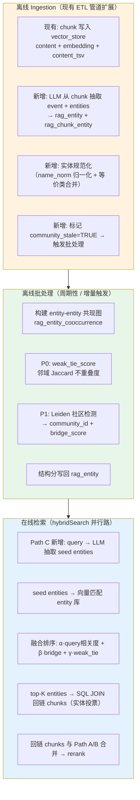
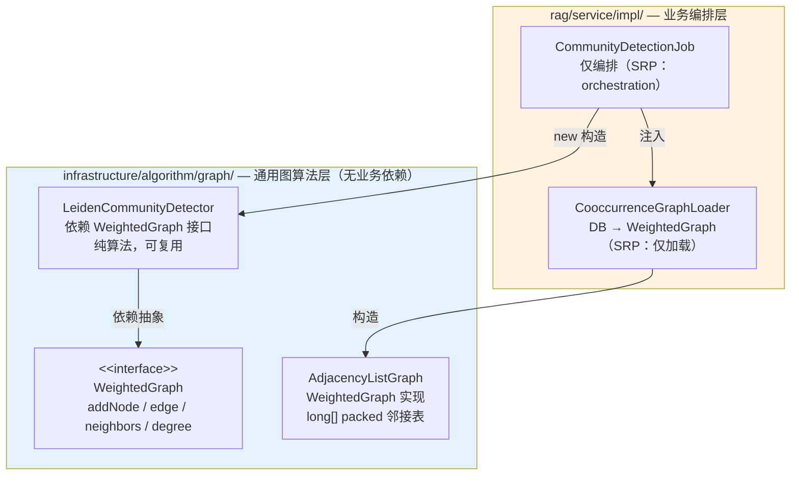
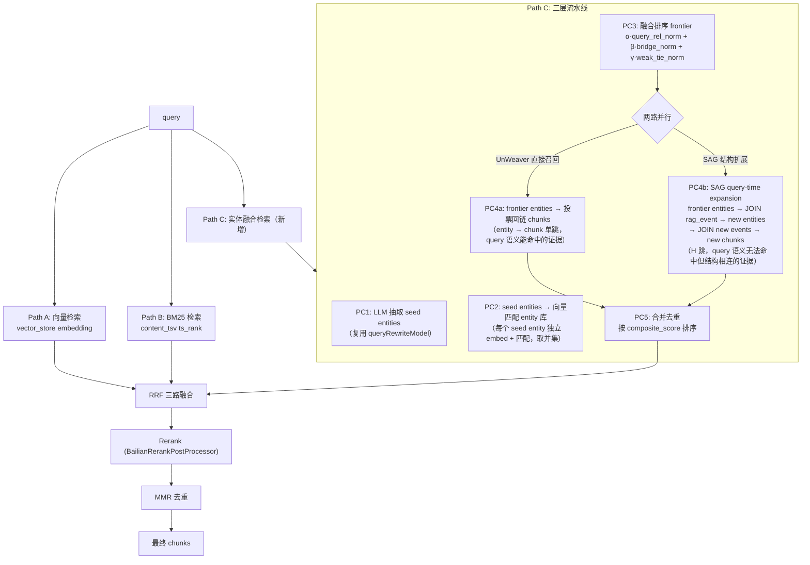
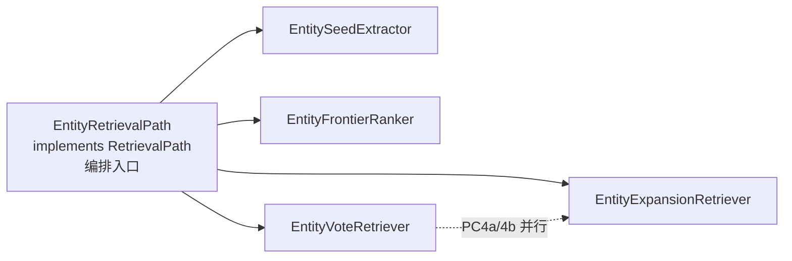

# 实体中心检索增强设计（Entity-Centric Retrieval Enhancement）

> **目标**：在现有 chunk 向量检索（hybridSearch: vector + BM25 + RRF + rerank）的基础上，引入实体中心索引层，将多跳推理能力从 Agent 编排层下沉到检索层，同时修复 SAG 的频次剪枝盲区。
>
> **研究来源**：
> - **SAG** (Zleap-AI, arXiv:2606.15971) — *SQL-Retrieval Augmented Generation with Query-Time Dynamic Hyperedges*
> - **UnWeaver** (Samsung AI, arXiv:2603.29875) — *UnWeaving the knots of GraphRAG – turns out VectorRAG is almost enough*
>
> **范围**：离线索引 + 在线检索路径。**不含 Agent 工具暴露**（本阶段不新增 `entityJoinSearch` 等 Agent 可调用工具，仅作为 hybridSearch 的并行召回路径）。
>
> **状态**：已实现并归档（2026-08-01）。全部 AC（AC1-AC6）验证通过，10 项启动/运行缺陷已修复，`entity.enabled=false` 零回归（1357 测试）。此前：设计阶段，未实现。已通过代码库可行性核验（2026-07）：修正 §8.2 ETL 时序、§8.4 版本化清理（第 1 轮）；七大原则复核修正 §4.4/§5.2/§6.1/§6.5/§7.1 架构拆分（第 2 轮，见 §10.3 审计表）。

---

## 1. 背景与动机

### 1.1 现状：多跳靠 Agent 迭代，成本高

smart-rag 当前是 Agentic VectorRAG：DeepRAG 原子决策 + Self-RAG 自省 + 查询改写 + rerank。多跳推理完全依赖 **Agent 循环迭代**（子问题分解 → 逐个检索 → 自省 → 重搜），每多一跳就是一轮 LLM 调用，代价是延迟和 token。

```
用户多跳问题 → Agent 分解子问题
  → 子问题1: hybridSearch → rerank → 中间答案
  → 子问题2: hybridSearch（基于答案1改写）→ rerank → 中间答案
  → 子问题3: ...
  → 合成最终答案

每跳 = 1次意图识别 + 1次检索 + 1次自省 + 可能改写重搜
```

### 1.2 两篇研究指向同一个杠杆

**SAG** 和 **UnWeaver** 结论收敛到一个核心观点：**把多跳能力从 Agent 编排下沉到索引/检索层，用一次检索代替多轮迭代。** 但两者路径不同：

| 维度 | SAG | UnWeaver |
|---|---|---|
| 数据结构 | event-entity 超边（1 chunk = 1 event + N entities） | entity 等价类（跨 chunk 聚合同名实体） |
| 多跳实现 | SQL JOIN 沿共享实体扩展（默认 H=1） | 不做遍历——实体"投票"（approval election）选 chunk |
| 回链方式 | event → 原始 chunk（保真） | entity → 原始 chunk（保真，不返回摘要） |
| 查询匹配 | LLM 抽取 query 实体 → 向量匹配 entity 库 | query embedding → 直接匹配 entity 向量库 |
| 盲区 | **频次剪枝杀低频桥接实体**（2Wiki Recall@5 输 HippoRAG2 2.4pt） | 依赖"名字语法等价"做规范化，真实语料上 canonicalization 不稳 |
| 成本 | indexing tokens ≈ VectorRAG × 10，query tokens ≈ VectorRAG | 同量级，query 阶段几乎不增 |

**两者的共同洞察**：一个 chunk 把多个主题揉进一个向量（信息混杂），实体抽取把主题拆开单独建索引——这是降噪和多跳能力的根本来源。

### 1.3 本设计的取舍

本设计融合 SAG 的 event-entity 超边索引 + UnWeaver 的实体等价类聚合，同时引入 **P0 weak_tie_score + P1 bridge_score** 叠加修复 SAG 的频次剪枝盲区。具体取舍：

- **采用 SAG 的 event 概念**：每 chunk 抽取 1 个事件（完整语义单元）+ N 个实体（索引点）。事件作为语义锚点，实体作为扩展点。
- **采用 UnWeaver 的实体等价类聚合**：跨 chunk 同名实体规范化聚合，拼接描述后统一 embed。
- **采用 UnWeaver 的实体投票选 chunk**：查询先命中实体，再通过 chunk-entity 回链矩阵投票选出 chunk（线性代数，非图遍历）。
- **修复 SAG 频次剪枝**：用 `composite_score = α·query相关度 + β·bridge_score + γ·weak_tie_score` 替代 `ORDER BY frequency`，让低频高桥实体活过剪枝。
- **不引入图数据库**：全部用 PostgreSQL 关系表 + pgvector 实现。H=1 SQL JOIN 扩展，不引入图遍历。
- **不暴露 Agent 工具**（本阶段）：实体检索路径作为 hybridSearch 的并行召回路，Agent 不直接感知。

---

## 2. 架构总览



三阶段分离原则（源自 SAG 论文的模块分工）：
- **SQL** 负责确定性过滤和 JOIN（结构路径）
- **Vector** 负责语义扩展和模糊匹配（embedding 路径）
- **LLM** 只用于离线抽取 + 在线少量高价值决策点（seed 实体抽取）

---

## 3. 数据模型

### 3.1 新增表（不改 vector_store）

实体索引层旁挂在现有 `vector_store` 上，通过 `rag_chunk_entity.chunk_id → vector_store.id` 回链。

```sql
-- ========== 实体表（规范化后的实体，跨 chunk 聚合） ==========
CREATE TABLE rag_entity (
    id              BIGSERIAL PRIMARY KEY,
    name_norm       VARCHAR(500) NOT NULL,       -- 规范化名称（lowercase + trim + Unicode NFC）
    name_display    VARCHAR(500),                -- 原始展示名（取首次出现或最高频形态）
    description     TEXT,                        -- 跨 chunk 拼接的实体描述（UnWeaver 风格）
    embedding       vector(1024),                -- description 的向量（DashScope 1024 维，同 vector_store）
    user_id         BIGINT NOT NULL,             -- 用户隔离（同 vector_store metadata 约定）
    team_id         BIGINT,                      -- 团队隔离（NULL = 个人文档）
    degree          INTEGER NOT NULL DEFAULT 0,  -- 出现在多少个 chunk 中（= 频次，保留供 trace，不参与打分公式）
    -- P0: 弱联系分（离线计算）
    weak_tie_score  DOUBLE PRECISION DEFAULT 0.5,-- 邻域不重叠度 [0,1]，默认 0.5（未计算时中性）
    -- P1: 桥接分（离线计算）
    bridge_score    DOUBLE PRECISION DEFAULT 0,  -- 跨社区连接数
    community_id    INTEGER,                     -- Leiden 社区 ID
    community_stale BOOLEAN NOT NULL DEFAULT TRUE, -- 社区信息是否过期（增量写入后标记）
    created_at      TIMESTAMPTZ NOT NULL DEFAULT NOW(),
    updated_at      TIMESTAMPTZ NOT NULL DEFAULT NOW()
);

-- 表级 UNIQUE 不接受 COALESCE 表达式，改用表达式唯一索引（PostgreSQL 语法约束）
CREATE UNIQUE INDEX uk_entity_norm_user_team ON rag_entity (name_norm, user_id, COALESCE(team_id, -1));

CREATE INDEX idx_entity_embedding ON rag_entity
    USING hnsw (embedding vector_cosine_ops) WITH (m = 32, ef_construction = 128);
CREATE INDEX idx_entity_user_team ON rag_entity (user_id, team_id);
CREATE INDEX idx_entity_name_norm ON rag_entity (name_norm);

-- ========== chunk-entity 关联表（二值回链矩阵） ==========
-- 对应 UnWeaver 的 W 矩阵 / SAG 的 event-entity 多对多连接
CREATE TABLE rag_chunk_entity (
    chunk_id    UUID NOT NULL,                   -- vector_store.id
    entity_id   BIGINT NOT NULL,                 -- rag_entity.id
    created_at  TIMESTAMPTZ NOT NULL DEFAULT NOW(),
    PRIMARY KEY (chunk_id, entity_id)
);
CREATE INDEX idx_ce_entity ON rag_chunk_entity (entity_id);
CREATE INDEX idx_ce_chunk  ON rag_chunk_entity (chunk_id);

-- ========== event 表（每 chunk 一个完整事件） ==========
-- 对应 SAG 的 event：chunk 的语义浓缩，保留完整语义单元
CREATE TABLE rag_event (
    id          BIGSERIAL PRIMARY KEY,
    chunk_id    UUID NOT NULL UNIQUE,            -- 1:1 对应 chunk（SAG 的 one-chunk-to-one-event）
    summary     TEXT NOT NULL,                   -- LLM 生成的事件摘要
    embedding   vector(1024),                    -- 事件摘要的向量
    user_id     BIGINT NOT NULL,
    team_id     BIGINT,
    document_id BIGINT NOT NULL,                 -- 关联 rag_document.id
    created_at  TIMESTAMPTZ NOT NULL DEFAULT NOW()
);
CREATE INDEX idx_event_embedding ON rag_event
    USING hnsw (embedding vector_cosine_ops) WITH (m = 32, ef_construction = 128);
CREATE INDEX idx_event_user_team ON rag_event (user_id, team_id);

-- ========== 实体-实体共现表（离线计算 weak_tie 和 bridge 的投影图） ==========
-- 两个实体在同一 chunk 出现 = 一条边（SAG 的 latent hyperedge 投影）
CREATE TABLE rag_entity_cooccurrence (
    id          BIGSERIAL PRIMARY KEY,           -- 代理主键（表级 PK 不接受 LEAST/GREATEST 表达式）
    entity_a    BIGINT NOT NULL,
    entity_b    BIGINT NOT NULL,
    co_count    INTEGER NOT NULL,                -- 共同出现的 chunk 数
    user_id     BIGINT NOT NULL,                 -- 隔离：共现图按用户/团队隔离
    team_id     BIGINT,
    created_at  TIMESTAMPTZ NOT NULL DEFAULT NOW()
);
-- 表级 PK 不接受 LEAST/GREATEST 表达式，改用表达式唯一索引
CREATE UNIQUE INDEX uk_cocur_scope_pair ON rag_entity_cooccurrence
    (user_id, COALESCE(team_id, -1), LEAST(entity_a, entity_b), GREATEST(entity_a, entity_b));
CREATE INDEX idx_cocur_pair ON rag_entity_cooccurrence (entity_a, entity_b);
CREATE INDEX idx_cocur_user ON rag_entity_cooccurrence (user_id, team_id);
```

### 3.2 设计决策

| 决策 | 理由 |
|---|---|
| **不改 `vector_store`** | Spring AI 管理此表（HNSW 索引、`vectorStore.add()`），侵入改动破坏契约。实体层旁挂。 |
| **`name_norm` 规范化** | UnWeaver 用"语法等价"做聚合的软肋——真实语料同义/别名/大小写需要显式归一化。先做 `lowercase + trim + Unicode NFC`，后续可叠加别名词典。 |
| **隔离字段下沉到 entity/event** | smart-rag 核心安全约定是 `metadata->>'userId'` 隔离。实体层复制同样字段，保证跨用户不泄露。 |
| **`degree` 保留但不进打分公式** | 保留频次列用于 trace/可观测（§6.2 SQL SELECT 中出现但仅此用途），不参与 composite_score 计算。这是 SAG 盲区的根因修复。 |
| **共现图按 user/team 隔离** | 严格隔离：不同用户的实体永不共现，防止跨用户实体关联泄露。 |
| **event 1:1 对应 chunk** | 采纳 SAG 的 one-chunk-to-one-event 设计。event.summary 是 chunk 的语义浓缩，为后续 query-time 直查提供更好的语义锚点（vs 直接查 chunk 原文）。 |

---

## 4. 离线索引：实体抽取与规范化

### 4.1 抽取流程（ETL 管道新增阶段）

在现有 ETL 管道的 `VectorStoreLoader.load()` 之后（chunk 已写入 `vector_store`），新增 `EntityExtractionService`（监听 ETL 事件，遵循项目 `*Service` 命名惯例，非 `*Step`）：

```
现有 ETL:
  Extract(MinIO 下载 + Parser 解析)
  → Transform(ChunkStrategy 分块)
  → Load(写入 vector_store: content + embedding + content_tsv)

新增阶段（Load 完成后异步触发）:
  EntityExtractionService（文档级编排，SRP 拆分细节见 §4.4）:
    Step 1: 对文档所有 chunk 并行 LLM 抽取 { event: "事件摘要", entities: [{name, description, type}] }
    Step 2: 实体规范化（name → name_norm）+ 文档级聚合拼接 description + 批量 UPSERT rag_entity
            （防竞态批量策略，勿逐 chunk UPSERT；见 §4.4）
    Step 3: 批量写入 rag_event + rag_chunk_entity，并同步 degree（派生列，= entity 在 rag_chunk_entity 的行数）
    Step 4: 异步批量 embed 聚合后的 description → 更新 rag_entity.embedding
    Step 5: 标记受影响实体 community_stale=TRUE（结构分待刷新）
    Step 6: 触发批处理（共现图 + weak_tie/bridge 结构分计算，见 §5/§8.1）
```

### 4.2 实体抽取 Prompt

```text
你是一个信息抽取专家。阅读以下文本片段，提取一个完整事件和若干索引实体。

## 文本片段
{chunk_content}

## 输出格式（JSON）
{
  "event": "用一句话概括这段文本的核心事件/事实（保留完整语义，不分拆为三元组）",
  "entities": [
    {
      "name": "实体规范名称",
      "description": "该实体在这段文本中的描述（1-2 句话）",
      "type": "person|organization|group|location|time|topic|work|action|product|metric|label"
    }
  ]
}

## 规则
1. event 必须是完整语义单元，不要拆成多个三元组
2. entities 是索引点，不含完整语义——只抽取对检索有意义的实体
3. 每个实体必须能独立理解，description 不要依赖上下文
4. 实体类型覆盖: 时间、地点、人物、组织、群体、主题、作品、产品、动作、指标、标签（SAG 的 11 类）
```

### 4.3 规范化策略

UnWeaver 论文承认 canonicalization 是"extremely nontrivial problem"，用语法等价搪塞。本设计采用分级规范化：

```
Level 1（默认，零成本）:
  name_norm = NFC_normalize(lowercase(trim(name)))
  → 处理大小写、首尾空格、Unicode 编码差异

Level 2（可选，需配置别名词典）:
  查 alias_dictionary: name_norm → canonical_name
  → 处理缩写（"AI" → "人工智能"）、别名（"北京" → "Beijing"）

Level 3（未来，需 embedding 相似度）:
  新实体 embedding 与已有实体 embedding 余弦相似度 > 0.92
  → 触发合并候选，需人工确认或 LLM 裁决
```

**Phase 1 只实现 Level 1**。`name_norm` 的唯一约束保证同用户/团队下同名实体自动聚合。Level 2/3 作为后续迭代。

### 4.4 description 拼接与重新 embed

同一 `name_norm` 的实体出现在多个 chunk 时，按 UnWeaver 的做法**拼接所有 chunk 的 description**：

```
实体 "PostgreSQL" 出现在 3 个 chunk:
  chunk_1: "开源关系型数据库，支持 pgvector 扩展"
  chunk_2: "支持 HNSW 索引进行近似最近邻搜索"
  chunk_3: "默认端口 5432"

拼接后 description = "开源关系型数据库，支持 pgvector 扩展。支持 HNSW 索引进行近似最近邻搜索。默认端口 5432。"
→ 重新 embed → 更新 rag_entity.embedding
```

**长度控制**（UnWeaver 论文提到的可扩展性问题）：description 超过阈值（默认 500 字符）时，用 LLM 压缩摘要后再 embed。

**并发安全（关键）**：ETL 管道使用 IO/CPU 双线程池并行处理 chunk（`EtlPipelineServiceImpl`），多个 chunk 可能同时抽取到同名实体（如 "PostgreSQL"）。直接在逐 chunk 流程中 `SELECT → concat → UPDATE` 会导致 lost-update 竞态（线程 B 覆盖线程 A 的拼接结果）。

**采用批处理收集策略**（而非逐 chunk 更新）。

**SRP 拆分**：原方案单个 `EntityExtractionService` 承担 LLM 抽取 + 规范化 + degree 维护 + 事件监听(2 个) + 批处理触发 = 5+ 职责。拆为 3 个协作类，各司一职：

| 组件 | 职责 | SRP 边界 |
|---|---|---|
| `EntityExtractionService` | **编排**：监听 `EtlCompletedEvent`/`EtlVectorizedEvent`（§8.2），调度 Step 1-6 | 仅编排，不含规范化/embedding 逻辑 |
| `EntityCanonicalizationService` | name_norm 归一化 + description 分组拼接 + UPSERT + 写 rag_chunk_entity + degree 同步（派生列） | 仅规范化与聚合（§10.2 已列但原方案未贯彻） |
| `EntityEmbeddingService` | 聚合后 description 的批量 embed → 更新 `rag_entity.embedding` | 仅 embedding（Step 4 异步） |

```
EntityExtractionService 编排流程（委托协作类）:
  Step 1: 对文档 D 的所有 chunk 并行 LLM 抽取（委托 ChatCapable 接口，DIP）
    → 收集全部结果到内存: List<(chunkId, eventName, description, type)>

  Step 2: 委托 EntityCanonicalizationService（SRP：仅规范化）
    → name_norm 归一化（Level 1: NFC + lowercase + trim）
    → 按 name_norm 分组，拼接 description
    → 批量 UPSERT rag_entity (ON CONFLICT DO UPDATE SET description = ...)

  Step 3: 委托 EntityCanonicalizationService 批量写入 rag_event + rag_chunk_entity，并同步 degree
    → degree 是**派生列**（= 该 entity 在 rag_chunk_entity 的行数）：写入时增量维护，§8.4 文档删除时全量重算

  Step 4: 委托 EntityEmbeddingService（SRP：仅 embedding）
    → 异步批量 embed 聚合后的 description → 更新 rag_entity.embedding

  Step 5: 标记本次写入涉及实体的 community_stale=TRUE（结构分待刷新）

  Step 6: 触发离线批处理——委托 EntityIndexService（§5/§8.1）：构建/增量更新共现图 + 计算 weak_tie(P0)/bridge(P1)
```

文档级聚合天然避免了同一文档内的竞态。跨文档并发（两个文档同时处理且共享实体）由 PostgreSQL 行级锁 + `ON CONFLICT DO UPDATE` 保证最终一致——即使两个文档的 UPSERT 交错执行，`ON CONFLICT` 保证不会丢失任一方的 description。重新 embed 在 Step 4 异步执行，读取的是聚合后的最终 description。

---

## 5. 离线批处理：结构分计算（P0 + P1）

### 5.1 P0 — weak_tie_score（弱联系分）

**理论基础**：Granovetter《弱联系的力量》(1973)。信息跨群体传播靠的不是强联系（高频），而是弱联系（低频但连接不同群体）。SAG 的频次剪枝在做的就是砍弱联系——而弱联系恰是多跳信息流通的唯一通道。

**计算定义**：一个实体的邻居之间互不相识，它就是桥。

```
对每个实体 e:
  neighbors(e) = {e' : cooccurrence(e, e') exists}

  对每对邻居 (n1, n2) ∈ neighbors(e):
    union_size  = |neighbors(n1) ∪ neighbors(n2)|
    common_size = |neighbors(n1) ∩ neighbors(n2)|
    embeddedness(n1, n2) = common_size / union_size    -- Jaccard 相似度

  weak_tie_score(e) = 1 - avg(embeddedness over all neighbor pairs)
```

- `weak_tie_score ≈ 1`：邻居之间几乎无交集 → 强桥（信息必经通道）
- `weak_tie_score ≈ 0`：邻居之间高度重叠 → 社区内部 hub（非桥）

**PostgreSQL 实现**：

```sql
CREATE OR REPLACE VIEW v_entity_neighbors AS
SELECT entity_a AS entity_id, entity_b AS neighbor_id, user_id, team_id
FROM rag_entity_cooccurrence
UNION ALL
SELECT entity_b AS entity_id, entity_a AS neighbor_id, user_id, team_id
FROM rag_entity_cooccurrence;

-- weak_tie_score 计算（批量 UPDATE，按 user/team 隔离执行）
WITH neighbor_sets AS (
    SELECT
        vn.entity_id,
        array_agg(vn.neighbor_id) AS neighbors
    FROM v_entity_neighbors vn
    JOIN rag_entity re ON re.id = vn.entity_id
    WHERE vn.user_id = :userId AND (vn.team_id = :teamId OR (:teamId IS NULL AND vn.team_id IS NULL))
      AND re.degree < 100              -- 性能预算：cap 极高 hub 的 O(d²) 邻域对计算。注意：被 cap 的 hub weak_tie 维持默认 0.5，经 γ=0.2 产生轻微正向偏置；但 hub 命中查询时 query_rel_norm（α=0.5 主信号）通常已很高，且 hub 本就是高语义召回点，该偏置不损害多跳目标。需精确时可在 hub 上改用邻居采样近似。
    GROUP BY vn.entity_id
),
neighbor_pairs AS (
    SELECT
        ns.entity_id,
        n1.neighbor_id AS n1,
        n2.neighbor_id AS n2,
        -- 共同邻居数: n1 的邻居 ∩ n2 的邻居
        (
            SELECT count(*) FROM v_entity_neighbors vn1
            WHERE vn1.entity_id = n1.neighbor_id
              AND vn1.neighbor_id IN (
                  SELECT neighbor_id FROM v_entity_neighbors WHERE entity_id = n2.neighbor_id
              )
        ) AS common_count,
        -- 并集大小: |neighbors(n1)| + |neighbors(n2)| - common_count
        (SELECT count(*) FROM v_entity_neighbors WHERE entity_id = n1.neighbor_id) AS deg_n1,
        (SELECT count(*) FROM v_entity_neighbors WHERE entity_id = n2.neighbor_id) AS deg_n2
    FROM neighbor_sets ns
    JOIN v_entity_neighbors n1 ON n1.entity_id = ns.entity_id
    JOIN v_entity_neighbors n2 ON n2.entity_id = ns.entity_id
    WHERE n1.neighbor_id < n2.neighbor_id
      AND n1.user_id = :userId
      AND (n1.team_id = :teamId OR (:teamId IS NULL AND n1.team_id IS NULL))
),
embeddedness AS (
    SELECT
        entity_id,
        avg(common_count::float / NULLIF(deg_n1 + deg_n2 - common_count, 0)) AS avg_emb
    FROM neighbor_pairs
    GROUP BY entity_id
)
UPDATE rag_entity e
SET weak_tie_score = COALESCE(1.0 - emb.avg_emb, 0.5),
    updated_at = NOW()
FROM embeddedness emb
WHERE e.id = emb.entity_id
  AND e.user_id = :userId;
```

**复杂度**：$O(\sum_e \binom{d_e}{2})$，$d_e$ 为实体 $e$ 的度数。大多数实体度数 < 20，只有 hub 度数高。为避免单个超高 hub 的 $O(d^2)$ 邻域对代价，限制 `WHERE degree < 100`。注意这是**纯性能预算**（非频次剪枝——本设计已废弃频次剪枝）：被排除的 hub 维持 `weak_tie_score=0.5` 默认值，经 γ 产生轻微正向偏置，但因 α 主信号主导且 hub 为高召回点，对多跳排序目标无害。如需精确，可对 hub 采用邻居采样近似。

### 5.2 P1 — bridge_score（社区桥接分）

**理论基础**：社区检测（Louvain/Leiden）识别密集子群。连接多个不同社区的实体是跨主题信息通道——即使低频，也是多跳链的关键桥。

**两步流程**：

```
Step 1: Leiden 社区检测
  从 rag_entity_cooccurrence 加载图（实体=节点，共现=边）
  运行 Leiden 算法 → 每个实体分配 community_id

Step 2: bridge_score 计算
  bridge_score(e) = |{distinct community_id of neighbors(e)}|
  只统计与 e 自身社区不同的社区
```

**PostgreSQL 实现 bridge_score（Step 2 是纯 SQL）**：

```sql
UPDATE rag_entity e
SET bridge_score = sub.distinct_communities,
    updated_at = NOW()
FROM (
    SELECT
        vn.entity_id,
        count(DISTINCT e2.community_id) AS distinct_communities
    FROM v_entity_neighbors vn
    JOIN rag_entity e2 ON e2.id = vn.neighbor_id
    JOIN rag_entity e1 ON e1.id = vn.entity_id
    WHERE e2.community_id IS NOT NULL
      AND e2.community_id != e1.community_id   -- 只算不同社区
      AND vn.user_id = :userId
    GROUP BY vn.entity_id
) sub
WHERE e.id = sub.entity_id
  AND e.user_id = :userId;
```

**Step 1 Leiden 的实现路径**（三层架构，遵循 SRP / DIP / CARP）：

社区检测涉及三类职责，分离到三个包层次，避免单类承担编排+数据加载+算法（原 SRP/DIP/CARP 违反）：



**层次职责划分：**

| 层 | 包 | 职责 | 依赖方向 |
|---|---|---|---|
| 通用算法层 | `infrastructure/algorithm/graph/` | 图抽象 + Leiden 实现，**零业务依赖** | 仅依赖 JDK + fastutil |
| 业务加载层 | `rag/service/impl/CooccurrenceGraphLoader` | DB 读取 → 构造 `WeightedGraph` | 依赖通用算法层 + Mapper |
| 业务编排层 | `rag/service/impl/CommunityDetectionJob` | 触发加载→检测→写回，**仅编排** | 依赖加载层 + Detector + Mapper |

---

**① `WeightedGraph` 接口**（`infrastructure/algorithm/graph/WeightedGraph.java`）：

```java
/**
 * 加权无向图抽象。Leiden / weak_tie_score / bridge_score 所需的全部图操作。
 * <p>
 * 设计目标：让算法（Leiden）与数据结构（邻接表/矩阵）解耦，未来可替换实现而不改算法。
 * 不继承 JGraphT 等库——共现图是无向加权简单图，三种操作足够表达。
 */
public interface WeightedGraph {
    void addNode(long node);
    void addEdge(long a, long b, double weight);           // 无向，重复加累加
    Set<Long> nodes();
    /** 返回邻居 → 边权的映射（只读视图） */
    Long2DoubleMap neighbors(long node);
    double edgeWeight(long a, long b);                      // 无边返回 0
    double weightedDegree(long node);                       // k_i
    double totalWeight();                                   // m = Σw/2
    int nodeCount();
}
```

**② `AdjacencyListGraph` 实现**（`infrastructure/algorithm/graph/AdjacencyListGraph.java`）：

```java
/**
 * 邻接表实现，long[] packed（neighbor/weight 交替）减少 GC 压力。
 * 适合稀疏图（共现图天然稀疏）。
 */
public class AdjacencyListGraph implements WeightedGraph {
    // 内部用 Long2ObjectMap<long[]> 存储，略
    // neighbors() 返回 Long2DoubleOpenHashMap 视图
}
```

**③ `LeidenCommunityDetector` 纯算法**（`infrastructure/algorithm/graph/LeidenCommunityDetector.java`）：

```java
/**
 * Leiden 社区检测（Traag, Waltman &amp; van Eck 2019，Louvain 的继任者）。
 * <p>
 * 依赖 {@link WeightedGraph} 接口，不依赖任何业务概念——可被文档相似度图、
 * 用户关系图等任何加权图复用。
 * <p>
 * 三阶段迭代：(1) fast local moving — 队列驱动贪心移动（含移入空社区候选）；
 * (2) refinement — 将每个社区拆为内部连通的子社区（保证社区连通，修复 Louvain
 * 的 disconnected communities 缺陷，bridge_score 依赖此性质）；
 * (3) aggregation — 按 refined 划分折叠为超节点，下一层初始划分按未 refined 分组。
 * 确定性实现（升序 ID 遍历 + 确定性 max-ΔQ 选择替代论文随机 θ），支持 resolution
 * 参数 γ（默认 1.0）控制社区粒度。
 * <p>
 * 复杂度：每轮 O(E)，fast local move 比 Louvain 全量扫描更快。smart-rag 单 user/team
 * 共现图（实体百~千级，边万级）单次执行 <100ms。
 */
public class LeidenCommunityDetector {

    private final WeightedGraph graph;
    private final double resolution;  // γ，默认 1.0

    public LeidenCommunityDetector(WeightedGraph graph) {
        this(graph, 1.0);
    }

    /** @return node → community_id 映射 */
    public Long2IntMap detect() { ... }  // 同前述骨架

    /**
     * 模度增量（节点从旧社区移除后，加入目标社区 C 的增益）：
     *   ΔQ = (k_{i,C} / m) − γ·(Σ_tot,C · k_i) / (2·m²)
     */
    private double deltaQ(long node, int targetCommunity) { ... }
}
```

**④ `CooccurrenceGraphLoader` 业务加载**（`rag/service/impl/CooccurrenceGraphLoader.java`）：

```java
/**
 * 从 rag_entity_cooccurrence 加载共现图。
 * <p>
 * SRP：仅负责"DB → WeightedGraph"转换，不参与检测或写回。
 */
@Component
public class CooccurrenceGraphLoader {

    private final EntityCooccurrenceMapper cooccurrenceMapper;

    public WeightedGraph load(Long userId, @Nullable Long teamId) {
        List<CooccurrenceRow> rows = cooccurrenceMapper.selectByScope(userId, teamId);
        WeightedGraph graph = new AdjacencyListGraph();
        for (CooccurrenceRow r : rows) {
            graph.addEdge(r.entityA(), r.entityB(), r.coCount());
        }
        return graph;
    }
}
```

**⑤ `CommunityDetectionJob` 仅编排**（`rag/service/impl/CommunityDetectionJob.java`）：

```java
/**
 * 离线社区检测编排任务（ETL 完成后异步触发 / 定时调度）。
 * <p>
 * SRP：仅编排"加载 → 检测 → 写回"，不持有算法逻辑或数据加载逻辑。
 * DIP：依赖 CooccurrenceGraphLoader（合成）和 LeidenCommunityDetector（直接构造，
 *      因 Detector 是无状态纯算法，构造即用，无需 Factory 抽象）。
 */
@Component
public class CommunityDetectionJob {

    private final CooccurrenceGraphLoader graphLoader;
    private final EntityMapper entityMapper;

    public void run(Long userId, @Nullable Long teamId) {
        WeightedGraph graph = graphLoader.load(userId, teamId);
        if (graph.nodeCount() < 2) return;                  // 单实体无需社区检测

        Long2IntMap communities = new LeidenCommunityDetector(graph).detect();

        entityMapper.batchUpdateCommunities(userId, teamId, communities);
        entityMapper.updateBridgeScores(userId, teamId);    // bridge_score 纯 SQL（上方 UPDATE）
        entityMapper.clearStaleFlag(userId, teamId);        // 全量清除（Leiden 覆盖所有节点）
    }
}
```

**为什么是三层而非单类（设计原则映射）：**

| 原则 | 单类违反 | 三层修正 |
|---|---|---|
| SRP | `CommunityDetectionJob` 混编排+加载+算法 | 三类各司一职 |
| DIP | Detector 依赖 `Long2ObjectMap<long[]>` 具体类型 | Detector 依赖 `WeightedGraph` 接口 |
| CARP | 算法与业务同包，不可复用 | 算法下沉 `infrastructure/algorithm/graph/`，通用可复用 |
| OCP | 新图类型要改 Detector | 新增 `WeightedGraph` 实现即可，Detector 不改 |

**为什么不引入图库（JGraphT / neil-justice / 其他）：**

1. **用不上通用图抽象**：共现图是无向加权简单图，Leiden 只需"邻接表遍历 + 加权度数 + 模度增量"。`WeightedGraph` 接口 7 个方法足够，JGraphT 的 `SimpleWeightedGraph` / `DefaultWeightedEdge` 是为不存在的需求买单。
2. **JGraphT 不含 Louvain 亦不含 Leiden**：上游 issue [#1272](https://github.com/jgrapht/jgrapht/issues/1272)（Louvain）至今 Open，Leiden 同样缺失。引入后仍要自实现，白拖 800KB（+ jheaps）。
3. **许可证风险**：JGraphT LGPL/EPL、neil-justice 传递 trove4j LGPL——自实现 + 项目内 `infrastructure/algorithm/graph/` 彻底规避。
4. **针对性优化**：`long[]` packed 邻接表比对象化边减少 GC 压力。
5. **算法可控**：边缘 case（孤立节点、完全图）可自行修正。

**实现成本**：`WeightedGraph` 接口 + `AdjacencyListGraph` ~150 行 + `LeidenCommunityDetector` ~400 行 + `CooccurrenceGraphLoader` ~30 行 + 测试 ~250 行（Zachary Karate Club 标准图 ground truth 验证 + 连通性保证 + 合成图），总计 ~830 行 Java，3 人日。

**复杂度与性能预算**：Leiden 单轮 $O(E)$（fast local move 队列驱动，通常比 Louvain 全量扫描更快），多层级迭代 → 总 $O(E \log V)$。smart-rag 单 user/team 共现图典型规模（$V < 10^4$，$E < 10^5$）执行 <100ms，每日/每周批处理毫无压力。

### 5.3 增量维护策略

| 场景 | weak_tie_score（P0） | bridge_score（P1） |
|---|---|---|
| 新 chunk + 新实体追加 | 只重算受影响实体 ±1 跳邻域（局部） | 新实体暂不分配社区，`community_stale=TRUE` |
| 新 chunk 连接已有实体 | 重算该实体 ±1 跳邻域的 weak_tie | 可能改变社区边界 → 标记 `community_stale=TRUE` |
| 定时全量刷新 | 每日/每周一次全量（离线批处理） | 每日/每周一次 Leiden |

**关键原则**：两个分数都是**缓存的离线属性，在线查询只读取不计算**。新数据写入时用旧分数（`weak_tie_score=0.5` 的默认值兜底），后台异步刷新，不阻塞在线查询。

### 5.4 共现图构建

```sql
-- 从 rag_chunk_entity 投影共现图
INSERT INTO rag_entity_cooccurrence (entity_a, entity_b, co_count, user_id, team_id)
SELECT
    LEAST(e1.entity_id, e2.entity_id) AS entity_a,
    GREATEST(e1.entity_id, e2.entity_id) AS entity_b,
    count(*) AS co_count,
    re1.user_id,
    re1.team_id
FROM rag_chunk_entity e1
JOIN rag_chunk_entity e2
  ON e1.chunk_id = e2.chunk_id
  AND e1.entity_id < e2.entity_id          -- 避免自环和重复对
JOIN rag_entity re1 ON re1.id = e1.entity_id
JOIN rag_entity re2 ON re2.id = e2.entity_id
WHERE re1.user_id = re2.user_id            -- 严格隔离
  AND COALESCE(re1.team_id, -1) = COALESCE(re2.team_id, -1)
GROUP BY LEAST(e1.entity_id, e2.entity_id),
         GREATEST(e1.entity_id, e2.entity_id),
         re1.user_id, re1.team_id
ON CONFLICT (user_id, COALESCE(team_id, -1), LEAST(entity_a, entity_b), GREATEST(entity_a, entity_b))
DO UPDATE SET co_count = EXCLUDED.co_count;
```

---

## 6. 在线检索：实体融合路径

### 6.1 检索流程

新增 **Path C**（实体路径），与现有 Path A（vector）和 Path B（BM25）并行执行，结果合并后进 rerank。



**三层各管一段（互补不冗余）：**

| 层 | 机制 | 来源 | 解决什么 |
|---|---|---|---|
| Frontier 选择 (PC3) | α·query_rel_norm + β·bridge_norm + γ·weak_tie_norm | 本设计原创 | 哪些实体进入候选（保护低频桥，修复 SAG frontier budget=50 硬截断盲区） |
| 直接召回 (PC4a) | entity → chunk 投票 | UnWeaver | query 语义**能命中**的证据（单跳回链） |
| 结构扩展 (PC4b) | entity → event → new entity → new event | SAG §3.4 | query 语义**无法命中**但结构相连的证据（多跳发现） |

**为什么三层缺一不可：** SAG 消融（Table 4）证明扩展单独贡献 +10.6pt（MuSiQue R@5: H=0 69.4% → H=1 80.0%）。UnWeaver 投票覆盖 query 语义面。P0/P1 保护扩展阶段的低频桥接实体不被 frontier budget 截断。去掉任一层都有覆盖盲区。

**Path C 组件拆分（SRP 合规，消除单类 5 职责）**

> **原方案**：单个 `EntityRetrievalService` 承担 seed 抽取 + 融合排序 + 投票回链 + SAG 扩展 + 合并去重 = 5 职责，违反 SRP。
>
> **修正方案**：拆为 4 个协作类 + 1 个编排入口，每个类 SRP 单一职责。

| 组件 | 职责 | 对应 PC 步骤 | 依赖 |
|---|---|---|---|
| `EntitySeedExtractor` | LLM 抽取 query → seed entities | PC1 | `ChatCapable`（DIP：依赖接口不依赖具体客户端） |
| `EntityFrontierRanker` | seed → 向量匹配 → 融合排序 → frontier 剪枝 | PC2-PC3 | `EntityMapper` |
| `EntityVoteRetriever` | frontier → 投票回链 chunks（UnWeaver） | PC4a | `ChunkEntityMapper` |
| `EntityExpansionRetriever` | frontier → SAG H 跳扩展 → chunks | PC4b | `EventMapper` |
| `EntityRetrievalPath` | 编排上述 4 类 + PC5 合并去重，实现 `RetrievalPath`（§6.5） | 编排 | 上述 4 类（CARP 合成） |



`EntityRetrievalPath` 是 §6.5 `RetrievalPath` 接口的 Path C 实现——`@Component` + `@ConditionalOnProperty(prefix="app.rag.entity", name="enabled")`，Spring 自动注册到 `HybridSearchService.paths`，**HybridSearchService 零改动**。

### 6.2 融合排序公式

**核心改造点**：替代 SAG 的 `ORDER BY entity_frequency DESC LIMIT N`（频次剪枝）。

```sql
-- 输入: query 抽取的 seed entities（多个），每个独立 embed 后与 entity 库匹配，取并集
-- seed entity embeddings 以临时表/CTE 传入（:seed_embeddings 是 vector[] 或多个参数绑定）
WITH seed_embeddings(embedding) AS (
    VALUES (:seed_embedding_1, :seed_embedding_2, ...)  -- 每个 seed entity 独立 embed
),
entity_match AS (
    -- 每个 entity e 与最近的 seed embedding 匹配（取 max 相似度），非单一 embedding
    SELECT
        e.id,
        e.name_display,
        MAX(1 - (e.embedding <=> se.embedding)) AS query_relevance,
        COALESCE(e.bridge_score, 0)     AS bridge,
        COALESCE(e.weak_tie_score, 0.5) AS weak_tie,
        e.degree,
        e.community_id
    FROM rag_entity e
    CROSS JOIN seed_embeddings se
    WHERE e.user_id = :userId
      AND (e.team_id = :teamId OR (:teamId IS NULL AND e.team_id IS NULL))
      AND e.embedding IS NOT NULL
      AND (1 - (e.embedding <=> se.embedding)) > :matchThreshold
    GROUP BY e.id, e.name_display, e.bridge_score, e.weak_tie_score, e.degree, e.community_id
),
scored AS (
    SELECT
        *,
        -- 融合公式: α·query_rel_norm + β·bridge_norm + γ·weak_tie_norm（三项均归一化到 [0,1]）
        (  :alpha * query_rel_norm
         + :beta  * bridge_norm
         + :gamma * weak_tie_norm
        ) AS composite_score
    FROM (
        SELECT
            *,
            -- 归一化到当前 matched 集合（entity_match）的 [0,1]，剪枝前计算
            COALESCE(query_relevance / NULLIF(max(query_relevance) OVER (), 0), 0) AS query_rel_norm,
            COALESCE(bridge / NULLIF(max(bridge) OVER (), 0), 0) AS bridge_norm,
            COALESCE(weak_tie / NULLIF(max(weak_tie) OVER (), 0), 0) AS weak_tie_norm
        FROM entity_match
    ) normalized
),
frontier AS (
    SELECT * FROM scored ORDER BY composite_score DESC LIMIT :frontierBudget
)
SELECT * FROM frontier;  -- frontier（已剪枝）即 PC4a/PC4b 下游消费的实体集
```

**权重设计逻辑**：

| `query_rel_norm` | 语义匹配（主信号） | α = 0.5 | 实体必须与查询相关 |
| `bridge_norm` | 跨社区桥接（P1） | β = 0.3 | 补全局结构视野——低频但连接不同主题簇 |
| `weak_tie_norm` | 邻域桥接（P0） | γ = 0.2 | 补局部拓扑——邻居互不相识的实体是信息通道 |

**为什么 β > γ**：bridge_score 基于 Leiden 全局社区划分，比 weak_tie 的纯邻域计算更稳定（抗噪），给更高权重。weak_tie 在小邻域上方差大，作辅助信号。

**为什么三项都要 window max 归一化**：`query_relevance` 是原始相似度（实际峰值远不到 1.0），而 `bridge_score`/`weak_tie_score` 可达较大值。若只归一化后两者，结构信号会被相对放大、压过主信号，α=0.5 的"主信号"名不副实。三项统一用 `max() OVER ()` 归一化到 [0,1]（剪枝前计算，frontier 在归一化后再取 top-K），保证 α/β/γ 权重语义对称、可比。

### 6.3 实体投票回链（UnWeaver 的 approval election）

融合排序选出 top-K 实体后，通过 `rag_chunk_entity` 回链矩阵投票选出 chunk：

```sql
SELECT
    ce.chunk_id,
    vs.content,
    vs.metadata,
    -- chunk 的分数 = 关联的 entity 中最高 composite_score（max 聚合）
    -- 也可用 sum（approval voting）或加权 sum
    max(s.composite_score) AS chunk_score,
    -- 记录哪些实体投了票（用于可解释性 trace）
    array_agg(s.name_display ORDER BY s.composite_score DESC) AS voted_by_entities
FROM frontier s
JOIN rag_chunk_entity ce ON ce.entity_id = s.id
JOIN vector_store vs ON vs.id = ce.chunk_id
WHERE vs.metadata->>'userId' = :userIdStr    -- 安全隔离（同现有约定）
GROUP BY ce.chunk_id, vs.content, vs.metadata
ORDER BY chunk_score DESC
LIMIT :chunkTopK;   -- 默认 20
```

**投票策略选择**：

| 策略 | 公式 | 特点 |
|---|---|---|
| `max`（默认） | chunk_score = max(entity_score) | 被任一高分实体命中即可——对低频桥友好 |
| `sum`（approval） | chunk_score = Σ(entity_score) | 被多个实体命中的 chunk 得分高——覆盖面广但噪声也高 |
| `weighted_sum` | chunk_score = Σ(entity_score × entity_degree^-0.5) | 低频实体投票权重更高——最激进地保护低频桥 |

Phase 1 默认用 `max`，后续可通过配置切换。

### 6.4 SAG 结构扩展（Query-Time Dynamic Hyperedge）


SAG §3.4 的 query-time expansion 是**纯结构 SQL JOIN**（论文原文："This process relies solely on SQL joins; multi-hop expansion amounts to relational joins in a database, not PageRank or graph reasoning"），**不在扩展阶段施加 query 语义过滤**。query 相似度裁决发生在扩展**之后**的 coarse ranking（SAG 对 $\mathcal{E}_{\text{cand}} = \mathcal{E}_R \cup \mathcal{E}_E$ 统一过滤 top-$K_{\text{cand}}$）。本设计忠实于此分工：PC4b 扩展纯结构 JOIN，扩展发现的 chunk 分数 = 结构传递分（发现它的中间 frontier 实体的 composite_score），query 语义裁决后移到 PC5 合并后的 RRF + rerank。

SAG 消融（Table 4）证明：禁用扩展（H=0）导致 MuSiQue R@5 从 80.0% 降至 69.4%，下降 10.6 个百分点。这些候选是"向量召回无法发现的、多跳推理链中的关键中间证据"。
**扩展流程（H 跳，默认 H=1）：**

```
输入: PC3 融合排序选出的 frontier entities (frontier 表的 top-K)

Hop 1:
  frontier entities → 反向 JOIN rag_event → 关联的所有 events
  → 从这些 events 提取新 entities (不在 frontier 中的)
  → 新 entities → JOIN rag_event → 新 events
  → 新 events → 映射回新 chunks (event.chunk_id)

终止条件:
  - 达到最大跳数 H (默认 1)
  - 或新实体集为空（无可扩展内容）
```

**SQL 实现（H=1 单跳扩展）：**

```sql
-- 输入: PC3 的 frontier 表（frontier budget 剪枝后的实体集）
-- 输出: 通过结构路径发现的新 chunks（与 query 无语义匹配）

WITH seed_events AS (
    -- frontier entities 关联的所有 events (通过 event ↔ chunk ↔ entity)
    SELECT DISTINCT e.id AS event_id, e.chunk_id
    FROM rag_event e
    JOIN rag_chunk_entity ce ON ce.chunk_id = e.chunk_id
    WHERE ce.entity_id IN (SELECT id FROM frontier)
      AND e.user_id = :userId
      AND (e.team_id = :teamId OR (:teamId IS NULL AND e.team_id IS NULL))
),
expanded_entities AS (
    -- seed events 中的新 entities（frontier entities 之外的）
    SELECT DISTINCT ce.entity_id
    FROM rag_chunk_entity ce
    JOIN seed_events se ON se.chunk_id = ce.chunk_id        -- 按 chunk 连接（seed_events 已携带 chunk_id）
    LEFT JOIN frontier s ON s.id = ce.entity_id            -- 排除已在 frontier 中的
    JOIN rag_entity e2 ON e2.id = ce.entity_id
    WHERE s.id IS NULL
      AND e2.user_id = :userId
),
expanded_events AS (
    -- 新 entities 关联的新 events → 新 chunks
    -- 纯结构 SQL JOIN，不加 query 语义过滤（忠于 SAG §3.4：expansion relies solely on SQL joins）
    SELECT DISTINCT e.id AS event_id, e.chunk_id,
           e.summary
    FROM rag_event e
    JOIN rag_chunk_entity ce ON ce.chunk_id = e.chunk_id
    WHERE ce.entity_id IN (SELECT entity_id FROM expanded_entities)
      AND e.user_id = :userId
)
SELECT
    ee.chunk_id,
    vs.content,
    vs.metadata,
    -- 扩展路径的 chunk 分数 = 结构传递分（发现它的中间实体 composite_score 的 max）
    -- 衰减因子 δ=:expansionDecay（默认 0.7，见 §7.1 expansionDecay）反映扩展的不确定性；query 语义裁决后移到 PC5 合并后的 RRF + rerank
    :expansionDecay * MAX(f.composite_score) AS chunk_score,
    array_agg(DISTINCT ex.entity_id) AS discovered_via_entities
FROM expanded_events ee
JOIN vector_store vs ON vs.id = ee.chunk_id
JOIN rag_chunk_entity ex ON ex.chunk_id = ee.chunk_id
JOIN frontier f ON f.id = ex.entity_id     -- 连接发现它的 frontier 实体（取结构传递分）
WHERE vs.metadata->>'userId' = :userIdStr
GROUP BY ee.chunk_id, vs.content, vs.metadata
ORDER BY chunk_score DESC
LIMIT :expandChunkTopK;   -- 默认 10（与投票路径的 chunkTopK 分开控制）
```

**P0/P1 在扩展阶段的门控角色：**

SAG 的频次剪枝盲区（§5.1 论文原文承认）发生在扩展阶段的 entity frontier 预算截断。P0/P1 的融合排序在 **frontier 选择时** 就已优先保留低频桥接实体（高 weak_tie/bridge_score），使得这些实体**在进入扩展阶段前就不被截断**。

此外，扩展发现的新实体（`expanded_entities`）如果也需要剪枝，应按 `weak_tie_score + bridge_score` 排序而非频次，确保低频但结构关键的中间实体不被丢弃。

**与投票路径（PC4a）的关系：**

| 路径 | 发现什么 | 与 query 的关系 | 分数含义 |
| PC4a 投票 | frontier entity 直接关联的 chunks | 语义匹配（entity 在 query 范围内） | composite_score（α·query_rel_norm + β·bridge_norm + γ·weak_tie_norm） |
| PC4b 扩展 | 经 H 跳结构路径发现的新 chunks | 结构相连（中间 entity 不在 query 范围内） | δ × composite_score（发现它的中间 frontier 实体的结构传递分，query 语义裁决后移到 RRF + rerank） |
两路 chunk 在 PC5 合并去重，以各自 chunk_score 排序后参与 RRF。

### 6.5 RRF 多路融合（RetrievalPath 抽象，OCP 合规）

Path C 合并后的 chunks（投票 + 扩展）与 Path A（vector）/ Path B（BM25）结果合并进 RRF。

**RRF 公式（各路加权模式不变）：**

| 路径 | 公式 | 加权模式 |
|---|---|---|
| Path A (vector) | `score * 1/(k + rank)` | SCORE_WEIGHTED |
| Path B (BM25) | `1/(k + rank)` | RANK_ONLY |
| Path C (entity) | `chunk_score * 1/(k + rank)` | SCORE_WEIGHTED（chunk_score 来自 §6.3/§6.4） |

```
score(doc) = Σ_path weighted_or_rank * 1 / (k + rank_path)
```

各路 rank 独立编号（各路内部从 1 开始）。同一 chunk_id 在多路出现时 RRF 自然累加。

**关键重构：RetrievalPath 接口（消除 OCP 违反）**

> **原方案**（侵入式）：`rrfFusion()` 签名从 `(List, List)` 改为 `(List, List, List)`，`hybridSearch()` 方法体硬编码 fork 数量从 2→3。每加一路召回都要改 Service 签名和方法体——**违反 OCP**。
>
> **修正方案**（OCP 合规）：引入 `RetrievalPath` 接口，`HybridSearchService` 依赖 `List<RetrievalPath>`（构造注入，Spring 自动收集所有 `@Component` 实现）。Path C 作为新增实现注册，**hybridSearch() 方法体零改动**。

```java
/**
 * 检索路径抽象（OCP：对扩展开放，对修改关闭）。
 * 每一路召回实现此接口。新增路径只需新增 @Component 实现，不改 Service。
 */
public interface RetrievalPath {
    String name();                                                    // 路径标识（trace/日志）
    List<ScoredDocument> search(String query, long userId, @Nullable Long teamId);
    RrfWeighting rrfWeighting();                                      // 加权模式
    enum RrfWeighting { SCORE_WEIGHTED, RANK_ONLY }
}

/** 共享 record（从 HybridSearchService.private 提升为顶层，供各路实现复用） */
public record ScoredDocument(Document doc, int rank, double score) {}
```

**现有两路的适配器**（仅包装现有逻辑，不改算法）：

```java
@Component
public class VectorRetrievalPath implements RetrievalPath {
    // 适配现有 vectorSearchWithScore(); rrfWeighting() = SCORE_WEIGHTED
}
@Component
@ConditionalOnProperty(prefix = "app.rag", name = "hybridRetrievalEnabled", havingValue = "true")
public class Bm25RetrievalPath implements RetrievalPath {
    // 适配现有 bm25Search(); rrfWeighting() = RANK_ONLY
}
```

**Path C 作为第三路注册**（见 §6.1 拆分后的 `EntityRetrievalPath`）：

```java
@Component
@ConditionalOnProperty(prefix = "app.rag.entity", name = "enabled", havingValue = "true")
public class EntityRetrievalPath implements RetrievalPath {
    // 本类即 Path C 编排入口：委托 EntitySeedExtractor/FrontierRanker/VoteRetriever/ExpansionRetriever + PC5 合并去重（§6.1）
    // rrfWeighting() = SCORE_WEIGHTED
}
```

**HybridSearchService 重构后**（fork 数量由注入的 paths 决定，不再硬编码）：

```java
@Service
public class HybridSearchService {
    private final List<RetrievalPath> paths;  // Spring 自动收集所有 @Component 实现

    public List<Document> hybridSearch(String query, long userId, @Nullable Long teamId) {
        try (var scope = scopedTasks.open("hybrid-search", options)) {
            Map<RetrievalPath, Subtask<List<ScoredDocument>>> tasks = new LinkedHashMap<>();
            for (RetrievalPath path : paths) {
                tasks.put(path, scope.fork(path.name(), () -> path.search(query, userId, teamId)));
            }
            scope.join();
            // 降级处理（同现有逻辑）...
            return rrfFusion(tasks);  // 签名：rrfFusion(Map<RetrievalPath, ...>)
        }
    }

    private List<Document> rrfFusion(Map<RetrievalPath, Subtask<List<ScoredDocument>>> results) {
        // 遍历每个 path，按 path.rrfWeighting() 选择加权/纯排名
    }
}
```

**OCP 合规验证**：未来加 Path D（如知识图谱路径），只需新增 `GraphRetrievalPath implements RetrievalPath` + `@Component`，**HybridSearchService 零改动**。

**配置变化**：`fusionTopK` 默认 60 → 80，覆盖三路召回上限（vectorTopK 20 + bm25TopK 20 + entityChunkTopK 20 + expandChunkTopK 10 ≈ 70，余量 10）。

---

## 7. 配置扩展

### 7.1 RagRetrievalProperties 扩展（嵌套 record，ISP/OCP 合规）

> **原方案**（record 膨胀）：主 record 平铺新增 15 个 `entity*` 字段，15→30 字段，`withOverrides` 需手动列出全部 30 参数——机械且易错。
>
> **修正方案**（ISP/OCP 合规）：主 record 只加一个字段 `entity`（嵌套 record），实体检索配置收敛在内。`withOverrides` 只需加 1 行。

```java
@ConfigurationProperties(prefix = "app.rag")
public record RagRetrievalProperties(
        // === 现有 15 字段（不变） ===
        boolean queryRewriteEnabled,
        boolean hybridRetrievalEnabled,
        String ftsConfig,
        int vectorTopK,
        int bm25TopK,
        int rrfK,
        int fusionTopK,
        boolean rerankEnabled,
        int rerankTopN,
        boolean mmrEnabled,
        double mmrLambda,
        int mmrTopK,
        double similarityThreshold,
        String queryRewriteModel,
        Double queryRewriteTemperature,

        // === 新增：唯一一个新字段（嵌套 record） ===
        EntityRetrievalProperties entity
) {
    public RagRetrievalProperties {
        // === 现有校验（不变） ===
        if (ftsConfig == null || ftsConfig.isBlank()) ftsConfig = "jiebacfg";
        if (rerankTopN <= 0) rerankTopN = 20;
        if (fusionTopK <= 0) fusionTopK = 80;   // 与 §6.5/§7.2 对齐（三路召回扩容）
        if (rerankTopN <= mmrTopK) throw new IllegalArgumentException("rerankTopN must be > mmrTopK");
        if (fusionTopK < rerankTopN) throw new IllegalArgumentException("fusionTopK must be >= rerankTopN");
        // entity 嵌套 record 的校验在其自身的 compact constructor 中
    }

    public RagRetrievalProperties withOverrides(Integer vectorTopKOverride, Integer bm25TopKOverride, Integer rrfKOverride) {
        return new RagRetrievalProperties(
                queryRewriteEnabled, hybridRetrievalEnabled, ftsConfig,
                vectorTopKOverride != null ? vectorTopKOverride : vectorTopK,
                bm25TopKOverride != null ? bm25TopKOverride : bm25TopK,
                rrfKOverride != null ? rrfKOverride : rrfK,
                fusionTopK, rerankEnabled, rerankTopN,
                mmrEnabled, mmrLambda, mmrTopK,
                similarityThreshold, queryRewriteModel, queryRewriteTemperature,
                entity  // ← 唯一新增行，原值透传
        );
    }

    /**
     * 实体中心检索配置（独立嵌套 record，ISP：实体配置自成一组）。
     * Spring Boot 支持 @ConfigurationProperties 嵌套 record 绑定，对应 yaml：app.rag.entity.*
     */
    public record EntityRetrievalProperties(
            boolean enabled,                    // 总开关，默认 false（灰度上线）
            double matchThreshold,              // 实体向量匹配余弦相似度阈值，默认 0.85
            int frontierBudget,                 // frontier 结构感知 top-K 预算，默认 50（打分用融合公式，截断仍是硬 top-K，§6.2）
            int chunkTopK,                      // PC4a 投票回链 chunk 数，默认 20
            int expandChunkTopK,                // PC4b SAG 扩展发现 chunk 数，默认 10
            int expansionHops,                  // SAG query-time expansion 跳数，默认 1（0=禁用）
            double expansionDecay,              // SAG 扩展结构传递衰减因子 δ，默认 0.7（§6.4）
            double alpha,                       // query 相关度权重，默认 0.5
            double beta,                        // bridge_score 权重，默认 0.3
            double gamma,                       // weak_tie_score 权重，默认 0.2
            boolean weakTieEnabled,             // weak_tie_score（P0）开关，默认 true；false 时 γ 强制为 0
            String extractionModel,             // 实体抽取 LLM 模型 ID，null 用默认
            int descriptionMaxChars,            // description 拼接最大字符数，默认 500
            boolean communityDetectionEnabled   // 社区检测（P1）开关，默认 true；false 时 β 强制为 0
    ) {
        public EntityRetrievalProperties {
            if (matchThreshold <= 0) matchThreshold = 0.85;
            if (frontierBudget <= 0) frontierBudget = 50;
            if (chunkTopK <= 0) chunkTopK = 20;
            if (expandChunkTopK < 0) expandChunkTopK = 10;
            if (expansionHops < 0) expansionHops = 1;
            if (expansionDecay <= 0 || expansionDecay > 1) expansionDecay = 0.7;
            if (alpha < 0 || beta < 0 || gamma < 0)
                throw new IllegalArgumentException("entity α/β/γ must be >= 0");
            if (alpha + beta + gamma == 0)
                throw new IllegalArgumentException("entity α/β/γ cannot all be 0");
            if (descriptionMaxChars <= 0) descriptionMaxChars = 500;
        }
    }
}
```

**对比改进：**

| 维度 | 原方案（平铺 30 字段） | 修正方案（嵌套 record） |
|---|---|---|
| 主 record 字段数 | 15 → 30 | 15 → 16 |
| withOverrides 新增行 | 15 行 | 1 行 |
| 配置访问 | ~~`properties.matchThreshold()`~~ → `properties.entity().matchThreshold()` | 嵌套 record 统一前缀 `entity.*`（全文 SQL 绑定同步为 `:matchThreshold`，见 §6.2） |
| 实体配置内聚性 | 散落在主 record | 收敛在 `EntityRetrievalProperties` |
| 后续新增实体配置 | 改主 record + withOverrides | 只改嵌套 record |

### 7.2 application.yml 默认配置

```yaml
app:
  rag:
    # === 现有配置（不变） ===
    queryRewriteEnabled: true
    hybridRetrievalEnabled: true
    ftsConfig: jiebacfg
    vectorTopK: 20
    bm25TopK: 20
    rrfK: 60
    fusionTopK: 80              # 调大：覆盖三路召回
    rerankEnabled: true
    rerankTopN: 20
    mmrEnabled: true
    mmrLambda: 0.5
    mmrTopK: 10
    similarityThreshold: 0.7
    queryRewriteModel: deepseek-v4-flash

    # === 新增：实体中心检索（嵌套结构，对应 EntityRetrievalProperties） ===
    entity:
      enabled: false                    # 灰度开关，默认关闭
      matchThreshold: 0.85              # 实体向量余弦相似度阈值
      frontierBudget: 50                # frontier 结构感知 top-K（打分用融合公式，截断仍是硬 top-K；详见 §6.2/§6.1）
      chunkTopK: 20                     # PC4a 投票回链 chunk 数
      expandChunkTopK: 10               # PC4b SAG 扩展发现 chunk 数
      expansionHops: 1                  # SAG 扩展跳数（0=禁用扩展，1=单跳）
      expansionDecay: 0.7               # SAG 扩展结构传递衰减因子 δ（§6.4）
      alpha: 0.5                        # query 相关度权重
      beta: 0.3                         # bridge_score 权重
      gamma: 0.2                        # weak_tie_score 权重
      weakTieEnabled: true              # P0 weak_tie 开关（false 时 γ 强制为 0，用于消融，§12.1）
      extractionModel: deepseek-v4-flash # 实体抽取模型
      descriptionMaxChars: 500          # description 拼接上限
      communityDetectionEnabled: true   # P1 社区检测开关（false 时 β 强制为 0）
```

---

## 8. ETL 管道集成

### 8.1 集成点

```
现有 ETL Pipeline:
  DocumentExtractor (MinIO 下载 + Parser 解析)
    → StrategyTransformer (ChunkStrategy 分块)
    → VectorStoreLoader (写入 vector_store)
    → [EtlCompletedEvent] ← 现有完成事件

新增:
  EntityExtractionService (监听 §8.2 的事件：StandardStrategy→EtlCompletedEvent，FastTrack→EtlVectorizedEvent)
    → 对每个 chunk 调用 LLM 抽取 event + entities
    → 写入 rag_event / rag_entity / rag_chunk_entity
    → 标记受影响实体 community_stale=TRUE
    → 触发批处理：构建共现图 + 结构分计算（P0 weak_tie + P1 bridge，见 §5）
```

### 8.2 与 FastTrackStrategy 的协作（时序修正）

> **修正说明**：早期版本假设"chunk 内容在 BM25 写入（T0）时已就绪，EntityExtraction 监听 EtlCompletedEvent 即可"。**该假设对 FastTrack 路径不成立**，已按源码核对修正。

**真实时序（核对 `FastTrackStrategy` / `EtlDispatchServiceImpl` 源码）：**

FastTrack 是"BM25 先行 + 异步向量化"两段式：
- **T0** `writeBm25Row()`：写入**单行整篇文档合并全文**（`FastTrackStrategy:116-118`，非分块 chunk），`embedding=NULL`，仅 BM25 可用。
- **T1** `execute()` 在阶段 2 即返回 `EtlResult.success(documentId, 0)`（`:123`，`chunkCount=0`）。
- **T2** `EtlCompletedEvent` 发布：由 `EtlDocumentConsumer`（消息路径）或 `EtlDispatchServiceImpl.dispatchViaThreadPool:148`（降级路径）在 `execute()` 返回 `COMPLETED` 后发布。**此时 chunk 尚未落库**——`asyncVectorize()` 刚被异步提交（`:128`）。
- **T3** `asyncVectorize()` 后台执行：`transformer.transform()` 分块 → `loader.load(chunks)` **此时 chunk 行才写入 vector_store**（`:196`）→ `deleteFastTrackRows()` 删除 T0 的临时全文行（`:197`）。

**问题**：若 EntityExtractionService 监听 `EtlCompletedEvent`，触发时 `vector_store` 只有 1 行临时 BM25 全文（且即将被删），**真正的 chunk_id 不存在**，无法按 §4.1 写 `rag_chunk_entity(chunk_id, entity_id)`。

> 反观 `StandardStrategy`（同步路径）：`loader.load(chunks)` 在 `execute()` 内同步完成、chunk 落库后才返回 success → 该路径监听 `EtlCompletedEvent` 是安全的。

**修复方案（推荐）：区分两条路径的"chunk 就绪"时刻**

```
StandardStrategy 路径（chunk 同步落库）:
  execute() [load 完成, chunk 已落库] → 返回 success
  → EtlCompletedEvent 发布
  → EntityExtractionService.onEtlCompleted() 触发抽取

FastTrack 路径（chunk 异步落库）:
  execute() [仅 BM25 全文] → 返回 success
  → EtlCompletedEvent 发布（chunk 未落库，EntityExtraction 不监听此事件）
  → asyncVectorize() 后台: load(chunks) 成功后
  → 【新增】EtlVectorizedEvent 发布
  → EntityExtractionService.onEtlVectorized() 触发抽取
```

- 新增 `EtlVectorizedEvent(Long documentId, Long userId, Long teamId)`，由 `FastTrackStrategy.asyncVectorize` 在 `loader.load()` 成功后、`deleteFastTrackRows()` 前发布。
- `EntityExtractionService` 提供两个 `@EventListener`（`onEtlCompleted` 处理 StandardStrategy、`onEtlVectorized` 处理 FastTrack），**委托同一** `extractAndIndex(documentId, userId, teamId)` 方法。
- `extractAndIndex` 按 `documentId` 从 `vector_store` 读取已落库的 chunk 行（两条路径触发时 chunk 均已确保存在），不依赖事件携带 chunkId 列表。
- 实体抽取仅依赖 chunk **文本**，与 chunk `embedding` 无依赖（`entity.description` 的 embedding 是对 LLM 生成文本的独立嵌入，见 §4.4 Step 4）。

**降级**：若 FastTrack 的 `asyncVectorize` 失败（`markVectorFailed`），`EtlVectorizedEvent` 不发布，该文档不进入实体索引——不影响 Path A/B（BM25 全文仍可用），符合 §8.3 失败隔离原则。

### 8.3 失败处理

- **LLM 抽取失败**：单个 chunk 失败不阻塞其他 chunk。失败的 chunk 标记为 `entity_extraction_failed`，不影响 vector_store 中的原始 chunk 检索（Path A/B 仍可用）。
- **结构分计算失败**：weak_tie/bridge 计算是增量的，失败时用默认值（`weak_tie_score=0.5`, `bridge_score=0`）兜底。不影响在线检索——`entity.enabled` 可独立关闭。
- **社区检测失败**：`community_stale=TRUE` 的实体用 `bridge_score=0` 参与排序，下次批处理重试。

### 8.4 文档删除与版本替换时的清理

实体索引的级联清理有**两个触发点**，必须都覆盖：

1. **物理/逻辑删除**：`DocumentLifecycleService.delete()` 删除 `rag_document` 时。
2. **版本替换（supersede）**：`DocumentSupersedeService.supersedeOldVersion(oldDocId, newDocId)`（`DocumentSupersedeService:330`，由新文档的 `EtlCompletedEvent` 触发）。现有代码在此调用 `vectorStoreLoader.deleteByDocumentId(oldDocId)`（`:343`）删除旧文档向量，**实体索引必须同步清理**，否则旧版本 chunk 行被删后 `rag_chunk_entity` 残留指向不存在的 `chunk_id`、`rag_entity.degree` 错乱、产生孤儿 entity。

**统一清理逻辑**：抽取为 `EntityIndexCleanupService.cleanupByDocumentId(documentId)`，两个触发点都调用（在删 `vector_store` 行**之前**执行，以捕获受影响 `entity_id`）：

```sql
-- 需在删除 vector_store 行之前执行（捕获受影响 entity_id）
WITH doc_chunks AS (
    SELECT id FROM vector_store WHERE metadata->>'documentId' = :documentIdStr
),
affected_entities AS (
    SELECT DISTINCT entity_id FROM rag_chunk_entity WHERE chunk_id IN (SELECT id FROM doc_chunks)
)
-- 1. 删除 chunk-entity 关联
DELETE FROM rag_chunk_entity WHERE chunk_id IN (SELECT id FROM doc_chunks);
-- 2. 删除 events
DELETE FROM rag_event WHERE chunk_id IN (SELECT id FROM doc_chunks);
-- 3. 重新计算受影响实体的 degree
UPDATE rag_entity SET degree = (
    SELECT count(*) FROM rag_chunk_entity WHERE entity_id = rag_entity.id
) WHERE id IN (SELECT entity_id FROM affected_entities);
-- 4. 删除 degree=0 的孤儿实体
DELETE FROM rag_entity WHERE degree = 0;
-- 5. 重建受影响范围的共现图 + 标记 stale
-- （由 EntityIndexService 增量任务处理）
```

**supersede 场景的额外注意**：新文档经 §8.2 的 `EtlVectorizedEvent`/`EtlCompletedEvent` 触发实体抽取会重建索引；旧文档的 `cleanupByDocumentId(oldDocId)` 必须在新文档抽取**之前或独立事务**完成，避免新旧版本共享实体（如 "PostgreSQL"）的 `degree` 计数错乱。建议在 `supersedeOldVersion` 中按"先清理旧文档实体 → 再删旧向量 → 新文档抽取由其自身事件异步驱动"的顺序执行。

**性能注记（G3）**：`vector_store.metadata` 是 `JSON` 非 `JSONB`（schema:807），`metadata->>'documentId'` 的级联 DELETE 走全表扫描，文档量大时清理延迟显著。建议二选一：
- 为清理路径建表达式索引：`CREATE INDEX idx_vs_meta_docid ON vector_store ((metadata->>'documentId'));`
- 或清理逻辑改为先按 `documentId` 查出 `chunk_id` 列表（走上述索引），再用 `chunk_id IN (...)` 删除，避免对 `vector_store` 的全表 `metadata` 扫描。

---

## 9. 可观测性与可解释性

### 9.1 检索 Trace（复用现有 Search Trace 模式）

Path C 的每一步都输出 trace：

```json
{
  "path": "C",
  "steps": [
    {
      "step": "entity_extraction",
      "durationMs": 300,
      "seedEntities": ["PostgreSQL", "向量检索"]
    },
    {
      "step": "entity_match",
      "durationMs": 50,
      "matchedEntities": 12,
      "threshold": 0.85
    },
    {
      "step": "fusion_ranking",
      "durationMs": 18,
      "frontierSize": 12,
      "budget": 50,
      "topEntities": [
        {"name": "PostgreSQL", "score": 0.82, "query_rel_norm": 0.9, "bridge_norm": 0.7, "weak_tie_norm": 0.6},
        {"name": "pgvector", "score": 0.71, "query_rel_norm": 0.85, "bridge_norm": 0.4, "weak_tie_norm": 0.8}
      ]
    },
    {
      "step": "vote_backlink",
      "durationMs": 30,
      "voteChunks": 8,
      "note": "PC4a UnWeaver 投票回链（query 语义能命中的证据）"
    },
    {
      "step": "sag_expansion",
      "durationMs": 82,
      "hops": 1,
      "expandedEntities": 5,
      "expandedEvents": 8,
      "expandedChunks": 3,
      "note": "PC4b 结构路径发现的 chunk（query 语义无法命中），与 PC4a 并行"
    },
    {
      "step": "merge",
      "durationMs": 8,
      "voteChunks": 8,
      "expandChunks": 3,
      "mergedChunks": 10
    }
  ],
  "totalDurationMs": 458
}
```

### 9.2 关键监控指标

| 指标 | 含义 | 告警阈值 |
|---|---|---|
| `entity_extraction_success_rate` | LLM 实体抽取成功率 | < 95% |
| `entity_match_avg_frontier_size` | 平均 frontier 实体数 | < 5（召回不足）或 > 45（噪声大） |
| `entity_path_latency_p99` | Path C 延迟 P99 | > 800ms |
| `low_freq_entity_survival_rate` | low-degree 实体在 frontier 中的存活率 | < 10%（weak_tie/bridge 未生效） |
| `community_stale_entity_ratio` | `community_stale=TRUE` 的实体比例（Leiden 全量刷新后应→0，clearStaleFlag 全量清除） | > 30%（Leiden 批处理积压或 clearStaleFlag 未全量执行） |

---

## 10. 与现有架构的关系

### 10.1 不改动的部分

| 组件 | 理由 |
|---|---|
| `vector_store` 表结构 | Spring AI 管理契约 |
| HNSW 索引 | 现有向量检索不变 |
| BM25 / GIN 索引 | 现有全文检索不变 |
| HybridSearchService（vector + bm25 + RRF） | 作为 Path A/B 不变，Path C 作为新增并行路 |
| Agent 循环逻辑 | 本阶段不暴露 Agent 工具，Agent 不直接感知 Path C |
| rerank / MMR 逻辑 | 三路合并后的结果走现有 rerank + MMR |
| 安全隔离（userId/teamId） | 实体层复制同样字段，严格隔离。**注意双重隔离机制**：entity 层用 `e.user_id = :userId`（BIGINT）过滤，chunk 回链用 `vs.metadata->>'userId' = :userIdStr`（字符串）过滤。两种参数绑定（`:userId` BIGINT / `:userIdStr` 字符串）须同时传入且一致，实现时勿漏绑任一。另外 `vector_store.metadata` 为 `JSON` 非 `JSONB`，`->>` 过滤/清理无索引支撑，性能风险见 §8.4 注记 |

### 10.2 新增的部分

> 以下组件表反映 §4.4/§5.2/§6.1/§6.5/§7.1 修正后的拆分方案。每个组件 SRP 单一职责。

| 组件 | 包路径 | 职责 |
|---|---|---|
| `rag_entity` / `rag_event` / `rag_chunk_entity` / `rag_entity_cooccurrence` | `db/migration/V21` | 数据模型（4 表 + 1 视图） |
| **离线索引（§4）** | | |
| `EntityExtractionService` | `rag/service/impl/` | ETL 编排：监听事件 + 调度 Step 1-4（SRP：仅编排） |
| `EntityCanonicalizationService` | `rag/service/impl/` | name_norm 归一化 + description 拼接 + UPSERT（SRP：仅规范化） |
| `EntityEmbeddingService` | `rag/service/impl/` | 聚合 description 批量 embed（SRP：仅 embedding） |
| **离线批处理（§5）** | | |
| `WeightedGraph` 接口 + `AdjacencyListGraph` | `infrastructure/algorithm/graph/` | 图抽象（DIP：算法依赖接口不依赖具体实现） |
| `LeidenCommunityDetector` | `infrastructure/algorithm/graph/` | Leiden 纯算法（零业务依赖，可复用） |
| `CooccurrenceGraphLoader` | `rag/service/impl/` | DB → WeightedGraph（SRP：仅加载） |
| `CommunityDetectionJob` | `rag/service/impl/` | 编排：加载→检测→写回（SRP：仅编排） |
| `EntityIndexService` | `rag/service/impl/` | weak_tie_score 计算（纯 SQL 驱动） |
| **在线检索（§6）** | | |
| `RetrievalPath` 接口 + `ScoredDocument` | `agent/service/` 或 `rag/retrieval/` | 检索路径抽象（OCP：对扩展开放） |
| `VectorRetrievalPath` / `Bm25RetrievalPath` | `rag/retrieval/` | 现有两路的适配器（包装现有逻辑） |
| `EntitySeedExtractor` | `rag/service/impl/` | PC1: LLM 抽取 seed entities（依赖 ChatCapable 接口，DIP） |
| `EntityFrontierRanker` | `rag/service/impl/` | PC2-3: 向量匹配 + 融合排序 + frontier 剪枝 |
| `EntityVoteRetriever` | `rag/service/impl/` | PC4a: UnWeaver 投票回链 |
| `EntityExpansionRetriever` | `rag/service/impl/` | PC4b: SAG query-time expansion |
| `EntityRetrievalPath` | `rag/retrieval/` | Path C 编排入口，实现 RetrievalPath（CARP：合成上述 4 类） |
| `EntityIndexCleanupService` | `rag/service/impl/` | 文档删除/supersede 时的实体索引清理（§8.4） |
| **基础设施** | | |
| `EntityMapper` / `EventMapper` / `ChunkEntityMapper` / `EntityCooccurrenceMapper` | `rag/mapper/` | MyBatis Mapper |
| `RagRetrievalProperties.EntityRetrievalProperties` | `rag/config/` | 嵌套配置 record（ISP：实体配置自成一组） |

### 10.3 设计原则合规审计

本次复核对七大原则逐项审计，修正了全部违反点：

| 原则 | 原违反 | 修正 | 章节 |
|---|---|---|---|
| **SRP** | `CommunityDetectionJob` 混编排+加载+算法 | 拆为 `CooccurrenceGraphLoader` + `LeidenCommunityDetector` + `CommunityDetectionJob` | §5.2 |
| **SRP** | `EntityExtractionService` 5+ 职责 | 拆为 `EntityExtractionService`(编排) + `EntityCanonicalizationService` + `EntityEmbeddingService` | §4.4 |
| **SRP** | `EntityRetrievalService` 5 职责 | 拆为 `EntitySeedExtractor` / `EntityFrontierRanker` / `EntityVoteRetriever` / `EntityExpansionRetriever` + `EntityRetrievalPath`(编排) | §6.1 |
| **OCP** | `rrfFusion(List,List)` 每加一路改签名 | `RetrievalPath` 接口 + `List<RetrievalPath>` 注入，Service 零改动 | §6.5 |
| **OCP** | `hybridSearch()` 硬编码 fork 数 | fork 数由 paths.size() 决定 | §6.5 |
| **OCP** | `RagRetrievalProperties` 15→30 字段 | 嵌套 `EntityRetrievalProperties`，主 record 15→16 | §7.1 |
| **LSP** | — | 无继承层级，N/A | — |
| **ISP** | 实体配置散落在主 record | 收敛到 `EntityRetrievalProperties` 嵌套 record | §7.1 |
| **ISP** | HybridSearchService 依赖大而全的 Service | 依赖 `RetrievalPath` 小接口 | §6.5 |
| **DIP** | `new LeidenCommunityDetector(Long2ObjectMap)` 依赖具体类型 | Detector 依赖 `WeightedGraph` 接口 | §5.2 |
| **DIP** | EntityExtraction 直接依赖具体 LLM 客户端 | 依赖 `ChatCapable` 接口（项目已有 DIP 范例） | §4.4/§6.1 |
| **LoD** | — | SQL 链式访问为惯例，可接受 | — |
| **CARP** | 算法与业务同包 | 算法下沉 `infrastructure/algorithm/graph/`，业务层通过合成复用 | §5.2 |

**侵入性总结**：对现有系统的修改从 6 处（3 严重 + 2 中等 + 1 非侵入）降至 **1 处非侵入 + 1 处中等**：
- ✅ `FastTrackStrategy`：新增事件发布（扩展点，非侵入）
- ⚠️ `DocumentSupersedeService`：通过事件解耦清理（中等，不改方法体）
- ❌→✅ `HybridSearchService`：**零改动**（RetrievalPath 注册机制）
- ❌→✅ `RagRetrievalProperties`：**仅加 1 个字段**（嵌套 record）

### 10.4 后续阶段：Agent 工具暴露（不在本设计范围）

本阶段 Path C 作为 hybridSearch 的内部并行路，Agent 不直接感知。未来可考虑暴露 `entitySearch` 工具给 Agent 显式调用（DEEP_RETRIEVAL 意图），让 Agent 在自省评估 `is_sufficient=false` 时主动走实体路径——这是后续迭代。

---

## 11. 风险与权衡

### 11.1 canonicalization 不稳定性（两篇论文共同软肋）

**风险**：UnWeaver 用"语法等价"搪塞，SAG "deliberately avoids introducing a full entity disambiguation system"。真实语料上同义/别名/缩写会导致同一实体分裂成多个等价类，投票失效。

**缓解**：Phase 1 只做 Level 1 规范化（lowercase + trim + NFC），`name_norm` 唯一约束自动聚合同名实体。上线后监控 `entity_fragmentation_ratio`（同一真实实体的分裂程度），必要时引入 Level 2 别名词典。

### 11.2 LLM 抽取质量依赖

**风险**：实体/事件抽取依赖 LLM 稳定性。弱模型抽出的实体噪声会直接污染索引。

**缓解**：`entity.extractionModel` 可配置，建议用与 queryRewrite 同档模型。监控 `entity_extraction_success_rate`。

### 11.3 Leiden 稳定性

**风险**：增量写入下社区划分可能抖动——同一实体在不同周期被分配到不同社区，导致 `bridge_score` 不稳定。

**缓解**：`community_stale` 标记 + 定时全量刷新。Leiden 对少量增量数据相对稳定（局部社区不会因新数据剧变），只有大规模导入才需立即全量重算。确定性实现（升序 ID 遍历）已消除运行间随机抖动；剩余抖动来自输入图本身的变化（§5.3 增量策略）。

### 11.4 延迟预算

**风险**：Path C 新增 LLM seed 实体抽取 + 向量匹配 + 融合排序 + 两路并行（投票 + SAG 扩展），增加检索延迟。

**延迟分解（Path C 内部，PC4a/PC4b 并行）**：

| 步骤 | 预估延迟 | 说明 |
|---|---|---|
| PC1 seed entity 抽取 | 300ms | LLM 调用（可与 query rewrite 合并） |
| PC2 entity 向量匹配 | 50ms | HNSW 索引 |
| PC3 融合排序 | 20ms | SQL window aggregation |
| PC4a 投票回链 | 30ms | `rag_chunk_entity` 等值 JOIN |
| PC4b SAG 扩展 | 80ms | 两层 SQL JOIN (entity→event→new_entity→new_event) |
| PC5 合并去重 | 8ms | 内存操作 |
| **Path C 合计** | **~460ms** | PC4a/PC4b 并行取 max(30, 80)=80ms |

**缓解**：
- **合并 LLM 调用**：PC1 seed entity 抽取可与 query rewrite 合并为单次 LLM 调用（输出 `{rewrittenQuery, entities}`），消除 ~300ms 延迟，Path C 降至 ~160ms
- **SAG Fast mode**：seed extraction 不用 LLM，用 BM25 直接匹配 entity 库（SAG 论文 Fast mode），消除 ~300ms，但精度略降
- entity 库 HNSW 索引保证向量匹配 < 50ms
- SAG 扩展的 SQL JOIN 是等值 JOIN，有主键索引
- **目标**：Path C 端到端 < 500ms（合并 LLM 后 < 200ms）；Path A/B 不受影响（并行 fork）

### 11.5 多跳链的覆盖率边界

**风险**：`H=1` SQL JOIN 只做单跳扩展（entity → event → new entity → new event）。对于需要 3-4 跳的链（MuSiQue 风格），单跳扩展可能不够。

**SAG 消融数据参考**（Table 4）：H=0（无扩展）MuSiQue R@5 = 69.4%，H=1（单跳扩展）= 80.0%（+10.6pt）。单跳扩展已能覆盖大部分多跳证据，因为实体等价类跨 chunk 聚合后 densifies 了已有连接——一个实体指向多个 chunk，单跳扩展自然覆盖了"共享实体的跨文档证据"。

**但是**，SAG 论文同时承认：对于极长实体链（2WikiMultiHop 中的部分问题），H=1 的 frontier budget=50 可能截断低频桥接实体。本设计的 P0/P1 融合排序（替代频次硬截断）正是缓解此问题的核心机制——确保低频桥接实体在 frontier 阶段不被截断。

**如果评估证明 H=1 + P0/P1 仍不够**：后续可升级到 `H=2`（二跳扩展），每跳增加一层 entity→event→new_entity→new_event JOIN，并在每跳的 frontier 预算中继续用 P0/P1 融合排序保护低频桥。代价是延迟增加（每跳 ~40ms SQL JOIN）和候选膨胀（需配合更激进的粗筛）。

---

## 12. 验证计划

### 12.1 离线评估

复用 smart-rag 现有 `EvaluationRunner` 框架，对比开关实体路径的 Recall@K：

| 配置 | 说明 |
|---|---|
| Baseline | `entity.enabled=false`（纯 Path A/B） |
| +Vote | `entity.enabled=true`, `entity.weakTieEnabled=false`, `entity.communityDetectionEnabled=false`, `entity.expansionHops=0`（纯 UnWeaver 投票，无结构分、无扩展） |
| +Vote+weak_tie | 上述 + `entity.weakTieEnabled=true`（叠加 P0 weak_tie） |
| +Vote+weak_tie+bridge | 上述 + `entity.communityDetectionEnabled=true`（叠加 P1 bridge） |
| +Vote+weak_tie+bridge+Expand | 上述 + `entity.expansionHops=1`（投票 + weak_tie + bridge + SAG 单跳扩展） |

**关键消融对比**（每步仅变更一个因子）：
- `+Vote` vs `Baseline`：UnWeaver 投票单独的召回贡献
- `+Vote+weak_tie` vs `+Vote`：weak_tie_score（P0）的边际贡献
- `+Vote+weak_tie+bridge` vs `+Vote+weak_tie`：bridge_score（P1）的边际贡献
- `+Vote+weak_tie+bridge+Expand` vs `+Vote+weak_tie+bridge`：SAG 扩展单独的召回贡献（预期类似 SAG Table 4 的 +10.6pt）

指标：
- **Recall@K**（K=2,5,10）：支持段落命中率
- **low_freq_entity_recall**：低频桥接实体相关问题的召回提升
- **Path C latency P50/P99**

### 12.2 参数调优

| 参数 | 搜索空间 | 策略 |
|---|---|---|
| `entity.alpha / entity.beta / entity.gamma` | {(0.5,0.3,0.2), (0.6,0.2,0.2), (0.4,0.4,0.2), (0.4,0.3,0.3)} | 网格搜索 |
| `entity.frontierBudget` | {30, 50, 80} | 从默认 50 开始 |
| `entity.matchThreshold` | {0.80, 0.85, 0.90} | 从默认 0.85 开始 |
| `entity.expansionHops` | {0, 1, 2} | 从默认 1 开始；对照 SAG Table 4 验证扩展贡献 |
| `entity.expandChunkTopK` | {5, 10, 20} | 从默认 10 开始 |

### 12.3 上线灰度

1. `entity.enabled=false` 上线（表结构 + ETL 抽取 + 结构分计算先跑起来，不影响在线）
2. 验证实体抽取质量和结构分合理性（人工抽查）
3. `entity.enabled=true` 灰度（只对部分用户/团队开启）
4. 对比 A/B 数据，调参后全量

---

## 13. 数据库迁移脚本（Flyway）

```sql
-- V21__entity_centric_index.sql  (原计划 V20；因 V20__trace_event.sql 先行占用而顺延)

-- 1. rag_entity
CREATE TABLE rag_entity (
    id              BIGSERIAL PRIMARY KEY,
    name_norm       VARCHAR(500) NOT NULL,
    name_display    VARCHAR(500),
    description     TEXT,
    embedding       vector(1024),
    user_id         BIGINT NOT NULL,
    team_id         BIGINT,
    degree          INTEGER NOT NULL DEFAULT 0,
    -- P0: 弱联系分（离线计算，与 §3.1 对齐）
    weak_tie_score  DOUBLE PRECISION DEFAULT 0.5,
    -- P1: 桥接分（离线计算，与 §3.1 对齐）
    bridge_score    DOUBLE PRECISION DEFAULT 0,
    community_id    INTEGER,
    community_stale BOOLEAN NOT NULL DEFAULT TRUE,
    created_at      TIMESTAMPTZ NOT NULL DEFAULT NOW(),
    updated_at      TIMESTAMPTZ NOT NULL DEFAULT NOW()
);
-- 表级 UNIQUE 不接受 COALESCE 表达式，改用表达式唯一索引
CREATE UNIQUE INDEX uk_entity_norm_user_team ON rag_entity (name_norm, user_id, COALESCE(team_id, -1));
CREATE INDEX idx_entity_embedding ON rag_entity
    USING hnsw (embedding vector_cosine_ops) WITH (m = 32, ef_construction = 128);
CREATE INDEX idx_entity_user_team ON rag_entity (user_id, team_id);
CREATE INDEX idx_entity_name_norm ON rag_entity (name_norm);

-- 2. rag_chunk_entity
CREATE TABLE rag_chunk_entity (
    chunk_id    UUID NOT NULL,
    entity_id   BIGINT NOT NULL,
    created_at  TIMESTAMPTZ NOT NULL DEFAULT NOW(),
    PRIMARY KEY (chunk_id, entity_id)
);
CREATE INDEX idx_ce_entity ON rag_chunk_entity (entity_id);
CREATE INDEX idx_ce_chunk  ON rag_chunk_entity (chunk_id);

-- 3. rag_event
CREATE TABLE rag_event (
    id          BIGSERIAL PRIMARY KEY,
    chunk_id    UUID NOT NULL UNIQUE,
    summary     TEXT NOT NULL,
    embedding   vector(1024),
    user_id     BIGINT NOT NULL,
    team_id     BIGINT,
    document_id BIGINT NOT NULL,
    created_at  TIMESTAMPTZ NOT NULL DEFAULT NOW()
);
CREATE INDEX idx_event_embedding ON rag_event
    USING hnsw (embedding vector_cosine_ops) WITH (m = 32, ef_construction = 128);
CREATE INDEX idx_event_user_team ON rag_event (user_id, team_id);

-- 4. rag_entity_cooccurrence
CREATE TABLE rag_entity_cooccurrence (
    id          BIGSERIAL PRIMARY KEY,           -- 代理主键
    entity_a    BIGINT NOT NULL,
    entity_b    BIGINT NOT NULL,
    co_count    INTEGER NOT NULL,
    user_id     BIGINT NOT NULL,
    team_id     BIGINT,
    created_at  TIMESTAMPTZ NOT NULL DEFAULT NOW()
);
CREATE UNIQUE INDEX uk_cocur_scope_pair ON rag_entity_cooccurrence
    (user_id, COALESCE(team_id, -1), LEAST(entity_a, entity_b), GREATEST(entity_a, entity_b));
CREATE INDEX idx_cocur_pair ON rag_entity_cooccurrence (entity_a, entity_b);
CREATE INDEX idx_cocur_user ON rag_entity_cooccurrence (user_id, team_id);

-- 5. 邻居视图（结构分计算用）
CREATE OR REPLACE VIEW v_entity_neighbors AS
SELECT entity_a AS entity_id, entity_b AS neighbor_id, user_id, team_id
FROM rag_entity_cooccurrence
UNION ALL
SELECT entity_b AS entity_id, entity_a AS neighbor_id, user_id, team_id
FROM rag_entity_cooccurrence;
```

---

## 附录 A：SAG vs UnWeaver vs 本设计 对照表

| 维度 | SAG | UnWeaver | 本设计 |
|---|---|---|---|
| 数据结构 | event-entity 超边 | entity 等价类（无 event） | event-entity 超边（采 SAG）+ entity 等价类聚合（采 UnWeaver） |
| 实体规范 | 字符串归一化 + SQL 去重 | 语法等价 | 分级规范化（Level 1 先行） |
| 多跳实现 | SQL JOIN H=1 扩展（query-time dynamic hyperedge） | 不遍历——实体投票 | **两路并行**：PC4a 实体投票（采 UnWeaver）+ PC4b SAG query-time expansion（采 SAG） |
| 剪枝策略 | **频次 top-50 硬截断** | 无剪枝（实体直接投票） | **融合分感知 top-K**（打分键 α·query_rel_norm + β·bridge_norm + γ·weak_tie_norm 替代频次，截断仍 LIMIT；见 §6.2） |
| 低频桥处理 | 被频次杀 | 无剪枝不杀 | weak_tie + bridge 保护（修复 SAG 2Wiki 盲区） |
| 全局视野 | 纯局部 | 纯局部 | 离线全局结构分注入局部召回 |
| 图遍历 | 无（纯 SQL JOIN） | 无（矩阵运算） | 无（纯 SQL + 向量） |
| 成本 | indexing × 10, query ≈ VectorRAG | 同量级 | indexing × 10, query + Path C ≈ 500ms（含扩展） |
| 存储 | MySQL + ES | 纯向量库 | PostgreSQL + pgvector |

## 附录 B：术语对照

| 本文档术语 | SAG 对应 | UnWeaver 对应 | smart-rag 对应 |
|---|---|---|---|
| event | event | — | 无（新增） |
| entity | entity | entity（等价类） | 无（新增） |
| chunk | — | chunk | vector_store 行 |
| frontier | entity frontier | top-k entities | scored 实体经 frontierBudget 剪枝后的子集（frontier CTE） |
| bridge_score | — | — | rag_entity.bridge_score（新增） |
| weak_tie_score | — | — | rag_entity.weak_tie_score（新增） |
| frequency pruning | top-50 by frequency | — | ~~废弃~~ → 融合分排序 |
| Path C | — | — | 实体融合检索路径（新增） |
