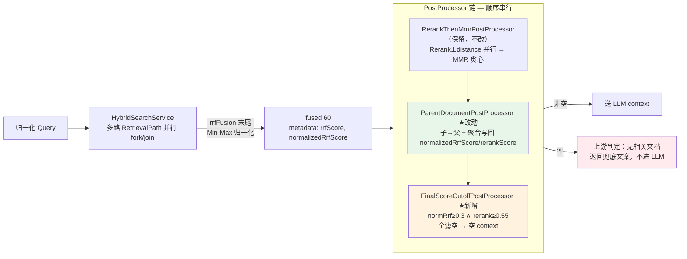

# RAG 检索管线增强：归一化 · 末端截断

> **目标**：治理当前检索管线两类缺陷——(1) 分数量纲断裂（`rrfScore ~0.033` 与 `rerankScore ~1.0` 差 30 倍，导致 `resolveScore` 链 fallback 时相关性信号塌一个数量级）；(2) 末端无质量门（Rerank 给出 `relevance_score=0.05` 的低相关文档只要进了 `mmrTopK` 就被原样塞进 LLM context）。
>
> **手段**：(a) 在 `rrfFusion` 末尾内嵌 Min-Max 归一化，写 `normalizedRrfScore ∈ [0,1]`；(b) `SCORE_KEYS` 链插入 `normalizedRrfScore` 作为中间层，保证 fallback 量纲连续；(c) Parent 聚合写回分数；(d) 末端新增 `FinalScoreCutoffPostProcessor` 双门截断。
>
> **范围**：`HybridSearchService.rrfFusion`、`ParentDocumentPostProcessor`（含 `SCORE_KEYS` 链）、`MmrDocumentPostProcessor.resolveRelevanceScore`、`RagAdvisorFactory.buildPostProcessors`（末端追加）、`RagRetrievalProperties`。**不含**召回层（RetrievalPath）、Rerank 客户端、分块策略。
>
> **状态**：设计阶段，未实施。
>
> **与初稿的差异**：初稿曾含 ScoreBlender 自适应融合器 + rank bonus + 删除 `RerankThenMmrPostProcessor` 改串行链。审查后判定这三项收益不抵复杂度（详见 §7 精简理由），本版移除，仅保留归一化与末端截断两块确定收益。

---

## 1. 背景与动机

### 1.1 缺陷一：分数量纲断裂

当前管线运行时分数的实测范围：

| 分数 | 来源 | 范围 | 归一化 |
|---|---|---|---|
| `rrfScore` | `HybridSearchService.rrfFusion:142-145` 累加 | (0, ~0.033]（单路 rank1≈0.0164，双路 BOTH rank1≈0.0328，k=60） | ❌ |
| `rerankScore` | 百炼 qwen3-rerank `relevance_score` 原样透传（`AbstractRerankClient:83`） | 依 provider，通常 [0,1] 但代码无 clamp 保证 | ❌ |

两者量纲差 ~30 倍。下游两个 `resolveScore`（`ParentDocumentPostProcessor:141`、`MmrDocumentPostProcessor:186`）用硬优先级链 `rerankScore > rrfScore > 0.5`——一旦 rerankScore 缺失（Rerank 关闭/失败透传），fallback 到 ~0.0164 的 rrfScore 会让 MMR/Parent 的相关性信号塌掉一个数量级。

### 1.2 缺陷二：末端无质量门

遍历整条 pipeline 后的截断现状：

| 阶段 | 截断方式 | 依据 |
|---|---|---|
| 向量召回（输入） | `similarityThreshold` 分数门 | `VectorRetrievalPath:51`——**仅向量路**，BM25 路完全不过这道门 |
| `rrfFusion` | `limit(fusionTopK=60)` 尺寸 | `HybridSearchService:152` |
| Rerank | `rerank().limit(topN=20)` 尺寸 | `AbstractRerankClient:50` + `RerankCapable:17` |
| MMR | `limit(mmrTopK=10)` 尺寸 | `MmrDocumentPostProcessor:119` |
| **Parent 之后（送 LLM 前）** | **无任何截断** | `RagAdvisorFactory:201` Parent 是链尾 |

末端无分数门：即便 Rerank 给出 `relevance_score=0.05` 的低相关文档，只要它进了 `mmrTopK=10`，就会被原样塞进 LLM context。

### 1.3 本设计的取舍

最小改动，只做两件事，不动既有架构：

- **归一化**：内嵌进 `rrfFusion` 末尾（排序后、写 metadata 时），不新增阶段，不破坏既有 postProcessor 链。
- **末端截断**：在 Parent 之后追加一个 `FinalScoreCutoffPostProcessor`，读 `normalizedRrfScore`（召回端门）与 `rerankScore`（精排端门），AND 语义。
- **保留 `RerankThenMmrPostProcessor`**：不删复合处理器，不做串行化，Rerank⊥distance 的并行收益完整保留。

---

## 2. 目标管线全景



★ 标记为本次新增/改动点。**未改动** `RerankThenMmrPostProcessor`（并行架构保留）。

---

## 3. 改动详解（锚定真实符号）

### 改动 1 · `HybridSearchService.rrfFusion` Min-Max 归一化（无 rank bonus）

**文件**：`src/main/java/com/smart/rag/rag/retrieval/HybridSearchService.java:127-163`

在排序后、写 metadata 的 `map` 块（`:150-162`）中，先求 min/max，再写 `normalizedRrfScore`：

```java
// 排序前先求 min/max（scores 是 docId → 原始 rrfScore 的累加 map）
double min = scores.values().stream().mapToDouble(Double::doubleValue).min().orElse(0);
double max = scores.values().stream().mapToDouble(Double::doubleValue).max().orElse(0);
double range = max - min;

return scores.entrySet().stream()
        .sorted(Map.Entry.<String, Double>comparingByValue().reversed())
        .limit(properties.fusionTopK())
        .map(e -> {
            Document doc = docMap.get(e.getKey());
            if (doc != null) {
                double raw = e.getValue();
                double normalized = (range == 0.0) ? 1.0 : (raw - min) / range;
                doc.getMetadata().put("rrfScore", raw);                   // 向后兼容 trace
                doc.getMetadata().put("normalizedRrfScore", normalized);  // ★新增，[0,1]
                doc.getMetadata().put("sources", sourcesByDoc.getOrDefault(e.getKey(), List.of()));
            }
            return doc;
        })
        .filter(Objects::nonNull)
        .toList();
```

**边界**：全相等（range=0）→ 统一 1.0（避免全部归零把好文档误杀）。单文档时 min=max → 1.0。

**不做 rank bonus**：初稿曾在 contribution 公式加 rank bonus（rank1→+0.05, rank2-3→+0.02）。审查发现 bonus 经 Min-Max 归一化后，只在"跨路排名分歧"的窄场景才改变排序顺序；一致高排名时 bonus 被归一化吸收为 no-op。收益不确定，徒增公式复杂度，本版移除（见 §7）。

### 改动 2 · `SCORE_KEYS` 链升级（两处）

量纲断裂的根因是 fallback 跨量纲（rerankScore ~1.0 → rrfScore ~0.033）。在中间插入 `normalizedRrfScore ∈ [0,1]`，保证每级 fallback 量纲连续。

#### 2a. `ParentDocumentPostProcessor.SCORE_KEYS:34`（注意：该类在 `rag/chunk/` 包，非 `rag/retrieval/`）

```java
// 当前
private static final String[] SCORE_KEYS = {"rerankScore", "rrfScore"};
// 升级
private static final String[] SCORE_KEYS = {"rerankScore", "normalizedRrfScore", "rrfScore"};
```

#### 2b. `MmrDocumentPostProcessor.resolveRelevanceScore:186`

同步升级为同一优先级链。MMR 的 `selectByMmr:124-126` 读 `relevanceScores[i] = resolveRelevanceScore(...)`，升级后自动用 `normalizedRrfScore` 作 fallback，量纲不再塌陷。

### 改动 3 · `ParentDocumentPostProcessor` 聚合写回分数（关键隐含改动）

**文件**：`src/main/java/com/smart/rag/rag/chunk/ParentDocumentPostProcessor.java`

当前 `process:71` 父文档来自 `vectorStoreMapper.batchFetchParents`（DB 回查），**metadata 里没有运行时分数**。末端 `Cutoff` 若要读父文档的 `normalizedRrfScore`/`rerankScore`，Parent 必须把子块的聚合分数写回输出文档。

> **前提已验证**：`ParentChildChunkStrategy:93-94` 确认父文档入库时自带 `parentId = 自身UUID`、`isParent=true`。故写回循环可从父文档的 metadata 读 `parentId` 去查聚合 map（与现有排序逻辑 `:119-126` 读 `parentId` 的方式一致）。

在现有聚合循环（`:95-107` 构建 `parentScoreMap`）旁，新增两个聚合 map：

```java
// 聚合阶段（在现有 parentScoreMap 构建循环内追加）
Map<String, Double> parentNormRrfMap = new HashMap<>();
Map<String, Double> parentRerankScoreMap = new HashMap<>();
for (Document doc : documents) {
    Map<String, Object> metadata = doc.getMetadata();
    Object isParent = metadata.get(ParentChildChunkStrategy.META_IS_PARENT);
    if (Boolean.TRUE.equals(isParent)) continue;
    Object parentIdObj = metadata.get(ParentChildChunkStrategy.META_PARENT_ID);
    if (parentIdObj == null) continue;
    String pid = parentIdObj.toString();
    parentScoreMap.merge(pid, resolveScore(doc), Math::max);  // 现有逻辑保留
    parentNormRrfMap.merge(pid, readDouble(doc, "normalizedRrfScore", DEFAULT_SCORE), Math::max);
    Double rr = readNullableDouble(doc, "rerankScore");
    if (rr != null) parentRerankScoreMap.merge(pid, rr, Math::max);
}
```

排序后、返回前，给每个回查父文档写回聚合分数：

```java
// 写回阶段（result 构建后、return 前）
// parentDocs = result.subList(0, parentCount)（与现有排序逻辑 :118 一致）
for (Document parentDoc : parentDocs) {
    Object pidObj = parentDoc.getMetadata().get(ParentChildChunkStrategy.META_PARENT_ID);
    if (pidObj == null) continue;
    String pid = pidObj.toString();
    parentDoc.getMetadata().put("normalizedRrfScore",
            parentNormRrfMap.getOrDefault(pid, DEFAULT_SCORE));
    Double rr = parentRerankScoreMap.get(pid);
    if (rr != null) parentDoc.getMetadata().put("rerankScore", rr);
}
```

`non-child` 文档（含 `isParent=true` 的召回父文档、无 parentId 的独立文档）自带 `normalizedRrfScore`/`rerankScore`（上游 rrfFusion/Rerank 写入），无需额外处理。

> **线程安全**：`ParentDocumentPostProcessor` 实例由 `cachedPostProcessors` 跨请求共享（`RagAdvisorFactory:58`），但写回操作针对的是**每次请求从 DB 新回查的父文档对象**（MyBatis 每次返回新实例），无共享可变状态，安全。

### 改动 4 · `FinalScoreCutoffPostProcessor`（新增末端门）

**文件**（新增）：`src/main/java/com/smart/rag/rag/retrieval/FinalScoreCutoffPostProcessor.java`

```java
public class FinalScoreCutoffPostProcessor implements DocumentPostProcessor {
    private final double normalizedRrfThreshold;  // 默认 0.3
    private final double rerankThreshold;         // 默认 0.55

    @Override
    public List<Document> process(Query query, List<Document> documents) {
        if (documents == null || documents.isEmpty()) return List.of();
        List<Document> kept = new ArrayList<>(documents.size());
        for (Document doc : documents) {
            // 门1：召回端综合分（Min-Max 归一化后，[0,1]）
            double normRrf = readDouble(doc, "normalizedRrfScore", DEFAULT_SCORE);
            if (normRrf < normalizedRrfThreshold) continue;
            // 门2：精排端语义分（缺失时跳过——Rerank 关闭场景下不应把所有文档卡死）
            Double rerank = readNullableDouble(doc, "rerankScore");
            if (rerank != null && rerank < rerankThreshold) continue;
            kept.add(doc);
        }
        log.info("FinalScoreCutoff: {} → {} (normRrf≥{}, rerank≥{})",
                documents.size(), kept.size(), normalizedRrfThreshold, rerankThreshold);
        return kept;  // 可能为空
    }
}
```

**双门语义（直接读两个原始分，不引入 finalScore 中间量）**：

- **门1（`normalizedRrfScore ≥ 0.3`）**：召回端门。Min-Max 保证 batch 内 best 恒为 1.0，门1 主要拦"召回双路都垫底"的文档。它的独有价值在于拦截 `rerankScore` 勉强过门2 但召回端判定无关的文档——这类文档 rerank 可能是假阳性。
- **门2（`rerankScore ≥ 0.55`）**：精排端门，主门。`rerankScore` 缺失（Rerank 关闭/透传/失败）时跳过，避免降级场景误杀全批。

**不引入 `finalScore` 中间量的理由**：初稿的 ScoreBlender 把两分融合成 `finalScore` 再做门。但量纲问题已被归一化解决，Cutoff 直接读两个原始分即可表达"召回端 ∧ 精排端都过线"的语义，无需融合（见 §7）。

**全滤空契约**：返回空列表，**不保底留 top1**。上游（`RagAdvisorFactory.retrieve:115-128` 和 chat 调用方）检测到空 context 时直接返回兜底文案（如"未检索到相关文档"），**不调用 LLM**。这是严格过滤语义——宁可明确告知无结果，也不塞低质内容诱导幻觉。

> ⚠️ **上游适配点**：`RagAdvisorFactory.retrieve:115-128` 和 chat 调用方需增加空 context 短路判断。这是本设计的隐含改动范围，实施时需覆盖。
>
> ⚠️ **假阴性风险**：若 rerank 模型对某类 query 系统性打低分，空 context 路径会误杀。因此初始阈值偏松（0.3 / 0.55），上线后必须用评估框架观察"空 context 率"与"人工标注相关性"是否一致——空率升高但相关性未升说明阈值过紧，需回调。

---

## 4. 分数流转表（全 pipeline metadata 生命周期）

| 阶段 | 产生/修改的 metadata key | 范围 | 消费者 |
|---|---|---|---|
| VectorRetrievalPath | —（score 在 ScoredDocument，不写 metadata） | — | rrfFusion |
| Bm25RetrievalPath | —（score=0.0，RANK_ONLY） | — | rrfFusion |
| **rrfFusion** | `rrfScore`（原始）、`normalizedRrfScore`（★新）、`sources` | [0,1] | resolveScore 链, Cutoff |
| RerankDocumentPostProcessor | `rerankScore` | [0,1]（依 provider） | resolveScore 链, Cutoff |
| RerankThenMmrPostProcessor | —（复合处理器，不改分数） | — | — |
| MmrDocumentPostProcessor | —（只重排/截断，不改分数） | — | — |
| **Parent** ★改 | 父文档写回 `normalizedRrfScore`/`rerankScore`（子块 max 聚合） | [0,1] | Cutoff |
| **FinalScoreCutoff** ★ | —（只过滤） | — | — |

---

## 5. 配置变更（`RagRetrievalProperties` record 扩字段）

新增 2 个字段，均带 compact-constructor 默认值（沿用 `fusionTopK`/`rerankTopN` 回退模式，旧 yml 不填可启动）：

```java
public record RagRetrievalProperties(
        // ... 现有 15 字段 ...
        // ★ 新增
        double normalizedRrfThreshold,  // 默认 0.3
        double rerankThreshold          // 默认 0.55
) {
    public RagRetrievalProperties {
        // ... 现有校验 ...
        // ★ 新增约束
        if (normalizedRrfThreshold < 0 || normalizedRrfThreshold > 1)
            throw new IllegalArgumentException("normalizedRrfThreshold must be in [0,1]");
        if (rerankThreshold < 0 || rerankThreshold > 1)
            throw new IllegalArgumentException("rerankThreshold must be in [0,1]");
    }
}
```

**`withOverrides:66`**（评估模块用，固定 3 参签名）：新增字段后需透传原值——参考现有 `fusionTopK`/`rerankTopN` 的透传写法（`:74,76`），无新破坏。若评估框架需扫这两个阈值，后续扩展 `withOverrides` 签名（见 OQ1）。

`application.yml` 新增：

```yaml
app:
  rag:
    normalized-rrf-threshold: ${RAG_NORMALIZED_RRF_THRESHOLD:0.3}
    rerank-threshold: ${RAG_RERANK_THRESHOLD:0.55}
```

---

## 6. `RagAdvisorFactory.buildPostProcessors` 末端追加 Cutoff

**文件**：`src/main/java/com/smart/rag/rag/config/RagAdvisorFactory.java:179-204`

**只追加，不重构**——既有 Rerank/MMR/Parent 编排全部保留（含 `RerankThenMmrPostProcessor` 并行复合处理器），仅在链尾追加 `FinalScoreCutoffPostProcessor`：

```java
private List<DocumentPostProcessor> buildPostProcessors() {
    List<DocumentPostProcessor> postProcessors = new ArrayList<>();

    boolean rerankOn = rerankPostProcessor != null;
    boolean mmrOn = properties.mmrEnabled();

    if (rerankOn && mmrOn) {
        // 复合处理器保留：Rerank⊥distance 并行（不改）
        MmrDocumentPostProcessor mmr = new MmrDocumentPostProcessor(
                properties.mmrLambda(), properties.mmrTopK(), properties.fusionTopK(), vectorStoreMapper);
        postProcessors.add(new RerankThenMmrPostProcessor(rerankPostProcessor, mmr, ragPostProcessExecutor));
    } else if (rerankOn) {
        postProcessors.add(rerankPostProcessor);
    } else if (mmrOn) {
        postProcessors.add(new MmrDocumentPostProcessor(
                properties.mmrLambda(), properties.mmrTopK(), properties.fusionTopK(), vectorStoreMapper));
    }

    // Parent-Child 子块→父文档替换（改动3：聚合写回分数）
    postProcessors.add(parentDocumentPostProcessor);

    // ★ 末端门（新增）
    postProcessors.add(new FinalScoreCutoffPostProcessor(
            properties.normalizedRrfThreshold(), properties.rerankThreshold()));

    return postProcessors;
}
```

`cachedPostProcessors` 缓存（`:58`）行为不变：`buildPostProcessors` 仍只构造一次，跨请求共享。新增的 `FinalScoreCutoffPostProcessor` 无状态，共享安全。

---

## 7. 精简理由（为何砍掉 ScoreBlender + rank bonus + 串行化）

初稿曾包含三项，审查后判定收益不抵复杂度，本版移除：

### 7.1 rank bonus —— 多数场景经 Min-Max 后是 no-op

初稿在 contribution 公式加 `rankBonus(rank)`（rank1→+0.05, rank2-3→+0.02）。但 bonus 是排序前加到原始分上，Min-Max 归一化在排序后执行。bonus 只有在**改变了排序顺序**时才对 `normalizedRrfScore` 产生影响；而 rank-1 文档通常本就累积了最高 RRF 分（双路命中时尤甚），加固定 bonus 不改变其首位事实。一致高排名场景下 bonus 被归一化完全吸收，等效 no-op。真正生效的"跨路排名分歧"场景窄且不可预期，不值得引入公式复杂度。

### 7.2 ScoreBlender —— 在已解决的问题上多套一层公式

初稿的 ScoreBlender 用 certainty 自适应公式（6 参数：baseWeight/factor/min/max…）把 `normalizedRrfScore` 与 `rerankScore` 融合成 `finalScore`，喂给 MMR 相关性与 Cutoff。审查发现其两个消费者都有更简单的替代：

- **MMR 相关性**：MMR 之前已有 `rerankScore`（精排分）。精排分本身就比"RRF+rerank 混合"更适合做 MMR 的 `sim(q,d)`——混入 RRF 召回分反而稀释精排质量。只有在 Rerank 关闭的降级场景 Blender 才有意义，为降级场景造一个 6 参数自适应器性价比极低。`SCORE_KEYS` 链升级（改动2）已让降级 fallback 量纲连续，覆盖了该场景。
- **Cutoff 门**：直接读 `normalizedRrfScore`（门1）与 `rerankScore`（门2）即可表达"召回端 ∧ 精排端都过线"，无需融合成 `finalScore`。两门 AND 的语义比单一 `finalScore` 阈值更可解释、可独立调参。

量纲问题已被归一化解决，Blender 是在已解决的问题上重复造轮子。

### 7.3 串行化 + 删除 `RerankThenMmrPostProcessor` —— 为 Blender 付出的不必要的代价

初稿删掉并行复合处理器改串行链，**唯一动机是 Blender 必须在 Rerank 之后、MMR 之前插入**（依赖 rerankScore 算 certainty）。Blender 砍掉后，串行化的理由消失。保留 `RerankThenMmrPostProcessor` 的并行收益（Rerank⊥distance，distance 的 DB 等待被 rerank 吸收），零延迟代价。

---

## 8. 降级契约矩阵（不中断检索链路硬约束）

| 故障场景 | Cutoff 行为 | 最终结果 |
|---|---|---|
| Rerank 关闭（`rerankEnabled=false`） | 无 `rerankScore` → 门2 跳过 | 非空（仅门1） |
| Rerank API 失败/超时/透传 | 透传文档无 `rerankScore` → 门2 跳过 | 非空（仅门1） |
| Rerank 返回空 | 透传文档无 `rerankScore` → 门2 跳过 | 非空（仅门1） |
| `normalizedRrfScore` 缺失（不应发生） | 读默认 0.5 → 过门1（0.5≥0.3） | 兜底非空 |
| distance DB 失败 | 不影响（MMR 走 relevance-only，Cutoff 不依赖 distance） | 非空 |
| 召回全低质 | `normalizedRrfScore` 普遍低 + `rerankScore` 普遍低 | **全滤空 → 空 context** |
| blank query | Rerank 透传、MMR 用 normalizedRrfScore fallback | Cutoff 正常跑，视质量 |
| 全链故障组合 | — | 空 → 上游兜底 |

**核心不变量**：
1. 任何单环故障不抛异常（沿用 R1-M8 降级契约）。
2. 送 LLM 的 context 要么非空且过双门，要么为空（触发上游兜底）——**不存在"塞低质内容进 LLM"的路径**。

**上游兜底契约**：`RagAdvisorFactory.retrieve` 及 chat 调用方检测到空 context 时，直接返回固定文案，**不调用 LLM**。这是本设计引入的新短路径，需在实施时覆盖调用方。

---

## 9. 影响面与 GitNexus impact

按 CLAUDE.md 硬性要求，提交前需对以下符号跑 `impact`：

| 符号 | 文件 | 改动类型 | 预期风险 |
|---|---|---|---|
| `rrfFusion` | HybridSearchService.java:127 | 修改（末尾加归一化） | MEDIUM（核心融合逻辑，但只追加 metadata 写入，不改公式/排序） |
| `SCORE_KEYS` | ParentDocumentPostProcessor.java:34（`rag/chunk/` 包） | 修改（链升级） | LOW |
| `resolveScore` | ParentDocumentPostProcessor.java:141 | 间接受益（读新链） | LOW |
| `resolveRelevanceScore` | MmrDocumentPostProcessor.java:186 | 修改（链升级） | LOW |
| `process` | ParentDocumentPostProcessor.java:44 | 修改（聚合写回） | MEDIUM（新增 metadata 写入，需验证线程安全） |
| `buildPostProcessors` | RagAdvisorFactory.java:179 | 修改（末端追加） | LOW（只追加，不改既有顺序） |
| `withOverrides` | RagRetrievalProperties.java:66 | 修改（透传 2 新字段） | LOW |
| `FinalScoreCutoffPostProcessor` | 新建 | 新增 | — |

**测试影响**：

| 测试文件 | 影响 | 处理 |
|---|---|---|
| `HybridDocumentRetrieverTest`（17 例） | metadata 新增 `normalizedRrfScore`，既有断言若检查 metadata 内容需调整 | 验证 + 修补 |
| `ParentDocumentPostProcessorTest` | 新增"父文档 normalizedRrfScore/rerankScore 写回"用例 | 新增 |
| `MmrDocumentPostProcessorTest` | resolveRelevanceScore 链升级 | 验证 + 补用例 |
| 新增 `FinalScoreCutoffPostProcessorTest` | 双门 + 全滤空返回空 + rerankScore 缺失跳过门2 | 新建 |
| **新增端到端集成测试** | 跨 5 处理器 score 流转：验证送 LLM 的文档 `normalizedRrfScore ∈ [0,1]` 且全过双门 | 新建（防止跨处理器 metadata key 拼写不一致类 bug） |

---

## 10. 分阶段实施建议（2 个独立 PR）

| PR | 内容 | 依赖 | 回滚点 |
|---|---|---|---|
| **PR-1 归一化+链升级** | 改动1（rrfFusion 归一化）+ 改动2（SCORE_KEYS 链升级，两处） | 无 | 单独验证量纲修复收益，零行为变更（不截断） |
| **PR-2 Parent 写回 + Cutoff** | 改动3（Parent 聚合写回）+ 改动4（Cutoff）+ 上游空 context 短路 + 配置 | PR-1 | 叠加末端门；阈值默认偏松（0.3/0.55），上线后用评估框架观察空 context 率与相关性，再收紧 |

PR-1 可独立验证量纲修复；PR-2 在其上叠加末端门。每个 PR 有清晰回滚点。

**阈值调参验证**（并入 PR-2 上线后观察）：用既有 `EvaluationRunner` + `PipelineInstrumenter` 对比 Cutoff on/off 的检索质量与空 context 率。若评估框架需扫这两个阈值，先扩展 `withOverrides` 签名（见 OQ1）。

---

## 11. Open Questions

| 编号 | 问题 | 当前倾向 | 决策时机 |
|---|---|---|---|
| OQ1 | 评估模块 `withOverrides` 是否需要支持两个新阈值覆盖（用于扫参）？ | PR-2 上线后若需用评估框架扫阈值，则补上 | PR-2 上线后 |
| OQ2 | `normalizedRrfScore` 是否需要进 `trace_event.documents` JSONB？ | 进——与 `rrfScore` 并列，便于消融分析。但 `normalizedRrfScore` 产生于融合阶段，现有 `recordPathRecall`（HybridSearchService:179）记录的是融合前的每路召回，需新增 FUSION step_type，而非塞进 PATH_RECALL | PR-1 实施时 |
| OQ3 | 空兜底文案是否需要可配置（`app.rag.no-result-message`）？ | 暂硬编码在调用方，后续按需提参 | PR-2 实施时 |
